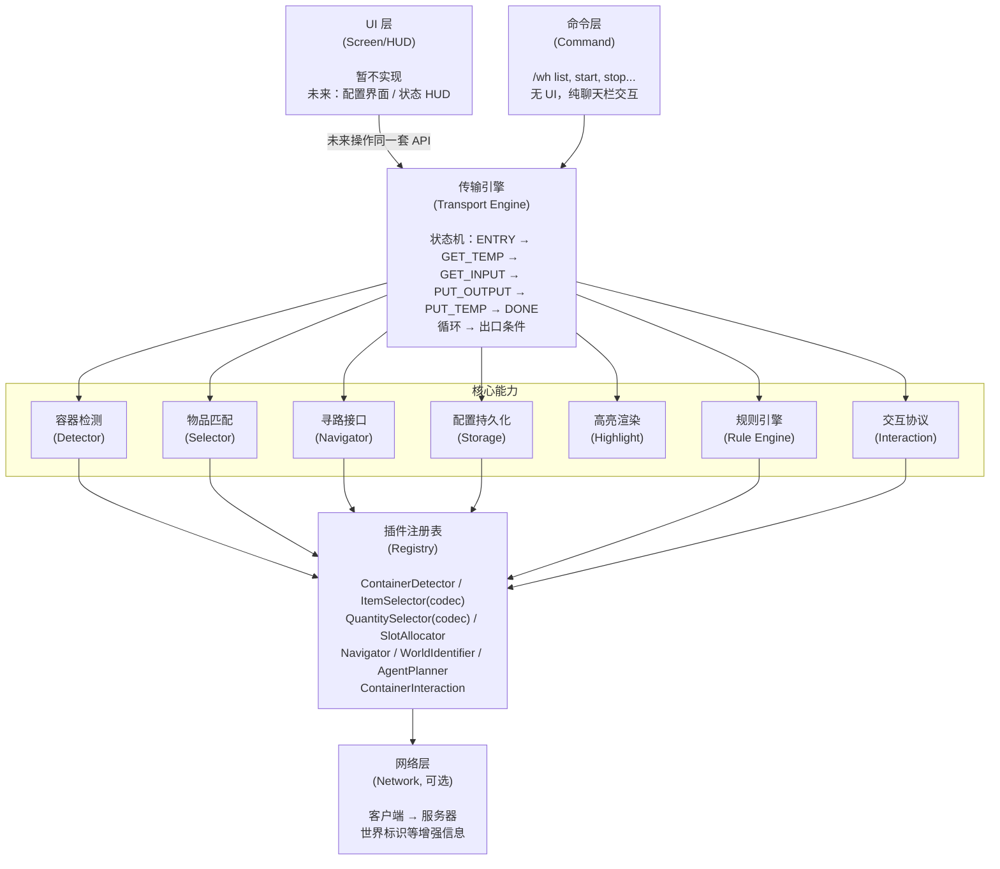
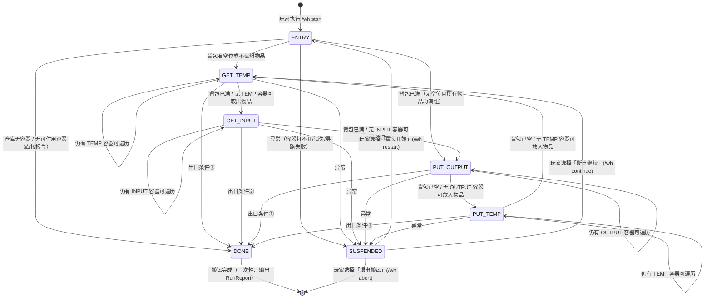

# Yuanlu Warehouse — 产品设计文档 v0.2

> **v0.2 变更摘要**：吸收旧项目（mc-warehouse）实现期教训——新增「世界与服务器标识」「运行时交互协议」「槽位能力模型」；数量选择器重构为「目标总量 + SlotAllocator」；事件系统改用 Fabric `Event<T>`；业务代码确定整体位于 `src/client`；补充防振荡双机制、缓存自愈、服务端对账等正确性约束。明细见文末版本历史与 §15。

## 1. 概述

Minecraft Fabric 模组，**纯客户端即可独立运行**，服务端可选装仅用于信息增强（如世界标识等标准 MC 客户端无法获取的信息）。玩家通过定义仓库（容器集合 + 规则），由模组驱动玩家背包作为媒介，自动完成从 INPUT 容器取出物品 → 放入 OUTPUT/TEMP 容器的搬运流程。所有交互均模拟正常玩家行为（打开 GUI、点击槽位），不对绕过反作弊提供支持。高度模块化设计，全部功能通过 API 接口解耦，命令层与（未来）UI 层操作同一套 API，支持附属 mod 扩展。

## 2. 架构分层



## 3. 核心数据模型

### 3.1 仓库 (Warehouse)

```java
Warehouse {
    id: String                          // 唯一标识
    anchors: Map<WorldDimRef, Pos>      // 每个 (worldId, dimId) 的基准点（JSON 嵌套结构见 §11.3）
    containers: List<ContainerInfo>
    rules: Map<String, ContainerRule>   // 本仓库内定义的规则（key = ruleId）
}
```

- 仓库可跨世界、跨维度，每个 `(worldId, dimId)` 有一个基准点
- 容器的 pos 存为**相对坐标**（相对于同 `(worldId, dimId)` 的 anchor），便于整体偏移
- `rules` 字段使得规则可以在仓库级别定义，也可在全局共享（见 §11 配置持久化）；全局与内嵌规则 id 冲突 = 加载报错拒载（§11.3）
- **v0.2**：删除 `active` 字段。激活态是运行时概念，由 `WarehouseManager.activeWarehouseId` 内存持有，不持久化（旧项目该字段持久化后从未被读取，见 §15.2）

### 3.2 容器信息 (ContainerInfo)

```java
ContainerInfo {
    pos: WorldDimPos[]            // (worldId, dimId, x, y, z)，支持多格容器；
                                  // pos[0] 为 canonical pos（缓存键与日志的主标识）
    ioType: IOType                // INPUT | OUTPUT | TEMP | IGNORE
    ruleMode: RuleMode            // WHITELIST | BLACKLIST
    rules: String[]               // 引用的 ContainerRule id
    cacheType: CacheType          // NONE | MEMORY | DISK
    priority: Priority            // hard：主排序键（降序遍历）；soft：hard 相同时的次级排序键
    label: String                 // 可选标签，用于高亮显示和日志
}
```

**IOType 枚举**：

| 类型   | 含义                                        | 取出 | 放入 | 默认 ruleMode |
| ------ | ------------------------------------------- | ---- | ---- | ------------- |
| INPUT  | 输入容器（物资产出点）                      | ✅   | ❌   | BLACKLIST     |
| OUTPUT | 输出容器（存储/机器输入）                   | ❌   | ✅   | WHITELIST     |
| TEMP   | 中转容器                                    | ✅   | ✅   | BLACKLIST     |
| IGNORE | 跳过（不出现在搬运流程中，仅用于高亮/标记） | ❌   | ❌   | —             |

IOType 是**封闭枚举**（有意决策）：它是用户意图标注；容器的真实物理能力由 Detector 的槽位能力模型表达（§8.2），二者正交。

**多格容器关联机制**：一个 `ContainerInfo.pos` 可包含多个坐标，这些坐标被视为**同一个逻辑容器**的多格（如大箱子 2 格、用户选中的多个末影箱关联为同一容器）。识别器（`ContainerDetector.resolveMultiBlock`）负责自动检测多格关系；用户也可手动将多个坐标归入同一个 `ContainerInfo.pos` 数组。搬运时，引擎会依次打开每个坐标的 UI 并操作，但逻辑上视为同一个容器（共享缓存、共享规则判定），缓存以 canonical pos（pos[0]）为键。

### 3.3 容器规则 (ContainerRule)

```java
ContainerRule {
    id: String                    // 唯一标识
    itemRules: ItemRule[]         // 物品规则列表（有序）
}
```

### 3.4 物品规则 (ItemRule)

```java
ItemRule {
    selector: ItemSelector        // 匹配物品
    negative: boolean             // 反选
    quantity: QuantitySelector    // 数量控制
}
```

> 迁移注记：旧项目字段名为 `negate` / `quantifier`，新项目统一为 `negative` / `quantity`。

### 3.5 物品选择器 (ItemSelector) — 接口

```java
public interface ItemSelector {
    /** 判断给定的物品堆是否匹配此选择器（只看物品本身与组件，不看数量） */
    boolean matches(ItemStack stack);
}
```

| 内置实现          | JSON 示例                                           | 匹配逻辑              |
| ----------------- | --------------------------------------------------- | --------------------- |
| IdSelector        | `{"type":"id","value":"minecraft:diamond"}`         | 物品 ID 精确匹配      |
| TagSelector       | `{"type":"tag","value":"minecraft:logs"}`           | 物品标签匹配          |
| NameSelector      | `{"type":"name","value":"钻石","fuzzy":true}`       | 显示名称模糊/精确匹配 |
| NbtSelector       | `{"type":"nbt","value":"{...}"}`                    | 见下方注记            |
| CompositeSelector | `{"type":"composite","op":"AND","selectors":[...]}` | AND/OR/NOT 组合       |

**CompositeSelector 的 op 取值**：`AND`（全部匹配）、`OR`（任一匹配）、`NOT`（全部不匹配，即取反嵌套）。

> **NbtSelector 注记（v0.2）**：名称沿用习惯叫法。MC 1.20.5+ 物品数据已是 DataComponents，26.x 无 NBT；其实际语义为**组件序列化文本包含匹配**（`toString().contains(value)`，旧项目实现即如此，并非曾声称的"NBT 子集匹配"）。是否更名（如 ComponentMatchSelector）及升级为结构化组件子集匹配，待调研其它 mod 做法后决定（§15.11）。插件作者请勿依赖其内部表示形式。

### 3.6 数量选择器与槽位分配

**v0.2 重构**：数量选择器只回答「目标总量是多少」，具体落到哪些槽位由独立的 SlotAllocator 决定（替代 v0.1 的 per-slot `Int2IntMap` 进出签名——两类职责耦合导致选择器实现过重且无法独立演进，§15.10）。

```java
public interface QuantitySelector {
    /**
     * 计算匹配物品在该容器中的目标总量。
     * delta = target - current 由引擎推导方向：
     *   正数需放入，负数需取出，0 表示刚好满足。
     */
    int computeTargetAmount(QuantityContext ctx);
}

/**
 * 数量计算的上下文。
 * slotCount/freeSlots 为容器侧参与判定的全部槽位口径
 * （canTakeFrom || canPutTo，见 §8.2），不做方向细分。
 */
record QuantityContext(
    int currentTotal,     // 容器中匹配物品的当前总量
    int slotCount,        // 参与判定的槽位总数
    int freeSlots,        // 其中空槽数
    int maxStackSize      // 该物品最大堆叠数
) {}
```

| 内置实现          | JSON 示例                         | 目标总量                                                                 |
| ----------------- | --------------------------------- | ------------------------------------------------------------------------ |
| CountSelector     | `{"type":"count","value":64}`     | `value`                                                                  |
| GroupSelector     | `{"type":"group","value":3}`      | `value × maxStackSize`                                                   |
| FillSlotsSelector | `{"type":"fill_slots","value":5}` | 占满除 `value` 个空位外的槽位 ≈ `max(0, slotCount-value) × maxStackSize` |
| PercentSelector   | `{"type":"percent","value":75}`   | `slotCount × maxStackSize × value%`（按容量比例取整）                    |

统一公式天然给出方向语义：同一 selector 在 OUTPUT 上表现为「填充上限」，在 INPUT 上表现为「保留下限」（取出多余部分）。

**槽位分配器 (SlotAllocator)** — 新扩展点：

```java
public interface SlotAllocator {
    String id();
    /**
     * 把「对 item 的 amount 个增删」分配到具体槽位。
     * toContainer=true 放入（只用 canPutTo 槽位），false 取出（只用 canTakeFrom 槽位）。
     */
    List<SlotAllocation> allocate(ContainerSnapshot snapshot,
                                  ItemStack item, int amount, boolean toContainer);
}

record SlotAllocation(int slot, int count) {}
```

- 内置 `FirstFitAllocator`：先并入已有同类不满堆（按槽序），再依次填充空槽
- 通过 Registry 注册，全局配置 `slotAllocator` 选择当前实现（§11.4）

### 3.7 规则判定语义

**判定顺序即优先级**：

- 对容器的每个槽位物品，按容器 `rules` 数组顺序遍历关联的 `ContainerRule`，再按其 `itemRules` 列表顺序遍历——**首条命中的 ItemRule 生效，其余忽略**
- `negative=true`：先求反匹配结果，再走命中流程
- **WHITELIST** 下无任何 ItemRule 命中 → 物品不允许放入（target=0）
- **BLACKLIST** 下无任何 ItemRule 命中 → 物品不受限：取出方向 target=∞（尽量清空）、放入方向 target=∞（尽量塞满）
- 多个 delta 汇总后交由引擎推导操作（放入容量受目标容器剩余空间约束）

**默认规则**：

| 容器类型 | ruleMode  | 规则 | 行为                                   |
| -------- | --------- | ---- | -------------------------------------- |
| INPUT    | BLACKLIST | 空   | 允许任意物品取出，尽量清空             |
| TEMP     | BLACKLIST | 空   | 允许任意物品取出和放入（杂项箱）       |
| OUTPUT   | WHITELIST | 空   | 默认不允许任何物品放入（必须明确配置） |
| IGNORE   | —         | —    | 跳过，不参与搬运                       |

### 3.8 容器内存 (ContainerMemory)

```java
ContainerMemory {
    key: CacheKey                 // (worldId, dimId, canonicalPos [, playerUUID])
    snapshot: ContainerSnapshot   // 最后一次扫描的快照
    cacheType: CacheType
    lastAccessTime: long
    explored: boolean             // 是否已被扫描过
}

ContainerSnapshot {
    slots: Map<Integer, ItemStack>      // slotIndex → 物品堆（空位不包含）
    slotInfos: Map<Integer, SlotInfo>   // 槽位能力（来自 Detector，§8.2）
    title: String                       // 容器 UI 标题（用于识别）
    slotCount: int                      // 容器侧总槽位数
}
```

**v0.2 正确性约束**（旧项目缺陷的直接对策）：

- **缓存键必须含 worldId 与 dimId**——裸 BlockPos 键会跨维度串数据；末影箱类因玩家而异的容器附加 playerUUID 维度；多格容器用 canonicalPos
- **快照只含容器侧槽位**：依据 Menu 中槽位的 container 归属判定，玩家背包/盔甲/副手一律不进入快照（旧项目把玩家背包区混入快照导致规则计算错乱）
- **DISK 缓存按 worldId 分目录**，切换世界时不加载其它世界的缓存文件
- **自愈机制**：任何基于缓存的预检被现实否定（点击无响应、内容与预期不符）→ 立即失效该容器缓存并强制重扫。缓存因此只是性能优化，不是正确性依赖（§5.5、§15.9）

**内存生命周期**：

- 当玩家打开一个容器时，引擎通过 Mixin 拦截 `Screen.onClose()` 自动创建/刷新 `ContainerMemory`；**写入前必须校验正在关闭的 Screen 与哪个容器会话绑定**（打开时建立映射），禁止用「上一个交互坐标」猜测——防止玩家手动开关无关 GUI 造成缓存投毒（旧项目缺陷）
- 缓存是惰性的：引擎需要某个容器的内容时，先检查是否有有效缓存；有则直接使用，无则尝试打开容器扫描
- 缓存有效性判断：
  - `NONE`：只在当前搬运轮次内有效，轮次结束后清除
  - `MEMORY`：随游戏 Session 生命周期，worldId 变化或退出世界/服务器时清除
  - `DISK`：持久化到文件系统，重启后重新加载；当用户主动打开容器时刷新

### 3.9 传输计划 (TransferPlan)

**注意**：`TransferPlan` 不是持久化数据模型，而是传输引擎运行时产生的**一次操作计划**，用于指导引擎执行具体操作。

```java
/** 一次搬运操作的计划：包含多个物品移动指令 */
TransferPlan {
    direction: PlanDirection       // TO_PLAYER | TO_CONTAINER
    moves: List<ItemMove>
}

/** 单个物品移动指令 */
ItemMove {
    targetPos: WorldDimPos         // 目标容器坐标
    targetSlot: int                // 目标槽位（-1 表示自动分配）
    item: ItemStack                // 要移动的物品
    amount: int                    // 移动数量
    priority: int                  // 执行优先级（同一 plan 内的排序）
}

/** 计划方向 —— 决定操作方向 */
enum PlanDirection {
    TO_PLAYER,     // 从容器 → 玩家背包（取出）
    TO_CONTAINER   // 从玩家背包 → 容器（放入）
}
```

引擎的每个阶段（GET_TEMP / GET_INPUT / PUT_OUTPUT / PUT_TEMP）都会生成一个 `TransferPlan`，然后逐条执行 `ItemMove`。`PlanDirection` 使得同一段执行代码可以处理取出和放入两种操作，避免重复逻辑。

> `amount` 的精确粒度语义（半组搬运需要拿起-放下两段点击序列）暂维持现状，待专项设计（§15.11）；一阶段执行层按整堆粒度解释。

## 4. 世界与服务器标识

仓库与配置必须回答「这是哪个服务器/存档」的问题，否则不同服务器的同名坐标会互相污染配置与缓存。

### 4.1 WorldIdentifier — 接口

```java
public interface WorldIdentifier {
    String id();
    /** 当前会话的 world 标识；会话未就绪（主菜单/已断开）返回 null */
    @Nullable String currentWorldId();
}
```

- world 标识用于三件事：**配置隔离**（不同服务器/存档互不干扰）、**缓存命名空间**、**仓库可达性判断**
- 引擎每 tick 缓存当前 worldId；**worldId 发生变化视为会话切换**：MEMORY 缓存清空、DISK 缓存卸载、运行中的搬运终止并报告

### 4.2 内置实现

| 实现                        | 标识格式                    | 来源                    |
| --------------------------- | --------------------------- | ----------------------- |
| SingleplayerWorldIdentifier | `singleplayer:<存档目录名>` | 当前 Level 的存档目录名 |
| MultiplayerWorldIdentifier  | `mp:<host>:<port>`          | ServerData 连接地址     |

两者默认同时注册，运行时按连接类型自动选择。插件可注册额外实现（如经代理区分同一服务器的多个分区）。

### 4.3 维度与 WorldDim

dim 即 MC 维度 id（如 `minecraft:overworld`）。`(worldId, dimId)` 二元组下称 **WorldDim**，是 anchor、容器坐标、寻路目标的完整限定；仅 dim 不构成唯一性（不同服务器/存档的同名维度是不同的世界）。

## 5. 传输引擎 (Transport Engine)

### 5.1 状态定义

```java
/** 搬运状态枚举 */
enum TransportState {
    /** 入口决策：判断背包是否有空位/不满组物品 */
    ENTRY,
    /** 从 TEMP 容器取出物品到背包 */
    GET_TEMP,
    /** 从 INPUT 容器取出物品到背包 */
    GET_INPUT,
    /** 从背包放入物品到 OUTPUT 容器 */
    PUT_OUTPUT,
    /** 从背包放入物品到 TEMP 容器 */
    PUT_TEMP,
    /** 出口条件满足，搬运结束 */
    DONE,
    /** 异常发生，搬运暂停 */
    SUSPENDED
}
```

### 5.2 状态机



**出口条件**：

- ① `(OUTPUT 全满 && TEMP 全满)`
- ② `(INPUT 全空)`

全满指——对于 OUTPUT/TEMP，所有容器均无空位且无不满组物品，或不满组物品在 INPUT 侧找不到可以合并的物品了；全空指——对于 INPUT，所有容器均无物品可取出。

**v0.2 补充**：聚合判定遇到**未探索容器**时，出口条件一律视为不满足——先探索再判定，禁止把未知当作满或空。DONE 为一次性结束：达成出口条件即停止并输出 RunReport（§5.9），不做持续监听；watch 模式留待后续（§15.11）。

### 5.3 状态机详细逻辑

**ENTRY**：

1. 获取当前激活仓库的容器列表；为空 → DONE 并报告
2. 检测玩家背包是否有空位或不满组的物品
3. 有空位 → GET_TEMP；无空位 → PUT_OUTPUT

**媒介口径（必须全流程统一）**：搬运媒介 = 主背包 36 格（快捷栏 + 主格）。盔甲槽、副手槽**永不参与**搬运的判定与操作。「有空位 / 不满组 / 已满 / 已空」四种判断使用同一口径（旧项目 isFull 与 isEmpty 口径不一致导致终止评估错乱）。

**GET_TEMP / GET_INPUT**（取出阶段）：

```
生成 TransferPlan(TO_PLAYER):
  遍历容器列表（按硬优先级降序）：
    对每个容器：
      1. 检查缓存 → 若缓存有效且无物品可取出，跳过
      2. [GET_INPUT 特有] 条件准入检查（见防振荡机制①）
      3. 寻路前往容器位置
      4. 打开容器（§6.1 协议），扫描内容 → 刷新缓存
      5. 根据规则引擎计算可取出物品列表
         [GET_TEMP 特有] 按 TEMP 双策略（见防振荡机制②）
      6. 将可取出物品加入 TransferPlan.moves
      7. 若背包已满（预估），停止遍历
  所有容器遍历完毕 → 执行 TransferPlan（§6.2 对账协议）→ 进入下一状态
```

**PUT_OUTPUT / PUT_TEMP**（放入阶段）：

```
生成 TransferPlan(TO_CONTAINER):
  遍历容器列表（按硬优先级降序）：
    对每个容器：
      1. 检查缓存 → 若缓存有效且无空位可放入，跳过
      2. 寻路前往容器位置
      3. 打开容器（§6.1 协议），扫描内容 → 刷新缓存
      4. 根据规则引擎和背包物品计算可放入物品列表
         （受目标容器剩余空间与槽位能力约束）
      5. 将可放入物品加入 TransferPlan.moves
      6. 若背包已空（预估），停止遍历
  所有容器遍历完毕 → 执行 TransferPlan（§6.2 对账协议）→ 进入下一状态
```

**防振荡机制（v0.2 新增，必实现；旧项目实测教训）**：

1. **INPUT 条件准入**：GET_INPUT 阶段对未探索的 INPUT 容器，仅当满足任一条件才加入本轮队列：
   - 背包尚有可用空间；
   - 存在仍有空间的 OUTPUT 容器；
   - 存在仍有空间的 TEMP 容器。
     否则跳过——取出后无处安放只会造成空转死循环。
2. **TEMP 取出双策略**：
   - 仍存在未探索的 OUTPUT 容器 → **保守模式**：按 BLACKLIST 空规则超额全取；
   - 全部 OUTPUT 已探索 → **精确模式**：仅取出能匹配某个 OUTPUT 白名单规则的物品。
     目的：避免「TEMP 取出 → OUTPUT 放不下 → PUT_TEMP 放回」的无限振荡。
3. **探索失败不计进展**：容器快照失败（UI 未开/身份不符）不得置 `roundHadNewExplore=true`，也不写入缓存；同一容器连续探索失败 ≥ `exploreFailMax` 次（默认 2）触发 SUSPENDED——防止「永远打不开的容器让轮次永远有进展」的死循环。

**TransferPlan 执行流程**：见 §6.2（运行时交互协议），含服务端对账。

**轮次追踪**：

```
roundHadAction: boolean     // 本轮是否有任何物品被移动（以对账成功为准）
roundHadNewExplore: boolean // 本轮是否有新容器被首次成功探索

如果连续两轮 roundHadAction == false && roundHadNewExplore == false：
  → 判定为"无进展"，自动终止搬运并输出 RunReport（含五档诊断，§5.9）
```

### 5.4 缓存机制

**三级缓存**：

| 类型   | 清除时机                 | 适用场景                             |
| ------ | ------------------------ | ------------------------------------ |
| NONE   | 搬运轮次结束时           | 机器入口/出口等频繁变化的容器        |
| MEMORY | 退出世界/服务器时        | 普通箱子等在一个游戏会话内不变的内容 |
| DISK   | 用户主动清除或重新打开时 | 长期存储区域，如仓库主存储区         |

> MEMORY/DISK 的「内容不变」假设在多人服/漏斗环境下随时可能失效，因此自愈机制（§3.8）是缓存体系的必要组成部分：预检错误只损失一次白跑，不会造成错误操作。

**缓存规则**：

- 缓存是惰性的：需要容器内容时，有缓存用缓存，无缓存则打开容器扫描
- 任何被动操作（因搬运需要打开容器）都会刷新缓存
- 通过 Mixin 拦截 `Screen.onClose()` 可以自动刷新缓存（即使不是由引擎触发的打开）；写入前校验 Screen↔容器会话绑定（§3.8）
- `NONE` 缓存在搬运轮次结束后清除，但搬运轮次内可重复使用以节省操作

### 5.5 异常处理

**异常类型**（v0.2 扩充）：

| 异常               | 触发条件                                            | 处理方式                             |
| ------------------ | --------------------------------------------------- | ------------------------------------ |
| 容器消失           | 坐标处无方块或方块实体类型与预期不符                | 暂停，提示玩家                       |
| 寻路失败           | Navigator FAILED 且重试次数耗尽（§7.1）             | 暂停，提示玩家                       |
| 容器打不开         | WAIT_SCREEN 超时（§6.1）                            | 暂停，提示玩家                       |
| UI 身份不匹配      | Screen 标题/槽位数/方块实体与 Detector 判定不符     | 暂停，提示玩家                       |
| 操作超时           | click 后 confirmTimeoutTicks 内无服务端对账（§6.2） | 失效该容器缓存 + 暂停                |
| UI 被外部关闭      | 对账完成前 Screen 关闭（按 E、死亡、踢出界面）      | **绝不视为成功**，暂停               |
| 反复探索失败       | 同一容器连续 ≥ exploreFailMax 次                    | 暂停，提示玩家                       |
| 玩家死亡           | 死亡掉落风险                                        | 终止本轮搬运，要求人工确认后 restart |
| 断线/切世界/切维度 | worldId 变化或连接中断（§4.1）                      | 终止搬运                             |

**恢复选项与命令映射**：

```
暂停后玩家处理完现场，可选：
  1. 重头开始 → /wh restart（重置状态与轮次标志，重新 ENTRY）
  2. 断点继续 → /wh continue（将出错容器标记 skip，继续当前轮次）
  3. 退出搬运 → /wh abort
注：/wh stop 仅暂停（可 /wh continue 无损恢复，不跳过容器）。
```

### 5.6 多仓库流转

**支持场景**：将一个仓库整体视为 INPUT 源，搬空后输入到另一个仓库的 OUTPUT 中。

```
/wh transfer <源仓库> <目标仓库> start   # 开始跨仓库搬运
/wh transfer status                      # 查看跨仓库搬运状态
/wh transfer stop                        # 停止跨仓库搬运
```

实现方式：`transfer` 命令将源仓库的**所有容器临时视为 INPUT**（无视其原本的 ioType），将目标仓库的**所有容器临时视为 OUTPUT**（无视其原本的 ioType），然后启动标准状态机流程。搬运完成后恢复原配置。（更泛化的阶段序列策略化见 §15.11。）

其他多仓库场景（如仓库间平衡、管道式流转）暂不考虑，留待后续扩展。

### 5.7 范围选择

用户可以框选一片区域，批量设置容器类型/规则，并可选地交由 AgentPlanner 细化配置。

**一阶段：命令式框选**

```
/wh select pos1 [--look]        # 设置第一角点：默认取玩家站位；--look 取准星指向方块(player.pick)
/wh select pos2 [--look]        # 设置第二角点（同上）
/wh select expand <n> <dir>     # 向指定方向扩展选区
/wh select show                 # 高亮显示当前选区
/wh select clear                # 清除选区
/wh select set-type <INPUT|OUTPUT|TEMP|IGNORE>  # 批量设置框选内所有容器的类型
/wh select set-rule <rule-id>   # 批量关联规则
/wh select set-cache <NONE|MEMORY|DISK>          # 批量设置缓存类型
/wh select plan                 # 交由 AgentPlanner 自动配置
```

**二阶段预留：点击式框选**——进入框选模式后拦截玩家的攻击/使用方块事件选取两个角点，需要额外的输入拦截 Mixin 与选区状态机（§15.11）。

区域扫描：三重循环遍历选区内坐标，`level.getBlockEntity` 后按各 Detector 的 `matchesBlock` 归类生成 ContainerInfo。成本 O(体积)，大选区需提示预计耗时。

### 5.8 高亮系统

高亮系统用于在游戏世界中可视化显示容器类型和状态，帮助玩家快速了解仓库布局。

**高亮类型**：

| 类型            | 颜色 | 说明                     |
| --------------- | ---- | ------------------------ |
| INPUT_OUTLINED  | 红色 | INPUT 容器轮廓           |
| OUTPUT_OUTLINED | 绿色 | OUTPUT 容器轮廓          |
| TEMP_OUTLINED   | 黄色 | TEMP 容器轮廓            |
| IGNORE_OUTLINED | 灰色 | IGNORE 容器轮廓          |
| HAS_SPACE       | 青色 | 容器有空位（运行时临时） |
| FULL            | 白色 | 容器已满（运行时临时）   |
| UNKNOWN         | 紫色 | 未扫描过的容器           |

**实现方式**：

通过 Mixin 注入 `WorldRenderer.collectPerFrameGizmos`，使用 Minecraft 26.1+ 的 Gizmos API 渲染容器轮廓线框。`HighlightManager` 维护一个 `Map<CacheKey, HighlightType>`，引擎在每个 tick 更新此映射，渲染器读取并绘制（相对坐标转绝对后渲染）。

一阶段可以不实现高亮系统，留待后续。（旧项目教训：HAS_SPACE/FULL/UNKNOWN 三种状态色曾定义了却从未赋值——要么实现要么不列。）

### 5.9 事件系统

**v0.2**：采用 Fabric `Event<T>` 类型化事件替代固定方法接口——新增事件不再破坏 API，且**插件也可订阅**（此前只有命令/UI 层能感知引擎）。全部事件在客户端主线程触发，监听器不得阻塞。

```java
public final class WarehouseEvents {
    /** 搬运状态变化 */           public static final Event<TransportStateListener> TRANSPORT_STATE;
    /** 进度描述更新 */           public static final Event<ProgressListener> PROGRESS;
    /** 异常发生 */               public static final Event<ErrorListener> ERROR;
    /** 单个 ItemMove 完成 */     public static final Event<ItemMovedListener> ITEM_MOVED;
    /** 仓库配置变更 */           public static final Event<WarehouseChangedListener> WAREHOUSE_CHANGED;
    /** 高亮数据更新 */           public static final Event<HighlightChangedListener> HIGHLIGHT_CHANGED;
    /** 搬运结束报告 */           public static final Event<RunFinishedListener> RUN_FINISHED;
}
```

一阶段命令层订阅这些事件输出聊天栏文字；未来 UI 层替换为 HUD/Screen 渲染，插件可做统计/通知等扩展。

**搬运结束报告 RunReport**（吸收旧项目的递进式终止诊断）：

```java
record RunReport(RunGrade grade, int itemsMoved, int rounds, long durationMs, String detailKey) {}
enum RunGrade { PERFECT, GOOD, ACCEPTABLE, BLOCKED, ABNORMAL }
```

| 档位       | 判定                                                   |
| ---------- | ------------------------------------------------------ |
| PERFECT    | INPUT 清空且背包装运完毕                               |
| GOOD       | OUTPUT 满 & TEMP 空 & 背包空                           |
| ACCEPTABLE | OUTPUT 满，TEMP 仍有剩余                               |
| BLOCKED    | OUTPUT/TEMP 空间不足，无法继续                         |
| ABNORMAL   | 仍有可用空间但无搬运计划（逻辑漏洞信号，附诊断上下文） |

## 6. 运行时交互协议

所有与容器的物理交互都经过本章协议。旧项目的三大缺陷（盲发点击不验证、GUI 被关当成功、快照记录客户端预测态）均由此章约束杜绝。

### 6.1 容器打开流程

到达 ≠ 可交互。打开容器是显式子流程，每步有超时：

```
openContainer(pos):
  1. PRECHECK    方块存在且某 Detector.matchesBlock 成立；
                 玩家距离 ≤ reachLimit（默认 4.5 格，服务端会校验触及距离）
                 失败 → 交还寻路 / 异常 CONTAINER_GONE
  2. FACE        转向方块中心
  3. OPEN        ContainerInteraction.requestOpen(handle)（默认实现：useItemOn 模拟右键）
  4. WAIT_SCREEN openTimeoutTicks 内出现 Screen 且身份校验通过
                 （Detector.matches 组合判定：方块实体类型 + 标题 + 槽位数，§8.1）
                 超时 → 异常 CONTAINER_NOT_OPENED；不符 → 异常 UI_MISMATCH
  5. SYNC        等待服务端初始槽位同步（≥1 tick）后执行扫描快照
```

### 6.2 点击执行与服务端对账

```
executeMove(move):
  1. 确保容器会话有效（Screen 已开且身份一致），否则重新走 §6.1
  2. 经 ContainerInteraction.quickMove*(handle, slot) 执行（默认：menu.clicked QUICK_MOVE）
  3. 对账：confirmTimeoutTicks 内观察到以下之一方为成功：
     a. ScreenHandler revision/stateId 发生变化且槽位内容符合预期增量；
     b. 服务端纠正包（预测被拒绝时客户端槽位被回滚）。
     超时无变化 → 操作超时异常（失效该容器缓存 + SUSPENDED）
  4. 计划推进只以对账后的状态为准；客户端预测值不作为任何决策输入
```

### 6.3 快照时机

- 只有**对账完成后**的状态才允许写入 ContainerMemory
- 一组 moves 执行完毕后再等 settleTicks 重扫一次作为最终快照（覆盖中途残留的预测态）

### 6.4 反作弊暴露面声明

默认 speed=2 tick/次 ≈ 10 click/s、固定顺序遍历容器，在装了反作弊插件的服务器上特征明显。缓解手段：调大 `interactionSpeed`、开启 `interactionJitterPercent`（每次操作附加随机延迟百分比，默认 0）。本模组立场为模拟正常玩家行为，不对绕过反作弊提供支持。

### 6.5 时间参数汇总（均可配置，§11.4）

| 参数                | 默认 | 含义                         |
| ------------------- | ---- | ---------------------------- |
| reachLimit          | 4.5  | 开容器的最大触及距离（格）   |
| openTimeoutTicks    | 20   | 等待 Screen 打开的超时       |
| confirmTimeoutTicks | 10   | 单次点击等待服务端对账的超时 |
| settleTicks         | 2    | 一组操作后的最终稳定等待     |
| exploreFailMax      | 2    | 同一容器连续探索失败上限     |
| navRetryMax         | 3    | 同一寻路目标的引擎侧重试上限 |

## 7. 寻路系统 (Navigation)

### 7.1 接口

```java
interface Navigator {
    String id();
    PathResult start(Goal goal);       // 开始寻路；单目标，内部不维护目标队列
    PathStatus tick();                 // 每 tick 更新状态，由引擎在游戏 tick 中调用
    void cancel();
}

PathResult {
    boolean success;
    String messageKey;                 // 给玩家的提示（i18n key）
}

enum PathStatus {
    MOVING,      // 正在移动中
    ARRIVED,     // 已到达目标
    FAILED,      // 寻路失败（无法到达）
    CANCELLED    // 被取消
}

Goal {
    WorldDimPos target;                // 目标坐标（跨维度：见下）
    double acceptableDistance;         // 可接受的距离（格数）
    @Nullable Direction faceHint;      // 到达后的朝向建议（引擎按方块中心计算传入，供开容器用）
}
```

- **跨维度语义**：target 含 WorldDim，Navigator 必须自行处理维度切换（如经传送门）；NoOp 实现直接提示玩家自行前往
- **重试协议归引擎**：FAILED 后由引擎决定重试（同一 Goal 最多 navRetryMax 次，每次重新调用 start()）；Navigator 不做内部重试、不持有目标队列——避免「控制器索引 ↔ 执行器内部队列」双账本脱钩（旧项目缺陷）

### 7.2 一阶段实现: NoOpNavigator

- `start()`: 输出 i18n 提示「请前往: (worldId, dim, x, y, z)」，返回 `PathResult(success=true)`
- `tick()`: 检测玩家位置，同维度且距目标 < acceptableDistance 返回 `ARRIVED`，否则返回 `MOVING`
- 由玩家自行前往目标，引擎不做任何自动移动

### 7.3 后续扩展（二阶段）

| 寻路器                 | 方式       | 说明                               |
| ---------------------- | ---------- | ---------------------------------- |
| SimpleWalkExecutor     | 走路       | 模拟 WASD 按键，向目标移动         |
| CreativeFlightExecutor | 创造飞行   | 在创造模式下直接飞行               |
| PortalExecutor         | 地狱门交通 | 利用地狱门缩短距离                 |
| ElytraExecutor         | 鞘翅飞行   | 使用烟花火箭推进                   |
| CommandExecutor        | 指令传送   | 使用 `/tp` 指令（需 OP 权限）      |
| HybridExecutor         | 组合       | 自动检测游戏模式，选择最佳寻路方式 |

**寻路配置持久化**（二阶段消费，格式先行预留）：`config/yuanlu-warehouse/pathfinders/<id>.json`

```json
{
  "type": "hybrid",
  "allowFlight": true,
  "allowPortal": true,
  "warpCommands": ["/tp", "/home"],
  "preferredRoutes": [
    { "fromDim": "minecraft:overworld", "toDim": "minecraft:the_nether" }
  ]
}
```

运行时覆盖：`/wh start --pathfinder <id>`；默认取 `worlds[world].dimensions[dim].pathfinder`（§11.4）。

寻路模块设计为独立库，可被其他 mod 复用。

## 8. 容器检测系统

### 8.1 接口

```java
interface ContainerDetector {
    String id();

    /** 打开前预判：目标方块（含方块实体类型）是否属于此容器类型 */
    boolean matchesBlock(BlockInWorld pos);

    /** 打开后校验：组合判定（方块实体类型 + Screen 标题 + 槽位数） */
    boolean matches(Screen screen, ContainerOpenContext ctx);

    /** 扫描当前打开 Screen 的容器侧内容，返回快照（含槽位能力，§8.2） */
    ContainerSnapshot scan(Screen screen);

    /** 解析多格容器：给定一组坐标，返回合并后的 ContainerInfo */
    ContainerInfo resolveMultiBlock(BlockPos[] positions);
}
```

- **身份识别必须组合判定**：仅凭 Screen 类不可靠（箱子/木桶/陷阱箱共用同类 Screen），须叠加方块实体类型与标题/槽位数
- v0.2 移除 `canInput(Screen)` / `canOutput(Screen)`：粗粒度布尔无法表达熔炉这类混合槽位容器，由 §8.2 槽位能力模型取代

### 8.2 槽位能力模型

机器类容器的槽位不是均质的（熔炉的输入/燃料/输出），没有槽位级元数据，「满/空」聚合与放入计划都会算错。

```java
/** 单个槽位的能力描述，由 Detector.scan 产出；默认全 GENERIC + 双 true */
record SlotInfo(SlotRole role, boolean canTakeFrom, boolean canPutTo) {}

enum SlotRole { GENERIC, MACHINE_INPUT, MACHINE_FUEL, MACHINE_OUTPUT, SPECIAL }
```

引擎约束：

- 放入计划只允许使用 `canPutTo=true` 的槽位；取出只用 `canTakeFrom=true`
- 「容器满/空」聚合、`QuantityContext.slotCount/freeSlots` 按角色口径过滤
- `MACHINE_FUEL` 槽位的放入还须经物品可燃性二次过滤（引擎内置常识表 + Detector 可覆盖）

内置角色表：

| 容器                               | 角色                                                                    |
| ---------------------------------- | ----------------------------------------------------------------------- |
| 箱子族/潜影盒/末影箱/漏斗/投掷器等 | 全 GENERIC                                                              |
| 熔炉系                             | slot0=MACHINE_INPUT、slot1=MACHINE_FUEL、slot2=MACHINE_OUTPUT（仅可取） |
| 酿造台                             | 3 药水位=MACHINE_INPUT、材料位=SPECIAL、粉末位=SPECIAL                  |

### 8.3 交互方式 SPI（ContainerInteraction）— 新增扩展点

打开/关闭/搬移动作的**物理实现**抽象。原版 GUI 点击只是默认实现——这是未来接入非 GUI 交互通道（如 AE 存储网络终端直连 API）的关键接口：

```java
interface ContainerInteraction {
    String id();
    /** 发起打开（异步；等待/校验由 §6.1 协议层负责，实现不关心时序） */
    void requestOpen(ContainerHandle handle);
    void requestClose(ContainerHandle handle);
    /** 整堆移出槽位 → 背包；返回是否已发起（成败由 §6.2 对账判定） */
    boolean quickMoveToPlayer(ContainerHandle handle, int slot);
    /** 背包 → 整堆移入槽位 */
    boolean quickMoveToContainer(ContainerHandle handle, int slot);
}
```

- 内置 `VanillaGuiInteraction`：`useItemOn` 打开 + `menu.clicked(QUICK_MOVE)` 移动
- `ContainerHandle` = 一次已建立的容器会话（pos + 当前 Screen/Menu 引用 + 身份信息）
- 协议层的等待/对账/超时逻辑（§6）对一切实现复用不变——插件换交互方式时无需重写协议

### 8.4 容器打开与交互流程

见 §6（运行时交互协议）。关键约束：所有操作必须在客户端打开 UI 后进行，且每次操作需服务端对账确认后才能推进。

### 8.5 一阶段内置实现

| 容器类型           | 检测方式                                                     | 特殊处理                   |
| ------------------ | ------------------------------------------------------------ | -------------------------- |
| 箱子/大箱子/陷阱箱 | matchesBlock 方块实体 + GenericContainerScreen，槽位数 27/54 | 大箱子自动检测双格并关联   |
| 木桶               | 方块实体识别 + 同屏类                                        | 27 格                      |
| 漏斗/投掷器/发射器 | 方块实体 + 特定槽位数                                        | —                          |
| 熔炉/高炉/烟熏炉   | FurnaceScreen                                                | 三格特殊（§8.2 角色表）    |
| 酿造台             | BrewingStandScreen                                           | 5 格（§8.2 角色表）        |
| 潜影盒             | ShulkerBoxScreen                                             | 27 格，视为普通容器        |
| 末影箱             | 方块实体 + 标题                                              | 27 格，缓存键附 playerUUID |

**玩家背包**作为搬运过程的媒介容器，不与 `ContainerInfo` 对应，口径见 §5.3（36 格主背包）。

### 8.6 容器物品（潜影盒/储物袋）处理

**一阶段**：将所有容器物品视为普通物品，不拆解其内部内容。潜影盒作为一个整体物品单元被搬运。

**后续阶段**（暂不实现）：

- 拆出模式：将潜影盒放在地上，打开取出/放入内部物品，再回收空盒
- 整箱模式：保持现状，整体搬运
- 通过规则优先级在两种模式间选择
- 需要处理落地位置、掉落物安全性、多类物品按规则分流等复杂逻辑

### 8.7 Mixin 注入点

| 目标类                | 注入点                  | 用途                                                   | 注册配置             |
| --------------------- | ----------------------- | ------------------------------------------------------ | -------------------- |
| `Screen`              | `onClose()` (HEAD)      | 容器 UI 关闭时自动刷新 ContainerMemory（校验会话绑定） | client mixins config |
| `WorldRenderer`       | `collectPerFrameGizmos` | 渲染容器高亮轮廓（一阶段不实现）                       | client mixins config |
| `MultiPlayerGameMode` | `useItemOn`             | 监控玩家右键点击方块（--look 选点/调试，一阶段不实现） | client mixins config |

所有 Mixin 均为 client-only，注册于 `yuanlu-warehouse.client.mixins.json`（§12）。

## 9. 插件系统 (Plugin API)

### 9.1 注册入口

```java
interface WarehousePlugin {
    void register(WarehouseRegistry registry);
}
```

通过 Fabric 的 `entrypoint` 机制加载：

```json
// fabric.mod.json (附属mod)
"entrypoints": {
    "warehouse-plugin": ["com.example.MyWarehousePlugin"]
}
```

### 9.2 WarehouseRegistry — 接口本体（v0.2 新增定义）

```java
public interface WarehouseRegistry {
    // ---- 能力实现注册（重复 id 抛 IllegalArgumentException，加载期快速失败）----
    void registerDetector(ContainerDetector detector);
    void registerNavigator(Navigator navigator);
    void registerWorldIdentifier(WorldIdentifier identifier);
    void registerInteraction(ContainerInteraction interaction);
    void registerSlotAllocator(SlotAllocator allocator);
    void registerAgentPlanner(AgentPlanner planner);

    // ---- 序列化 codec 注册：解决「插件自定义 selector 无法持久化」----
    void registerItemSelectorCodec(SelectorCodec<? extends ItemSelector> codec);
    void registerQuantitySelectorCodec(SelectorCodec<? extends QuantitySelector> codec);
}

/** JSON 多态编解码：type 即 JSON "type" 字段值，全局唯一 */
public interface SelectorCodec<T> {
    String type();
    JsonObject toJson(T value);
    T fromJson(JsonObject json);
}
```

- **注册时机**：插件 entrypoint 调用期间（客户端初始化线程），早于任何功能使用；此后注册表冻结，运行期注册一律拒绝
- 内置实现由模组自身经同一机制注册（自食其力，保证 API 完备性）
- Gson TypeAdapter 按 codec 注册表分发（§11.2）

### 9.3 扩展点总表

| 扩展点     | 接口                        | 说明                                                  |
| ---------- | --------------------------- | ----------------------------------------------------- |
| 容器检测器 | `ContainerDetector`         | 识别新类型容器（如 AE 存储网络、其他 mod 的特殊容器） |
| 交互方式   | `ContainerInteraction`      | 非 GUI 的物品搬移通道                                 |
| 物品选择器 | `ItemSelector` (+codec)     | 新的物品匹配方式                                      |
| 数量选择器 | `QuantitySelector` (+codec) | 新的数量控制方式                                      |
| 槽位分配器 | `SlotAllocator`             | 槽位落位策略                                          |
| 寻路器     | `Navigator`                 | 新的寻路算法                                          |
| 世界标识器 | `WorldIdentifier`           | 特殊的 world 划分方式                                 |
| 仓库规划器 | `AgentPlanner`              | AI/规则引擎自动规划仓库配置                           |
| 事件订阅   | `WarehouseEvents.*`         | 监听引擎状态/数据变化（§5.9）                         |

### 9.4 AgentPlanner 接口

```java
interface AgentPlanner {
    String id();
    void plan(Warehouse warehouse, PlanningContext context);
    // 可增删改查仓库所有配置：物品选择、容器设置、寻路设置等
}
```

LLM API 作为一种内置实现（二阶段）：密钥等敏感配置独立文件、调用异步化、默认关闭；附属 mod 也可通过此接口接入规则引擎等。

### 9.5 规则引擎 (Rule Engine)

规则引擎不属于"插件"，而是传输引擎的核心子模块，但附属 mod 可以通过注册新的 `ItemSelector`/`QuantitySelector` 来扩展规则能力。

**核心职责**：

```
输入：容器快照(ContainerSnapshot) + 容器规则(ContainerRule[]) + 玩家背包内容
输出：TransferPlan（包含所有可执行的操作）

处理流程：
  1. 对于容器中的每个槽位：
     a. 按容器 rules 数组顺序遍历关联的 ContainerRule 及其 ItemRule[]
        （首条命中生效，§3.7）
     b. 用 ItemSelector.matches() 判断槽位物品是否匹配
     c. 匹配后，用 QuantitySelector.computeTargetAmount() 计算目标总量
     d. delta = target - current 确定方向与数量
  2. 放入方向的 delta 经 SlotAllocator 分配到具体 canPutTo 槽位，
     并受容器剩余空间约束；取出方向同理分配 canTakeFrom 槽位
  3. 对于反选规则（negative=true），先正常匹配再取反结果
  4. 合并所有结果，生成 TransferPlan
```

**TEMP 容器的特殊规则**：

TEMP 容器同时参与取出和放入两个阶段，其行为取决于当前阶段：

- `GET_TEMP` 阶段：按 §5.3 双策略取出（保守/精确模式）
- `PUT_TEMP` 阶段：放入背包中所有无法放入 OUTPUT 的多余物品

## 10. 命令系统

### 10.1 命令树

| 命令                                                    | 功能                                                     | 一阶段 |
| ------------------------------------------------------- | -------------------------------------------------------- | ------ |
| `/wh help`                                              | 帮助                                                     | ✅     |
| `/wh list`                                              | 列出所有仓库                                             | ✅     |
| `/wh create <name>`                                     | 创建新仓库                                               | ✅     |
| `/wh remove <name>`                                     | 删除仓库                                                 | ✅     |
| `/wh use <name>`                                        | 激活指定仓库                                             | ✅     |
| `/wh status`                                            | 查看当前仓库状态                                         | ✅     |
| `/wh show`                                              | 高亮显示当前仓库所有容器                                 | ✅     |
| `/wh anchor set [<x> <y> <z>]`                          | 设置当前 (world,dim) 基准点（缺省=当前位置）             | ✅     |
| `/wh start [--pathfinder <id>]`                         | 开始搬运（可选临时寻路器覆盖配置）                       | ✅     |
| `/wh stop`                                              | 暂停搬运（可 continue 无损恢复）                         | ✅     |
| `/wh continue`                                          | 断点继续（跳过出错容器）                                 | ✅     |
| `/wh restart`                                           | 重头开始（SUSPENDED 恢复选项①）                          | ✅     |
| `/wh abort`                                             | 退出搬运（SUSPENDED 恢复选项③）                          | ✅     |
| `/wh rule list`                                         | 列出所有规则                                             | ✅     |
| `/wh rule create <id>`                                  | 创建新规则                                               | ✅     |
| `/wh rule delete <id>`                                  | 删除规则                                                 | ✅     |
| `/wh rule show <id>`                                    | 显示规则详情                                             | ✅     |
| `/wh rule add <id> <selector> [--negate] [--count N]`   | 为规则添加物品条目                                       | ✅     |
| `/wh rule remove <id> <index>`                          | 移除规则中的条目                                         | ✅     |
| `/wh container add [<x> <y> <z>] [--type T] [--rule R]` | 添加容器（坐标支持 `~` 相对；省略=准星指向 player.pick） | ✅     |
| `/wh container remove <pos>`                            | 移除容器                                                 | ✅     |
| `/wh container list`                                    | 列出当前仓库所有容器                                     | ✅     |
| `/wh container type <pos> <type>`                       | 设置容器类型                                             | ✅     |
| `/wh container mode <pos> <mode>`                       | 设置容器的 ruleMode                                      | ✅     |
| `/wh container memory <pos>`                            | 查看容器缓存状态                                         | ✅     |
| `/wh container memory clear <pos>`                      | 清除容器缓存                                             | ✅     |
| `/wh container rules <pos> <add/remove> <ruleId>`       | 管理容器关联的规则                                       | ✅     |
| `/wh select pos1/pos2 [--look]`                         | 设置框选角点                                             | ✅     |
| `/wh select expand <n> <dir>`                           | 向指定方向扩展选区                                       | ✅     |
| `/wh select show` / `clear`                             | 高亮/清除选区                                            | ✅     |
| `/wh select set-type/set-rule/set-cache`                | 批量设置                                                 | ✅     |
| `/wh select plan`                                       | 交由 Agent 自动配置                                      | ✅     |
| `/wh transfer <src> <dst> start/status/stop`            | 跨仓库搬运                                               | ✅     |
| `/wh reload`                                            | 重载配置文件                                             | ✅     |
| `/wh config show`                                       | 显示当前配置                                             | ✅     |
| `/wh config set <key> <value>`                          | 设置配置项                                               | ✅     |

复杂配置通过 JSON 文件编辑，命令仅做常用操作。跨维度添加容器经 JSON 编辑完成。

Tab 补全：仓库名、规则 id、枚举值（IOType/CacheType/ruleMode）、pathfinder id 提供 SuggestionProvider。

### 10.2 命令别名

- `/wh` 是 `/warehouse` 的别名，用 Brigadier `redirect` 实现（不重复注册命令树）

### 10.3 命令输出与 i18n（AGENTS.md 硬性要求）

所有输出走 `Component.translatable`，key 约定 `commands.wh.<group>.<key>`；`assets/yuanlu-warehouse/lang/` 下 `en_us.json` 与 `zh_cn.json` 成对提供。样式用 `ChatFormatting` 枚举，代码中不写 `§` 字面量与硬编码文案：

```java
source.sendSuccess(() -> Component.translatable(
        "commands.wh.warehouse.activated", name)
        .withStyle(ChatFormatting.GREEN), false);
```

```json
// zh_cn.json
"commands.wh.warehouse.activated": "仓库 \"%s\" 已激活"
```

## 11. 配置持久化

### 11.1 文件结构

```
config/yuanlu-warehouse/
├── warehouses/           # 仓库定义
│   ├── main.json         # 仓库 "main" 的配置
│   └── mining.json       # 仓库 "mining" 的配置
├── rules/                # 全局规则（可被多个仓库引用）
│   ├── ores.json         # 矿石规则
│   └── building.json     # 建材规则
├── pathfinders/          # 寻路配置（二阶段消费，格式见 §7.3）
├── config.json           # 全局配置（ModConfig + WorldConfig）
└── cache/<worldId>/      # DISK 磁盘缓存，按 world 隔离；自动生成
```

### 11.2 序列化格式与健壮性

使用 Gson 进行 JSON 序列化/反序列化。`ItemSelector` 和 `QuantitySelector` 是接口，TypeAdapter 按 **Registry 中注册的 codec 表**分发（内置实现同样经 codec 注册——插件因此获得同等的持久化能力）：

```json
{
  "type": "id",
  "value": "minecraft:diamond"
}
```

- 每个 JSON 文件顶层携带 `"schemaVersion": 1`，为未来迁移留路（旧项目零版本兼容，枚举改名即炸配置）
- 写盘一律 **临时文件 + 原子移动**（ATOMIC_MOVE），防止崩溃截断文件
- 读失败/缺字段：回退默认值并告警日志，不静默吞掉

### 11.3 仓库配置 JSON 示例

```json
{
  "schemaVersion": 1,
  "id": "main",
  "anchors": {
    "singleplayer:New World": {
      "minecraft:overworld": { "x": 0, "y": 64, "z": 0 }
    }
  },
  "containers": [
    {
      "pos": [{ "dim": "minecraft:overworld", "x": 10, "y": 0, "z": 20 }],
      "ioType": "OUTPUT",
      "ruleMode": "WHITELIST",
      "rules": ["ores"],
      "cacheType": "DISK",
      "priority": { "hard": 10, "soft": 5 },
      "label": "主存储箱-1"
    }
  ],
  "rules": {
    "ores": {
      "id": "ores",
      "itemRules": [
        {
          "selector": { "type": "tag", "value": "minecraft:coal_ores" },
          "negative": false,
          "quantity": { "type": "count", "value": 64 }
        }
      ]
    }
  }
}
```

坐标说明：

- `pos` 条目为**相对坐标**：x/z 相对同 `(world, dim)` 的 anchor，y 为相对 anchor.y 的偏移
- pos 条目的 `world` 可省略：省略时取 anchors 键中唯一的 worldId；仓库锚定多个 world 时必须显式写明
- `anchors` 为 `worldId → dimId → Pos` 两级嵌套，避免分隔符转义问题

**规则 id 冲突**：仓库内嵌 `rules` 与全局 `rules/` 目录出现同名 id → 加载报错并列出冲突，拒绝载入该仓库（要求改名），不做静默覆盖。

### 11.4 全局配置

```json
{
  "schemaVersion": 1,
  "debug": false,
  "defaultInteractionSpeed": 2,
  "interactionJitterPercent": 0,
  "slotAllocator": "first_fit",
  "timeouts": { "openTicks": 20, "confirmTicks": 10, "settleTicks": 2 },
  "worlds": {
    "singleplayer:New World": {
      "dimensions": {
        "minecraft:overworld": { "interactionSpeed": 2, "pathfinder": "noop" }
      }
    },
    "mp:mc.example.com:25565": {
      "dimensions": {
        "minecraft:overworld": { "interactionSpeed": 3, "pathfinder": "noop" }
      }
    }
  }
}
```

全局配置分为 `ModConfig`（模组级）和 `WorldConfig`（世界级）两部分。**v0.2**：WorldConfig 采用 `worldId → dimId` 两级结构（吸收旧项目 sp/mp 双通道按服务器地址分层的经验），查找顺序：`worlds[world].dimensions[dim]` → `worlds[world]` 级默认 → 全局默认。

| 配置项                                   | 类型    | 默认值    | 说明                                       |
| ---------------------------------------- | ------- | --------- | ------------------------------------------ |
| debug                                    | boolean | false     | 是否输出调试日志                           |
| defaultInteractionSpeed                  | int     | 2         | 默认交互速度（每次操作后的 tick 等待数）   |
| interactionJitterPercent                 | int     | 0         | 每次操作的随机额外延迟百分比（反作弊缓解） |
| slotAllocator                            | String  | first_fit | 槽位分配器 id                              |
| timeouts.openTicks                       | int     | 20        | 等待容器 UI 打开的超时（§6.5）             |
| timeouts.confirmTicks                    | int     | 10        | 单次点击对账超时（§6.5）                   |
| timeouts.settleTicks                     | int     | 2         | 一组操作后的稳定等待（§6.5）               |
| worlds[w].dimensions[d].interactionSpeed | int     | 2         | 特定 (world,dim) 的交互速度                |
| worlds[w].dimensions[d].pathfinder       | String  | noop      | 特定 (world,dim) 的默认寻路器              |

## 12. 包结构规划

**v0.2 决策**：本模组为纯客户端 mod，全部业务代码位于 `src/client/java`；`src/main/java` 仅保留 ModInitializer 空壳（未来服务端增强/网络层预留位）。依据见 §15.6。

```
src/client/java/bid/yuanlu/mc/warehouse/     # ★ 全部业务代码
├── api/                        # 公开 API 接口（插件的编译期契约）
│   ├── container/              # ContainerDetector, ContainerInfo, IOType, SlotInfo
│   ├── item/                   # ItemSelector, QuantitySelector, QuantityContext, ItemRule
│   ├── warehouse/              # Warehouse, WarehouseManager
│   ├── transport/              # TransportEngine, TransportState, TransferPlan
│   ├── navigation/             # Navigator, Goal, PathStatus
│   ├── interaction/            # ContainerInteraction, ContainerHandle
│   ├── plugin/                 # WarehousePlugin, WarehouseRegistry, SelectorCodec, AgentPlanner
│   └── world/                  # WorldIdentifier, WorldDim
├── core/                       # 核心实现
│   ├── registry/               # WarehouseRegistry 实现 + 内置注册
│   ├── warehouse/              # WarehouseManagerImpl
│   ├── transport/              # TransportEngineImpl（状态机 + 轮次追踪）
│   ├── engine/                 # 规则引擎
│   │   ├── rule/               # RuleApplicator, ItemMatcher, QuantityCalculator
│   │   └── container/          # ContainerSession(协议层), ContainerMemoryManager
│   ├── cache/                  # 三级缓存管理（CacheKey、自愈失效）
│   ├── highlight/              # HighlightManager, ContainerOutlineRenderer
│   ├── event/                  # WarehouseEvents 定义 + 命令层桥接
│   └── config/                 # JSON 读写（codec 分发、schemaVersion、原子写）
├── impl/                       # 内置实现
│   ├── selector/               # IdSelector, TagSelector, NameSelector, NbtSelector, CompositeSelector (+各 codec)
│   ├── quantity/               # CountSelector, GroupSelector, FillSlotsSelector, PercentSelector (+各 codec)
│   ├── allocator/              # FirstFitAllocator
│   ├── container/              # 原版箱子/熔炉/潜影盒等检测器 + VanillaGuiInteraction
│   ├── navigation/             # NoOpNavigator
│   └── world/                  # Singleplayer/MultiplayerWorldIdentifier
├── command/                    # /wh 命令实现（Brigadier 子命令类）
├── mixin/                      # client mixins（注册于 yuanlu-warehouse.client.mixins.json）
├── util/                       # CoordinateUtils, Constants
└── YuanluWarehouseClient.java  # ClientModInitializer：入口 + 内置实现注册 + 事件桥接

src/main/java/bid/yuanlu/mc/warehouse/
└── YuanluWarehouse.java        # ModInitializer 空壳（未来网络层/服务端增强预留）

src/client/resources/
└── yuanlu-warehouse.client.mixins.json
src/main/resources/
└── fabric.mod.json
```

约束：`splitEnvironmentSourceSets` 下 client 不引用 gametest/test；api/ 包保持最小依赖面，便于未来如需服务端共享时可平移。

## 13. 测试策略映射

呼应 `doc/testing.md` 的两层测试：

| 层           | 覆盖内容                                                                                                                            | 位置                                   |
| ------------ | ----------------------------------------------------------------------------------------------------------------------------------- | -------------------------------------- |
| JVM 单测     | Selector/QuantitySelector/SlotAllocator 纯逻辑、规则合并语义（§3.7）、坐标换算、Gson 序列化往返（含多态 codec）、配置加载与冲突检测 | `src/test`                             |
| E2E GameTest | 容器打开协议（超时/身份校验）、点击对账、状态机整轮循环、出口条件与未知态、缓存自愈、SUSPENDED 三种恢复路径、RunReport 五档         | `src/gametest`（真实启动 MC，CI 矩阵） |

## 14. 一阶段实现范围

| 模块                    | 实现程度         | 说明                                                                         |
| ----------------------- | ---------------- | ---------------------------------------------------------------------------- |
| **核心 API 接口定义**   | 全部定义         | 包括所有 `api/` 下的接口、记录与枚举                                         |
| **数据模型**            | 全部实现         | Warehouse, ContainerInfo, ContainerRule, ItemRule, 各 Selector 等            |
| **世界标识**            | 完整实现         | Singleplayer/Multiplayer 内置实现 + 会话切换处理（§4）                       |
| **仓库管理 (CRUD)**     | 完整实现         | WarehouseManager 创建/读取/更新/删除/激活                                    |
| **容器检测**            | 完整实现         | 原版常见容器（箱子族/木桶/熔炉系/漏斗族/酿造台/潜影盒/末影箱）+ 槽位能力模型 |
| **交互方式**            | 默认实现         | VanillaGuiInteraction + 运行时交互协议全链路（§6）                           |
| **物品选择器**          | 完整实现         | Id/Tag/Name/Nbt/Composite + codec                                            |
| **数量选择器+分配**     | 完整实现         | Count/Group/FillSlots/Percent（新签名）+ FirstFitAllocator                   |
| **传输引擎**            | 完整实现         | 状态机 + 防振荡双机制 + 优先级遍历 + TransferPlan + 轮次追踪                 |
| **规则引擎**            | 完整实现         | RuleApplicator 按判定语义生成 TransferPlan                                   |
| **容器内存**            | 完整实现         | 三级缓存 + 世界标识键 + Mixin 校验快照 + 自愈失效                            |
| **命令系统**            | 基础命令         | §10.1 表格中标记 ✅ 的命令，全量 i18n                                        |
| **寻路**                | NoOpNavigator    | 仅提示，玩家自行前往                                                         |
| **事件系统**            | 完整实现         | Fabric Event<T> + 聊天栏桥接 + RunReport                                     |
| **配置持久化**          | 完整实现         | Gson + codec 分发 + schemaVersion + 原子写                                   |
| **插件注册表**          | 框架搭建         | WarehouseRegistry 全量接口 + 内置自注册                                      |
| **高亮系统**            | 不实现           | 留待后续                                                                     |
| **AgentPlanner**        | 接口定义，不实现 | 留待后续                                                                     |
| **点击式框选**          | 不实现           | 一阶段用命令式框选（§5.7）                                                   |
| **容器物品拆解**        | 不实现           | 视为普通物品整体搬运                                                         |
| **半组精确搬运**        | 不实现           | amount 语义专项设计后再做（§15.11）                                          |
| **网络层 / 服务端增强** | 不实现           | 留待后续                                                                     |
| **UI**                  | 不实现           | 留待后续                                                                     |

## 15. 设计决策记录

### 15.1 为什么状态机顺序是 GET_TEMP → GET_INPUT → PUT_OUTPUT → PUT_TEMP？

1. **先取 TEMP**：TEMP 容器中的物品通常是上一轮搬运的多余物品，优先清空 TEMP 可以最大化利用背包空间
2. **再取 INPUT**：从 INPUT 获取新物品
3. **先放 OUTPUT**：优先将物品放入规则定义的 OUTPUT 容器
4. **再放 TEMP**：所有 OUTPUT 放不下或不符合规则的多余物品放入 TEMP

### 15.2 为什么激活态不入仓、业务代码整体放 src/client？

- 旧项目把 `active` 持久化进 JSON 但从不读取，实际激活态在内存——两处状态必然漂移。新项目明确：激活是运行时单选，WarehouseManager 内存持有。
- 本模组纯客户端。splitEnvironmentSourceSets 下混放极易误引 client-only 类（Screen/渲染）；全部业务收拢到 `src/client` 后边界天然清晰，main 只留 ModInitializer 空壳作为未来服务端增强的挂载点。

### 15.3 为什么 TEMP 既参与取出又参与放入？

TEMP 是中转容器，设计为"杂项箱"。当 OUTPUT 规则明确时，TEMP 中可能正好有 OUTPUT 需要的物品（比如玩家之前手动放入的），所以优先从 TEMP 取出。当 OUTPUT 放不下时，多余的物品回到 TEMP。

### 15.4 为什么使用 TransferPlan 而非直接操作？

TransferPlan 将「计算」和「执行」分离：可以在执行前预览操作、在执行失败时精准恢复、便于日志记录和调试。

### 15.5 为什么必须「服务端对账后才能推进/快照」？（v0.2）

客户端 `menu.clicked()` 是本地预测：服务器可能拒绝或修正。旧项目的三个缺陷同根同源——盲发 click 不验证、GUI 被外部关闭当作成功、快照记录的是预测态。对策统一为 §6 协议：对账成功才推进计划、才写缓存；对账前的 Screen 关闭一律视为异常。

### 15.6 为什么需要防振荡双机制？（v0.2）

- 无「INPUT 条件准入」时：取出物品后发现无处可放，下一轮又取——空转死循环；
- 无「TEMP 双策略」时：从 TEMP 取出的物品 OUTPUT 放不下又放回 TEMP——往复振荡。
  二者是该领域特有的收敛保障，属于必实现的正确性逻辑而非优化。（教训来自旧项目实测。）

### 15.7 为什么缓存必须带世界标识且要有自愈？（v0.2）

裸 BlockPos 缓存键会跨维度串数据；MEMORY/DISK 的「内容不变」假设在多人服/漏斗环境下随时失效。自愈机制把缓存从正确性依赖降级为性能优化：预检错了只是白跑一趟，到达重扫即可自愈，绝不产生错误操作。

### 15.8 为什么 QuantitySelector 简化为总量 + SlotAllocator？（v0.2）

per-slot 进出签名把「算多少」（选择器职责）与「放哪格」（分配职责）耦合在一个接口里：每个数量选择器都被迫处理槽位布局，无法独立演进。分离后选择器只返回一个 int，落位策略（FirstFit 等）独立成扩展点，双方各自简单。（替代 v0.1 的 Int2IntMap 签名。）

### 15.9 为什么事件系统改用 Fabric Event<T>？（v0.2）

固定方法接口每加一个事件就破坏一次 API，且只有模组自己能发事件。类型化 Event 天然向后兼容、支持插件订阅，与 Fabric 生态一致。

### 15.10 为什么 Navigator 单目标、重试归引擎？（v0.2）

旧项目中控制器维护 targetIndex、执行器内部又持有目标队列，两条账各自推进，在早退/失败路径上错位（到达 A 却操作 B）。新接口收敛为单 Goal：队列只在引擎一侧，Navigator 只对单个 Goal 负责。

### 15.11 待定项 / 后续专项

| 事项                         | 说明                                                                                           |
| ---------------------------- | ---------------------------------------------------------------------------------------------- |
| `ItemMove.amount` 精确粒度   | 半组搬运需拿起-放下两段点击序列，涉及光标占用与失败恢复；一阶段维持整堆粒度，待专项设计        |
| NbtSelector 更名与语义升级   | 是否更名 ComponentMatchSelector、是否做结构化组件子集匹配，调研其它 mod 做法后决定             |
| 点击式框选                   | 输入拦截 Mixin 方案（attack/useBlock）与选区状态机                                             |
| watch 持续监控模式           | DONE 后监听 INPUT 变化自动重启搬运                                                             |
| TransportEngine 阶段序列泛化 | 四阶段固定 → GET(sourceSet)/PUT(destSet) 策略序列；`transfer` 命令的 IOType 临时覆盖可被其取代 |
| 高亮状态色                   | HAS_SPACE/FULL/UNKNOWN 与运行时联动                                                            |

## 16. 版本历史

| 版本 | 变更                                                                                                                                                                                                                                                                                                                             |
| ---- | -------------------------------------------------------------------------------------------------------------------------------------------------------------------------------------------------------------------------------------------------------------------------------------------------------------------------------- |
| v0.2 | 吸收旧项目实现期教训：新增 §4 世界与服务器标识、§6 运行时交互协议、§8.2 槽位能力模型、§8.3 交互方式 SPI、§13 测试映射；QuantitySelector 重构（总量 + SlotAllocator）；事件系统改 Fabric Event<T> + RunReport；业务代码定于 src/client；补防振荡双机制、缓存键世界化+自愈、服务端对账、异常扩充、i18n 化、Registry/codec 本体定义 |
| v0.1 | 初稿                                                                                                                                                                                                                                                                                                                             |
