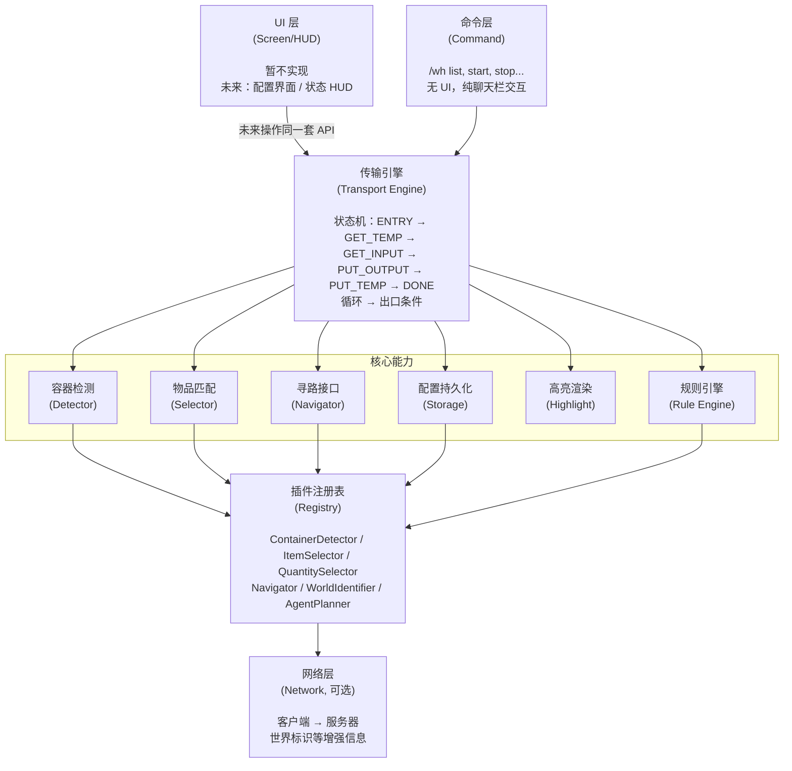
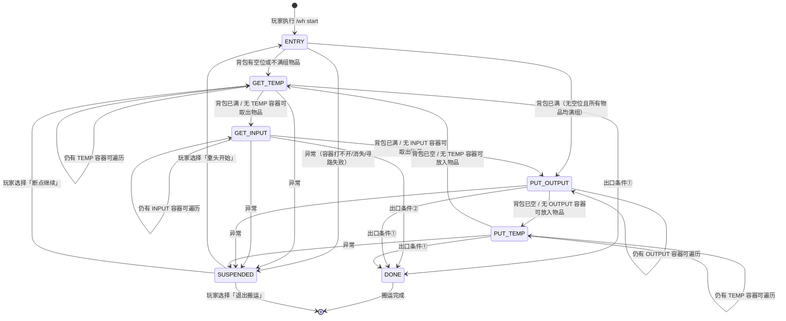

# Yuanlu Warehouse — 产品设计文档 v0.1

## 1. 概述

Minecraft Fabric 模组，**纯客户端即可独立运行**，服务端可选装仅用于信息增强（如世界标识等标准 MC 客户端无法获取的信息）。玩家通过定义仓库（容器集合 + 规则），由模组驱动玩家背包作为媒介，自动完成从 INPUT 容器取出物品 → 放入 OUTPUT/TEMP 容器的搬运流程。高度模块化设计，全部功能通过 API 接口解耦，命令层与（未来）UI 层操作同一套 API，支持附属 mod 扩展。

## 2. 架构分层



## 3. 核心数据模型

### 3.1 仓库 (Warehouse)

```java
Warehouse {
    id: String                    // 唯一标识
    anchor: Map<WorldDim, Pos>    // 每个 (world,dim) 的基准点
    containers: List<ContainerInfo>
    rules: Map<String, ContainerRule>  // 本仓库内定义的规则（key = ruleId）
    active: boolean               // 是否当前激活的仓库
}
```

- 仓库可跨维度，每个 `(world, dim)` 有一个基准点
- 容器的 pos 存为**相对坐标**（相对于该维度基准点），便于整体偏移
- `rules` 字段使得规则可以在仓库级别定义，也可在全局共享（见 §9 配置持久化）

### 3.2 容器信息 (ContainerInfo)

```java
ContainerInfo {
    pos: WorldDimPos[]            // (world, dim, x, y, z) 5-tuple，支持多格容器
    ioType: IOType                // INPUT | OUTPUT | TEMP | IGNORE
    ruleMode: RuleMode            // WHITELIST | BLACKLIST
    rules: String[]               // 引用的 ContainerRule id
    cacheType: CacheType          // NONE | MEMORY | DISK
    priority: Priority            // hardPriority + softPriority
    label: String                 // 可选标签，用于高亮显示和日志
}
```

**IOType 枚举**：

| 类型   | 含义                                        | 取出 | 放入 | 默认 ruleMode |
| ------ | ------------------------------------------- | ---- | ---- | ------------- |
| INPUT  | 输入容器（物资产出点）                      | ✅   | ❌   | BLACKLIST     |
| OUTPUT | 输出容器（存储/机器输入）                   | ❌   | ✅   | WHITELIST     |
| TEMP   | 中转容器                                    | ✅   | ✅   | BLACKLIST     |
| IGNORE | 跳过（不出现在搬运流程中，仅用于高亮/标记） | ❌   | ❌   | —             |

**多格容器关联机制**：一个 `ContainerInfo.pos` 可包含多个坐标，这些坐标被视为**同一个逻辑容器**的多格（如大箱子 2 格、用户选中的多个末影箱关联为同一容器）。识别器（`ContainerDetector.resolveMultiBlock`）负责自动检测多格关系；用户也可手动将多个坐标归入同一个 `ContainerInfo.pos` 数组。搬运时，引擎会依次打开每个坐标的 UI 并操作，但逻辑上视为同一个容器（共享缓存、共享规则判定）。

### 3.3 容器规则 (ContainerRule)

```java
ContainerRule {
    id: String                    // 唯一标识
    itemRules: ItemRule[]         // 物品规则列表
}
```

### 3.4 物品规则 (ItemRule)

```java
ItemRule {
    selector: ItemSelector        // 匹配物品
    negative: boolean             // 反选
    quantity: QuantitySelector    // 数量控制
}
```

### 3.5 物品选择器 (ItemSelector) — 接口

```java
public interface ItemSelector {
    /** 判断给定的物品堆是否匹配此选择器 */
    boolean matches(ItemStack stack);
}
```

| 内置实现          | JSON 示例                                           | 匹配逻辑              |
| ----------------- | --------------------------------------------------- | --------------------- |
| IdSelector        | `{"type":"id","value":"minecraft:diamond"}`         | 物品 ID 精确匹配      |
| TagSelector       | `{"type":"tag","value":"minecraft:logs"}`           | 物品标签匹配          |
| NameSelector      | `{"type":"name","value":"钻石","fuzzy":true}`       | 显示名称模糊/精确匹配 |
| NbtSelector       | `{"type":"nbt","value":"{...}"}`                    | NBT 子集匹配          |
| CompositeSelector | `{"type":"composite","op":"AND","selectors":[...]}` | AND/OR/NOT 组合       |

**CompositeSelector 的 op 取值**：`AND`（全部匹配）、`OR`（任一匹配）、`NOT`（全部不匹配，即取反嵌套）。

### 3.6 数量选择器 (QuantitySelector) — 接口

```java
public interface QuantitySelector {
    /**
     * 计算匹配该 selector 的物品在容器中应保留的目标数量。
     * delta = target - current，正数需放入，负数需取出。
     * 返回空 map 代表刚好满足要求，无需操作。
     *
     * @param currentCount  当前容器中各 slot 该物品的数量（只含匹配 slot）
     * @param totalSlots    容器总槽位数
     * @param maxStackSize  该物品的最大堆叠数
     * @return 各 slot 应保留的目标数量（key = slotIndex, value = 目标数量）
     */
    Int2IntMap computeTargetQuantity(Int2IntMap currentCount, int totalSlots, int maxStackSize);
}
```

| 内置实现          | JSON 示例                         | 含义                                                          |
| ----------------- | --------------------------------- | ------------------------------------------------------------- |
| CountSelector     | `{"type":"count","value":64}`     | 保持该物品总量不超过 64 个（OUTPUT 方向上限，INPUT 方向下限） |
| GroupSelector     | `{"type":"group","value":3}`      | 保持 3 组（`<物品最大堆叠数> * 3`）                           |
| FillSlotsSelector | `{"type":"fill_slots","value":5}` | 填充到只剩 5 个空格                                           |
| PercentSelector   | `{"type":"percent","value":75}`   | 填充到容器 75% 容量                                           |

**语义方向**：`computeTargetQuantity` 返回的 delta 符号决定方向 —— 负数表示需要取出（INPUT/GET 方向），正数表示需要放入（PUT 方向）。同一个 QuantitySelector 在 INPUT 和 OUTPUT 容器上均可使用，引擎根据 delta 符号决定操作类型。

### 3.7 默认规则

| 容器类型 | ruleMode  | 规则 | 行为                                   |
| -------- | --------- | ---- | -------------------------------------- |
| INPUT    | BLACKLIST | 空   | 允许任意物品取出，尽量清空             |
| TEMP     | BLACKLIST | 空   | 允许任意物品取出和放入（杂项箱）       |
| OUTPUT   | WHITELIST | 空   | 默认不允许任何物品放入（必须明确配置） |
| IGNORE   | —         | —    | 跳过，不参与搬运                       |

### 3.8 容器内存 (ContainerMemory)

```java
ContainerMemory {
    pos: WorldDimPos              // 容器坐标
    snapshot: ContainerSnapshot   // 最后一次扫描的快照
    cacheType: CacheType          // 缓存类型
    lastAccessTime: long          // 最后访问时间戳
    explored: boolean             // 是否已被扫描过
}

ContainerSnapshot {
    slots: Map<Integer, ItemStack>  // slotIndex → 物品堆（空位不包含）
    title: String                   // 容器 UI 标题（用于识别）
    slotCount: int                  // 总槽位数
}
```

**内存生命周期**：

- 当玩家打开一个容器时，引擎通过 Mixin 拦截 `Screen.onClose()`，自动创建/刷新 `ContainerMemory`
- 缓存是惰性的：引擎需要某个容器的内容时，先检查 `ContainerMemory` 是否有有效缓存；有则直接使用，无则尝试打开容器扫描
- 缓存有效性判断：
  - `NONE`：只在当前搬运轮次内有效，轮次结束后清除
  - `MEMORY`：随游戏 Session 生命周期，退出世界/服务器时清除
  - `DISK`：持久化到文件系统，重启后重新加载；当用户主动打开容器时刷新

### 3.9 传输计划 (TransferPlan)

**注意**：`TransferPlan` 不是持久化数据模型，而是传输引擎运行时产生的**一次操作计划**，用于指导引擎执行具体操作。

```java
/** 一次搬运操作的计划：包含多个物品移动指令 */
TransferPlan {
    direction: PlanDirection       // TO_PLAYER | TO_CONTAINER
    moves: List<ItemMove>
}

/** 单个物品移动指令 */
ItemMove {
    targetPos: WorldDimPos         // 目标容器坐标
    targetSlot: int                // 目标槽位（-1 表示自动分配）
    item: ItemStack                // 要移动的物品
    amount: int                    // 移动数量
    priority: int                  // 执行优先级（同一 plan 内的排序）
}

/** 计划方向 —— 决定操作方向 */
enum PlanDirection {
    TO_PLAYER,     // 从容器 → 玩家背包（取出）
    TO_CONTAINER   // 从玩家背包 → 容器（放入）
}
```

引擎的每个阶段（GET_TEMP / GET_INPUT / PUT_OUTPUT / PUT_TEMP）都会生成一个 `TransferPlan`，然后逐条执行 `ItemMove`。`PlanDirection` 使得同一段执行代码可以处理取出和放入两种操作，避免重复逻辑。

## 4. 传输引擎 (Transport Engine)

### 4.1 状态定义

```java
/** 搬运状态枚举 */
enum TransportState {
    /** 入口决策：判断背包是否有空位/不满组物品 */
    ENTRY,
    /** 从 TEMP 容器取出物品到背包 */
    GET_TEMP,
    /** 从 INPUT 容器取出物品到背包 */
    GET_INPUT,
    /** 从背包放入物品到 OUTPUT 容器 */
    PUT_OUTPUT,
    /** 从背包放入物品到 TEMP 容器 */
    PUT_TEMP,
    /** 出口条件满足，搬运结束 */
    DONE,
    /** 异常发生，搬运暂停 */
    SUSPENDED
}
```

### 4.2 状态机



**出口条件**：

- ① `(OUTPUT 全满 && TEMP 全满)`
- ② `(INPUT 全空)`

全满指——对于 OUTPUT/TEMP，所有容器均无空位且无不满组物品，或不满组物品在 INPUT 侧找不到可以合并的物品了；
全空指——对于 INPUT，所有容器均无物品可取出。

### 4.3 状态机详细逻辑

**ENTRY**：

1. 获取当前激活仓库的容器列表
2. 检测玩家背包是否有空位或不满组的物品
3. 有空位 → GET_TEMP；无空位 → PUT_OUTPUT

**GET_TEMP / GET_INPUT**（取出阶段）：

```
生成 TransferPlan(TO_PLAYER):
  遍历容器列表（按硬优先级降序）：
    对每个容器：
      1. 检查缓存 → 若缓存有效且无物品可取出，跳过
      2. 寻路前往容器位置
      3. 打开容器，扫描内容 → 刷新缓存
      4. 根据规则引擎计算可取出物品列表
      5. 将可取出物品加入 TransferPlan.moves
      6. 若背包已满（预估），停止遍历
  所有容器遍历完毕 → 执行 TransferPlan → 进入下一状态
```

**PUT_OUTPUT / PUT_TEMP**（放入阶段）：

```
生成 TransferPlan(TO_CONTAINER):
  遍历容器列表（按硬优先级降序）：
    对每个容器：
      1. 检查缓存 → 若缓存有效且无空位可放入，跳过
      2. 寻路前往容器位置
      3. 打开容器，扫描内容 → 刷新缓存
      4. 根据规则引擎和背包物品计算可放入物品列表
      5. 将可放入物品加入 TransferPlan.moves
      6. 若背包已空（预估），停止遍历
  所有容器遍历完毕 → 执行 TransferPlan → 进入下一状态
```

**TransferPlan 执行流程**：

```
对 TransferPlan.moves 中的每条 ItemMove：
  1. 确保目标容器 UI 已打开（若未打开则重新打开）
  2. 根据 PlanDirection 执行操作：
     TO_PLAYER:    menu.clicked(slot, 0, QUICK_MOVE, player)
     TO_CONTAINER: menu.clicked(slot, 0, QUICK_MOVE, player)
  3. 等待服务器响应（tick 循环检测 UI 状态变化）
  4. 记录操作结果，更新缓存
```

**轮次追踪**：

引擎维护两个标志位来检测是否陷入死循环：

```
roundHadAction: boolean     // 本轮是否有任何物品被移动
roundHadNewExplore: boolean // 本轮是否有新容器被首次探索

如果连续两轮 roundHadAction == false && roundHadNewExplore == false：
  → 判定为"无进展"，自动终止搬运并报告
```

### 4.4 缓存机制

**三级缓存**：

| 类型   | 清除时机                 | 适用场景                             |
| ------ | ------------------------ | ------------------------------------ |
| NONE   | 搬运轮次结束时           | 机器入口/出口等频繁变化的容器        |
| MEMORY | 退出世界/服务器时        | 普通箱子等在一个游戏会话内不变的内容 |
| DISK   | 用户主动清除或重新打开时 | 长期存储区域，如仓库主存储区         |

**缓存规则**：

- 缓存是惰性的：需要容器内容时，有缓存用缓存，无缓存则打开容器扫描
- 任何被动操作（因搬运需要打开容器）都会刷新缓存
- 通过 Mixin 拦截 `Screen.onClose()` 可以自动刷新缓存（即使不是由引擎触发的打开）
- `NONE` 缓存在搬运轮次结束后清除，但搬运轮次内可重复使用以节省操作

### 4.5 异常处理

**异常类型**：

| 异常       | 触发条件                         | 处理方式       |
| ---------- | -------------------------------- | -------------- |
| 容器打不开 | 右键点击方块后未出现预期 UI      | 暂停，提示玩家 |
| 容器消失   | 坐标处无方块或方块类型与预期不符 | 暂停，提示玩家 |
| 寻路失败   | Navigator 返回 FAILED            | 暂停，提示玩家 |
| UI 不匹配  | 打开的 UI 标题/槽位数与预期不符  | 暂停，提示玩家 |

**恢复选项**：

```
暂停搬运 → 玩家处理后选择：
  1. 重头开始（重置所有状态，重新 ENTRY）
  2. 断点继续（跳过出错的容器，继续当前轮次）
  3. 退出搬运（终止）
```

### 4.6 多仓库流转

**支持场景**：将一个仓库整体视为 INPUT 源，搬空后输入到另一个仓库的 OUTPUT 中。

```
/wh transfer <源仓库> <目标仓库> start   # 开始跨仓库搬运
/wh transfer status                      # 查看跨仓库搬运状态
/wh transfer stop                        # 停止跨仓库搬运
```

实现方式：`transfer` 命令将源仓库的**所有容器临时视为 INPUT**（无视其原本的 ioType），将目标仓库的**所有容器临时视为 OUTPUT**（无视其原本的 ioType），然后启动标准状态机流程。搬运完成后恢复原配置。

其他多仓库场景（如仓库间平衡、管道式流转）暂不考虑，留待后续扩展。

### 4.7 范围选择

用户可以框选一片区域，批量设置容器类型/规则，并可选地交由 AgentPlanner 细化配置。

**命令接口**：

```
/wh select start                           # 进入框选模式（提示点击第一个点）
/wh select end                             # 完成框选
/wh select expand <n> <dir>                # 向指定方向扩展选区
/wh select show                            # 高亮显示当前选区
/wh select set-type <INPUT|OUTPUT|TEMP|IGNORE>  # 批量设置框选内所有容器的类型
/wh select set-rule <rule-id>              # 批量关联规则
/wh select set-cache <NONE|MEMORY|DISK>    # 批量设置缓存类型
/wh select plan                            # 交由 AgentPlanner 自动配置
```

框选通过玩家依次点击两个对角点确定一个长方体区域，自动扫描区域内所有已注册类型的容器，加入当前仓库。

### 4.8 高亮系统

高亮系统用于在游戏世界中可视化显示容器类型和状态，帮助玩家快速了解仓库布局。

**高亮类型**：

| 类型            | 颜色 | 说明                     |
| --------------- | ---- | ------------------------ |
| INPUT_OUTLINED  | 红色 | INPUT 容器轮廓           |
| OUTPUT_OUTLINED | 绿色 | OUTPUT 容器轮廓          |
| TEMP_OUTLINED   | 黄色 | TEMP 容器轮廓            |
| IGNORE_OUTLINED | 灰色 | IGNORE 容器轮廓          |
| HAS_SPACE       | 青色 | 容器有空位（运行时临时） |
| FULL            | 白色 | 容器已满（运行时临时）   |
| UNKNOWN         | 紫色 | 未扫描过的容器           |

**实现方式**：

通过 Mixin 注入 `WorldRenderer.collectPerFrameGizmos`，使用 Minecraft 26.1+ 的 Gizmos API 渲染容器轮廓线框。`HighlightManager` 维护一个 `Map<BlockPos, HighlightType>`，引擎在每个 tick 更新此映射，渲染器读取并绘制。

一阶段可以不实现高亮系统，留待后续。

### 4.9 事件总线

事件总线用于解耦传输引擎和 UI/命令层，使得未来 UI 层可以监听引擎状态变化而无需直接依赖引擎实现。

```java
interface WarehouseEventBus {
    /** 搬运状态变化时触发 */
    void onTransportStateChanged(TransportState oldState, TransportState newState);
    /** 搬运进度更新时触发（当前操作描述） */
    void onProgressUpdate(String description);
    /** 异常发生时触发 */
    void onError(WarehouseException exception);
    /** 单次 ItemMove 完成时触发 */
    void onItemMoved(ItemMove move, boolean success);
    /** 仓库配置变更时触发 */
    void onWarehouseChanged(Warehouse warehouse);
    /** 高亮数据更新时触发 */
    void onHighlightChanged(Map<BlockPos, HighlightType> highlights);
}
```

一阶段命令层直接实现 `WarehouseEventBus` 接口，将事件输出为聊天栏文字。未来 UI 层可以替换此实现，通过 HUD/Screen 显示。

## 5. 寻路系统 (Navigation)

### 5.1 接口

```java
interface Navigator {
    String id();
    PathResult start(Goal goal);       // 开始寻路
    PathStatus tick();                 // 每 tick 更新状态，由引擎在游戏 tick 中调用
    void cancel();
}

PathResult {
    boolean success;
    String message;                    // 给玩家的提示信息
}

enum PathStatus {
    MOVING,      // 正在移动中
    ARRIVED,     // 已到达目标
    FAILED,      // 寻路失败（无法到达）
    CANCELLED    // 被取消
}

Goal {
    WorldDimPos target;                // 目标坐标
    double acceptableDistance;         // 可接受的距离（格数）
}
```

### 5.2 一阶段实现: NoOpNavigator

- `start()`: 打印 `[Warehouse] §a请前往: (world, dim, x, y, z)`，返回 `PathResult(success=true)`
- `tick()`: 检测玩家位置，距离目标 < 4 格返回 `ARRIVED`，否则返回 `MOVING`
- 由玩家自行前往目标，引擎不做任何自动移动

### 5.3 后续扩展（二阶段）

| 寻路器                 | 方式       | 说明                               |
| ---------------------- | ---------- | ---------------------------------- |
| SimpleWalkExecutor     | 走路       | 模拟 WASD 按键，向目标移动         |
| CreativeFlightExecutor | 创造飞行   | 在创造模式下直接飞行               |
| PortalExecutor         | 地狱门交通 | 利用地狱门缩短距离                 |
| ElytraExecutor         | 鞘翅飞行   | 使用烟花火箭推进                   |
| CommandExecutor        | 指令传送   | 使用 `/tp` 指令（需 OP 权限）      |
| HybridExecutor         | 组合       | 自动检测游戏模式，选择最佳寻路方式 |

寻路模块设计为独立库，可被其他 mod 复用。

## 6. 容器检测系统

### 6.1 接口

```java
interface ContainerDetector {
    String id();

    /** 判断当前打开的 Screen 是否匹配此容器类型 */
    boolean matches(Screen screen);

    /** 扫描当前打开 Screen 的内容，返回容器快照 */
    ContainerSnapshot scan(Screen screen);

    /** 是否能从此容器取出物品 */
    boolean canInput(Screen screen);

    /** 是否能向此容器放入物品 */
    boolean canOutput(Screen screen);

    /** 解析多格容器：给定一组坐标，返回合并后的 ContainerInfo */
    ContainerInfo resolveMultiBlock(BlockPos[] positions);
}
```

### 6.2 容器打开与交互流程

引擎通过以下步骤与容器交互：

1. **打开容器**：模拟玩家右键点击方块（`GameMode.useItemOn` 或 `InteractBlockC2SPacket`）
2. **等待响应**：等待服务器返回 `ScreenHandler` 和 `Screen`，通过 `Screen.getTitle()` 和槽位数确认 UI 匹配
3. **读取内容**：通过 `ScreenHandler.slots` 遍历所有槽位，读取 `ItemStack`
4. **执行操作**：使用 `ScreenHandler.clicked(slot, button, actionType, player)` 执行物品移动
   - 取出：`clicked(slot, 0, QUICK_MOVE, player)` 将物品从容器移到背包
   - 放入：`clicked(slot, 0, QUICK_MOVE, player)` 将物品从背包移到容器
5. **关闭 UI**：`player.closeScreen()` 或等待操作完成后自动关闭

**关键约束**：所有操作必须在客户端打开 UI 后才能进行，且需要等待服务器响应。引擎通过 tick 循环检测 UI 状态变化，每次操作后等待 1-2 tick 确保数据同步。

### 6.3 一阶段内置实现

| 容器类型           | 检测方式                                         | 特殊处理                   |
| ------------------ | ------------------------------------------------ | -------------------------- |
| 箱子/大箱子/陷阱箱 | 匹配 `GenericContainerScreen`，槽位数 27/54/双倍 | 大箱子自动检测双格并关联   |
| 漏斗/投掷器/发射器 | 匹配 `GenericContainerScreen` + 特定槽位数       | —                          |
| 熔炉/高炉/烟熏炉   | 匹配 `FurnaceScreen`                             | 三格特殊（输入/燃料/输出） |
| 酿造台             | 匹配 `BrewingStandScreen`                        | 5 格                       |
| 潜影盒             | 匹配 `ShulkerBoxScreen`                          | 27 格，视为普通容器        |
| 末影箱             | 匹配 `GenericContainerScreen` + 标题             | 27 格，内容因玩家而异      |
| 玩家背包           | 特殊处理，使用 `PlayerInventory`                 | 搬运媒介，非固定容器       |

**玩家背包**作为搬运过程中的媒介容器，不与 `ContainerInfo` 对应。引擎直接操作 `Player.getInventory()` 来读取和修改背包内容。

### 6.4 容器物品（潜影盒/储物袋）处理

**一阶段**：将所有容器物品视为普通物品，不拆解其内部内容。潜影盒作为一个整体物品单元被搬运。

**后续阶段**（暂不实现）：

- 拆出模式：将潜影盒放在地上，打开取出/放入内部物品，再回收空盒
- 整箱模式：保持现状，整体搬运
- 通过规则优先级在两种模式间选择
- 需要处理落地位置、掉落物安全性、多类物品按规则分流等复杂逻辑

### 6.5 Mixin 注入点

以下 Mixin 注入点是实现容器检测和交互所必需的：

| 目标类                | 注入点                  | 用途                                                   |
| --------------------- | ----------------------- | ------------------------------------------------------ |
| `Screen`              | `onClose()`             | 当任意容器 UI 关闭时，自动刷新 ContainerMemory 快照    |
| `WorldRenderer`       | `collectPerFrameGizmos` | 渲染容器高亮轮廓（一阶段不实现）                       |
| `MultiPlayerGameMode` | `useItemOn`             | 监控玩家右键点击方块，用于自动打开容器（一阶段不实现） |

## 7. 插件系统 (Plugin API)

### 7.1 注册接口

```java
interface WarehousePlugin {
    void register(Registry registry);
}
```

通过 Fabric 的 `entrypoint` 机制加载：

```json
// fabric.mod.json (附属mod)
"entrypoints": {
    "warehouse-plugin": ["com.example.MyWarehousePlugin"]
}
```

### 7.2 可注册的扩展点

| 扩展点     | 接口                | 说明                                                  |
| ---------- | ------------------- | ----------------------------------------------------- |
| 容器检测器 | `ContainerDetector` | 识别新类型容器（如 AE 存储网络、其他 mod 的特殊容器） |
| 物品选择器 | `ItemSelector`      | 新的物品匹配方式                                      |
| 数量选择器 | `QuantitySelector`  | 新的数量控制方式                                      |
| 寻路器     | `Navigator`         | 新的寻路算法                                          |
| 世界标识器 | `WorldIdentifier`   | 多世界支持，返回当前 (world, dim) 标识                |
| 仓库规划器 | `AgentPlanner`      | AI/规则引擎自动规划仓库配置                           |

### 7.3 AgentPlanner 接口

```java
interface AgentPlanner {
    String id();
    void plan(Warehouse warehouse, PlanningContext context);
    // 可增删改查仓库所有配置：物品选择、容器设置、寻路设置等
}
```

LLM API 作为一种内置实现，附属 mod 可通过此接口接入规则引擎等。

### 7.4 规则引擎 (Rule Engine)

规则引擎不属于"插件"，而是传输引擎的核心子模块，但附属 mod 可以通过注册新的 `ItemSelector`/`QuantitySelector` 来扩展规则能力。

**核心职责**：

```
输入：容器快照(ContainerSnapshot) + 容器规则(ContainerRule[]) + 玩家背包内容
输出：TransferPlan（包含所有可执行的操作）

处理流程：
  1. 对于容器中的每个槽位：
     a. 对每个关联的 ContainerRule，遍历其 ItemRule[]
     b. 用 ItemSelector.matches() 判断槽位物品是否匹配
     c. 匹配后，用 QuantitySelector.computeTargetQuantity() 计算目标数量
     d. 计算 delta = target - current，确定操作方向
  2. 对于反选规则（negative=true），先正常匹配再取反结果
  3. 合并所有 delta 结果，生成 TransferPlan
```

**TEMP 容器的特殊规则**：

TEMP 容器同时参与取出和放入两个阶段，其行为取决于当前阶段：

- `GET_TEMP` 阶段：按 `BLACKLIST + 空规则` 取出任意物品，优先取那些匹配 OUTPUT 规则（说明 OUTPUT 需要）的物品
- `PUT_TEMP` 阶段：放入背包中所有无法放入 OUTPUT 的多余物品

## 8. 命令系统

### 8.1 命令树

| 命令                                                  | 功能                     | 一阶段 |
| ----------------------------------------------------- | ------------------------ | ------ |
| `/wh list`                                            | 列出所有仓库             | ✅     |
| `/wh create <name>`                                   | 创建新仓库               | ✅     |
| `/wh remove <name>`                                   | 删除仓库                 | ✅     |
| `/wh use <name>`                                      | 激活指定仓库             | ✅     |
| `/wh status`                                          | 查看当前仓库状态         | ✅     |
| `/wh show`                                            | 高亮显示当前仓库所有容器 | ✅     |
| `/wh start`                                           | 开始搬运                 | ✅     |
| `/wh stop`                                            | 暂停搬运                 | ✅     |
| `/wh continue`                                        | 断点继续                 | ✅     |
| `/wh rule list`                                       | 列出所有规则             | ✅     |
| `/wh rule create <id>`                                | 创建新规则               | ✅     |
| `/wh rule delete <id>`                                | 删除规则                 | ✅     |
| `/wh rule show <id>`                                  | 显示规则详情             | ✅     |
| `/wh rule add <id> <selector> [--negate] [--count N]` | 为规则添加物品条目       | ✅     |
| `/wh rule remove <id> <index>`                        | 移除规则中的条目         | ✅     |
| `/wh container add <pos> [--type] [--rule]`           | 添加容器                 | ✅     |
| `/wh container remove <pos>`                          | 移除容器                 | ✅     |
| `/wh container list`                                  | 列出当前仓库所有容器     | ✅     |
| `/wh container type <pos> <type>`                     | 设置容器类型             | ✅     |
| `/wh container mode <pos> <mode>`                     | 设置容器的 ruleMode      | ✅     |
| `/wh container memory <pos>`                          | 查看容器缓存状态         | ✅     |
| `/wh container memory clear <pos>`                    | 清除容器缓存             | ✅     |
| `/wh container rules <pos> <add/remove> <ruleId>`     | 管理容器关联的规则       | ✅     |
| `/wh select start`                                    | 进入框选模式             | ✅     |
| `/wh select end`                                      | 完成框选                 | ✅     |
| `/wh select expand <n> <dir>`                         | 向指定方向扩展选区       | ✅     |
| `/wh select show`                                     | 高亮显示当前选区         | ✅     |
| `/wh select set-type <t>`                             | 批量设置框选容器类型     | ✅     |
| `/wh select set-rule <r>`                             | 批量关联规则             | ✅     |
| `/wh select set-cache <c>`                            | 批量设置缓存类型         | ✅     |
| `/wh select plan`                                     | 交由 Agent 自动配置      | ✅     |
| `/wh transfer <src> <dst>`                            | 跨仓库搬运               | ✅     |
| `/wh reload`                                          | 重载配置文件             | ✅     |
| `/wh config show`                                     | 显示当前配置             | ✅     |
| `/wh config set <key> <value>`                        | 设置配置项               | ✅     |

复杂配置通过 JSON 文件编辑，命令仅做常用操作。

### 8.2 命令别名

- `/wh` 是 `/warehouse` 的别名，两个均可使用

### 8.3 命令输出格式

所有命令输出通过聊天栏以 `§` 颜色代码格式化：

```
§6[仓库] §a仓库 "main" 已激活
§6[仓库] §c错误: 未指定容器坐标
§6[仓库] §e搬运已暂停，使用 /wh continue 继续
```

## 9. 配置持久化

### 9.1 文件结构

```
config/yuanlu-warehouse/
├── warehouses/           # 仓库定义
│   ├── main.json         # 仓库 "main" 的配置
│   └── mining.json       # 仓库 "mining" 的配置
├── rules/                # 全局规则（可被多个仓库引用）
│   ├── ores.json         # 矿石规则
│   └── building.json     # 建材规则
├── config.json           # 全局配置（ModConfig + WorldConfig）
└── cache/                # 磁盘缓存
    └── ...               # 自动生成，不清除
```

### 9.2 序列化格式

使用 Gson 进行 JSON 序列化/反序列化。由于 `ItemSelector` 和 `QuantitySelector` 是接口，需使用自定义 TypeAdapter 实现多态反序列化：

```json
{
  "type": "id",
  "value": "minecraft:diamond"
}
```

TypeAdapter 根据 `type` 字段值分发到对应的实现类。

### 9.3 仓库配置 JSON 示例

```json
{
  "id": "main",
  "anchor": {
    "minecraft:overworld": { "x": 0, "y": 64, "z": 0 }
  },
  "containers": [
    {
      "pos": [{ "world": "minecraft:overworld", "x": 10, "y": 64, "z": 20 }],
      "ioType": "OUTPUT",
      "ruleMode": "WHITELIST",
      "rules": ["ores"],
      "cacheType": "DISK",
      "priority": { "hard": 10, "soft": 5 },
      "label": "主存储箱-1"
    }
  ],
  "rules": {
    "ores": {
      "id": "ores",
      "itemRules": [
        {
          "selector": { "type": "tag", "value": "minecraft:coal_ores" },
          "negative": false,
          "quantity": { "type": "count", "value": 64 }
        }
      ]
    }
  },
  "active": true
}
```

### 9.4 全局配置

```json
{
  "debug": false,
  "defaultInteractionSpeed": 2,
  "worlds": {
    "minecraft:overworld": {
      "interactionSpeed": 2,
      "pathfinder": "noop"
    },
    "minecraft:the_nether": {
      "interactionSpeed": 3,
      "pathfinder": "noop"
    }
  }
}
```

全局配置分为 `ModConfig`（模组级）和 `WorldConfig`（世界级）两部分：

| 配置项                       | 类型    | 默认值 | 说明                                     |
| ---------------------------- | ------- | ------ | ---------------------------------------- |
| debug                        | boolean | false  | 是否输出调试日志                         |
| defaultInteractionSpeed      | int     | 2      | 默认交互速度（每次操作后的 tick 等待数） |
| worlds[dim].interactionSpeed | int     | 2      | 特定维度的交互速度                       |
| worlds[dim].pathfinder       | String  | "noop" | 特定维度使用的寻路器                     |

## 10. 包结构规划

```
src/main/java/bid/yuanlu/mc/warehouse/
├── api/                        # 公开 API 接口
│   ├── container/              # ContainerDetector, ContainerInfo, IOType
│   ├── item/                   # ItemSelector, QuantitySelector, ItemRule
│   ├── warehouse/              # Warehouse, WarehouseManager
│   ├── transport/              # TransportEngine, TransportState, TransferPlan
│   ├── navigation/             # Navigator, Goal, PathStatus
│   ├── plugin/                 # WarehousePlugin, Registry, AgentPlanner
│   └── world/                  # WorldIdentifier, WorldDim
├── core/                       # 核心实现
│   ├── registry/               # 插件注册表实现
│   ├── warehouse/              # WarehouseManagerImpl
│   ├── transport/              # TransportEngineImpl (状态机)
│   ├── engine/                 # 规则引擎
│   │   ├── rule/               # RuleApplicator, ItemMatcher, QuantityCalculator
│   │   └── container/          # ContainerInteractor, ContainerMemoryManager
│   ├── cache/                  # 三级缓存管理
│   ├── highlight/              # HighlightManager, ContainerOutlineRenderer
│   ├── event/                  # WarehouseEventBus 实现
│   └── config/                 # JSON 读写 + 配置管理
├── impl/                       # 内置实现
│   ├── selector/               # IdSelector, TagSelector, NameSelector, NbtSelector, CompositeSelector
│   ├── quantity/               # CountSelector, GroupSelector, FillSlotsSelector, PercentSelector
│   ├── container/              # 原版箱子/熔炉/潜影盒等检测器
│   ├── navigation/             # NoOpNavigator
│   └── agent/                  # LLM AgentPlanner 实现
├── command/                    # /wh 命令实现
│   ├── WarehouseCommand.java   # 主命令入口
│   └── sub/                    # 子命令
│       ├── WarehouseSubCommand.java
│       ├── ContainerSubCommand.java
│       ├── RuleSubCommand.java
│       ├── SelectSubCommand.java
│       ├── RunSubCommand.java
│       └── ConfigSubCommand.java
├── network/                    # 客户端→服务器通信（可选增强）
├── mixin/                      # 必要的 Mixin
│   ├── ContainerScreenMixin.java
│   ├── WorldRendererMixin.java
│   └── MultiPlayerGameModeMixin.java
├── util/                       # 工具类
│   ├── CoordinateUtils.java    # 相对/绝对坐标转换
│   └── Constants.java          # 常量定义
├── YuanluWarehouse.java        # ModInitializer 入口
└── YuanluWarehouseClient.java  # ClientModInitializer 入口（在 src/client 中）
```

## 11. 一阶段实现范围

| 模块                  | 实现程度            | 说明                                                                  |
| --------------------- | ------------------- | --------------------------------------------------------------------- |
| **核心 API 接口定义** | 全部定义            | 包括所有 `api/` 下的接口和枚举                                        |
| **数据模型**          | 全部实现            | Warehouse, ContainerInfo, ContainerRule, ItemRule, ItemSelector 等    |
| **仓库管理 (CRUD)**   | 完整实现            | WarehouseManager 的创建/读取/更新/删除/激活                           |
| **容器检测**          | 完整实现            | 原版常见容器（箱子/熔炉/漏斗/酿造台/潜影盒/末影箱/背包）              |
| **物品选择器**        | 完整实现            | IdSelector, TagSelector, NameSelector, NbtSelector, CompositeSelector |
| **数量选择器**        | 完整实现            | CountSelector, GroupSelector, FillSlotsSelector, PercentSelector      |
| **传输引擎**          | 完整实现            | 完整状态机 + 优先级遍历 + TransferPlan + 轮次追踪                     |
| **规则引擎**          | 完整实现            | RuleApplicator 根据规则和容器内容生成 TransferPlan                    |
| **容器内存**          | 完整实现            | 三级缓存 + Mixin 自动快照 + 惰性加载                                  |
| **容器交互**          | 完整实现            | 打开/扫描/读取/操作/关闭                                              |
| **命令系统**          | 基础命令            | 所有 §8.1 表格中标记 ✅ 的命令                                        |
| **寻路**              | NoOpNavigator       | 仅打印提示，玩家自行前往                                              |
| **配置持久化**        | 完整实现            | Gson 序列化 + 文件系统存储                                            |
| **事件总线**          | 接口定义 + 基础实现 | 输出到聊天栏                                                          |
| **插件注册表**        | 框架搭建            | 基础注册能力，无需实际插件                                            |
| **高亮系统**          | 不实现              | 留待后续                                                              |
| **AgentPlanner**      | 接口定义，不实现    | 留待后续                                                              |
| **容器物品拆解**      | 不实现              | 视为普通物品整体搬运                                                  |
| **网络层**            | 不实现              | 留待后续                                                              |
| **UI**                | 不实现              | 留待后续                                                              |

## 12. 设计决策记录

### 12.1 为什么状态机顺序是 GET_TEMP → GET_INPUT → PUT_OUTPUT → PUT_TEMP？

1. **先取 TEMP**：TEMP 容器中的物品通常是上一轮搬运的多余物品，优先清空 TEMP 可以最大化利用背包空间
2. **再取 INPUT**：从 INPUT 获取新物品
3. **先放 OUTPUT**：优先将物品放入规则定义的 OUTPUT 容器
4. **再放 TEMP**：所有 OUTPUT 放不下或不符合规则的多余物品放入 TEMP

### 12.2 为什么 TEMP 既参与取出又参与放入？

TEMP 是中转容器，设计为"杂项箱"。当 OUTPUT 规则明确时，TEMP 中可能正好有 OUTPUT 需要的物品（比如玩家之前手动放入的），所以优先从 TEMP 取出。当 OUTPUT 放不下时，多余的物品回到 TEMP。

### 12.3 为什么使用 TransferPlan 而非直接操作？

TransferPlan 将「计算」和「执行」分离：

- 计算阶段：根据规则和容器内容，计算出所有需要执行的操作，生成 TransferPlan
- 执行阶段：逐条执行 ItemMove，处理异常和重试

这种分离使得：

- 可以在执行前预览操作
- 可以在执行失败时精准恢复
- 便于日志记录和调试

### 12.4 为什么使用 Mixin 而非直接发包？

纯客户端 mod 无法直接访问服务端 Inventory。通过 Mixin 拦截 `Screen.onClose()` 可以在玩家（或引擎）关闭容器 UI 时自动快照容器内容，无需额外发包。这是纯客户端 mod 获取容器内容的标准做法。
