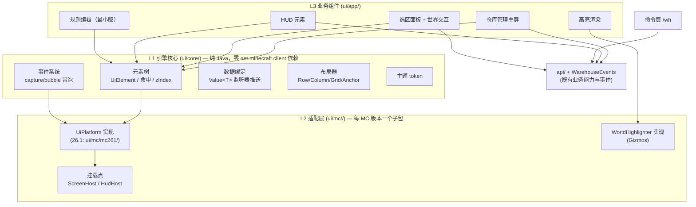

# Yuanlu Warehouse — UI 层设计文档 v0.1

> 本文档是 `doc/PDD.md` 的 UI 层专篇。主 PDD §2 中「UI 层暂不实现」的预留位由此文档接管。
> 设计依据：`doc/ui-research.md`（对 11 个参考源的调研结论）。
> 基线：**MC 26.1**（编译目标 = universal jar 编译线），26.2 适配后续按同一 SPI 追加。

## 目录

1. [目标与范围](#1-目标与范围)
2. [架构分层](#2-架构分层)
3. [L1 引擎核心（ui/core/）](#3-l1-引擎核心uicore)
4. [L2 适配层（ui/mc/<mc版本>/）](#4-l2-适配层uimcmc版本)
5. [L3 业务组件（ui/app/）](#5-l3-业务组件uiapp)
6. [HUD 设计](#6-hud-设计)
7. [世界高亮系统（Gizmos）](#7-世界高亮系统gizmos)
8. [快捷键系统](#8-快捷键系统)
9. [交互设计规范](#9-交互设计规范)
10. [i18n 与文案](#10-i18n-与文案)
11. [插件系统预留设计位](#11-插件系统预留设计位)
12. [包结构规划](#12-包结构规划)
13. [测试策略映射](#13-测试策略映射)
14. [一期实现范围与里程碑](#14-一期实现范围与里程碑)
15. [对主 PDD 的修订项](#15-对主-pdd-的修订项)
16. [设计决策记录](#16-设计决策记录)

---

## 1. 目标与范围

**总目标**：用户不执行任何命令即可获得 `/wh` 的全部等价能力（能力映射见 `doc/ui-research.md` §5），同时 UI 引擎本身具备跨 MC 版本的长期生命力。

**产品约束**：

- 纯客户端 mod，全部 UI 数据来自 `api/` 接口 + `WarehouseEvents` 事件；UI 不直接触碰 core/impl 内部（主 PDD §2 约束不变）。
- 命令层保留（高级用户/脚本场景），UI 与命令是同一能力的两个前端，不存在 UI 独占的能力。
- 所有 UI 文案走 i18n（`en_us.json` / `zh_cn.json` 成对）。
- universal jar：一份字节码跑全部支持版本，跨版本兼容是**硬约束**而非优化项。

**版本基线策略**：

| 项 | 决策 |
|---|---|
| 编译/设计基准 | MC 26.1 + fabric-api 0.155.2+26.1.2 |
| 26.2 适配 | 后续单独做：只允许改 L2（见 §4），L1/L3 不出现版本分支 |
| 引用 26.2 经验 | 采纳 Wurst7 报告的 4 个已知漂移点作为 L2 接口切分的依据 |

**一期交付**（用户已确认）：L1 引擎核心 + L2 适配层**完整框架**；L3 选择重点做——**仓库管理主屏**、**选区/批量操作 + 世界高亮**、**HUD（纯展示 + 快捷键）**。规则编辑器做框架内可扩展的最小版（列表 + 条目增删），物品选择网格等完整交互留里程碑弹性；容器 Screen 覆盖层、3D 场景 widget 留二期。

---

## 2. 架构分层



**依赖方向规则**（强制）：

1. L1 不 import 任何 `net.minecraft.client.*`；MC **通用**类型（`ItemStack`、`Component`、`BlockPos`）允许作为数据类型出现（这些类历史上远比 client GUI 类稳定）。
2. L3 不 import 任何 `net.minecraft.client.gui.*`——一切绘制/挂载经 L1 端口（`UiDraw`）与 L2 实现。
3. L2 是唯一允许接触 client GUI API 与 Fabric 渲染 API 的包；L2 不含业务逻辑。
4. 违反 2/3 由 ArchUnit 风格的 JVM 单测守护（§13）。

---

## 3. L1 引擎核心（ui/core/）

### 3.1 元素模型

```java
public abstract class UiElement {
    // 树
    @Nullable UiElement parent;
    List<UiElement> children;
    // 几何（GUI 缩放坐标，由布局器写入）
    int x, y, width, height;          // 相对父级
    // 状态
    boolean visible, enabled;
    int zIndex;                        // 同层绘制与命中顺序
    String id;  Set<String> classes;   // 主题选择与查询用
    // 引擎维护的伪状态（只读，主题/绘制可见）
    boolean hovered, focused, pressed;
}
```

- **生命周期**：`onAttached/onDetached`（进/出树）+ `onThemeChanged`；无独立 init——**挂载即构建**（Screen 侧沿用 vanilla "resize 时全量重建" 约定，见 D4）。
- **命中测试** `hitTest(px, py)`：先 `visible && contains(px,py)`（含父链 scissor 交集预判），再按 `zIndex` 降序递归子级。**每帧提取前算一次 hover 结果并缓存**（LDLib2 模式），输入事件只查缓存。
- **提取式渲染**：`extract(UiDraw g)` 递归——`g.pushClip(本元素)` → 自绘 → 按 zIndex 升序递归子级 → `g.popClip()`。L1 元素**禁止在 extract 中改状态**（26.x 提取模型约束，主渲染数据必须先于帧就绪）。

### 3.2 事件系统

DOM 式三阶段（LDLib2 `UIEventDispatcher` 思想，自研约 200 行）：

```java
public record UiEvent(Type type, UiElement target, double x, double y,
                      int button, int keyCode, int modifiers, double scrollY, Phase phase) {
    enum Type { MOUSE_DOWN, MOUSE_UP, CLICK, DOUBLE_CLICK, MOUSE_MOVE, ENTER, LEAVE, WHEEL,
                DRAG_START, DRAG, DRAG_END, KEY_DOWN, KEY_UP, CHAR, FOCUS, BLUR }
    enum Phase { CAPTURE, BUBBLE }
}
```

- **派发**：CAPTURE 根→父 → 目标 → BUBBLE 父→根；`consume()` 断链。
- **合成事件在引擎层做一次**：`MOUSE_DOWN+UP` 合成 `CLICK`；300ms 同元素同键合成 `DOUBLE_CLICK`；跨帧位置比较合成 `ENTER/LEAVE`；拖拽状态机合成 `DRAG_*`。元素端只需注册 `onClick(Runnable)` 级别的便捷 API。
- **与 MC 输入对接**：L2 的 `ScreenHost` 把 vanilla `MouseButtonEvent/KeyEvent/CharacterEvent` 翻译成 `UiEvent` 投入根元素；`ScreenHost` 本身是唯一的 `GuiEventListener`（LDLib2 的单一适配器壳模式）。
- **焦点**：引擎维护 `focusedElement` 链，`requestFocus` 发 `BLUR/FOCUS`；Tab 导航按 `tabOrder`（默认注册序）。

### 3.3 数据绑定

```java
public final class Value<T> {
    T get();
    void set(T v);                     // 触发 listeners
    void listen(Consumer<T> l);        // 注册即回调一次（callImmediately 语义）
}
Value<T> derived(Function<T2,T> f, Value<T2>... srcs);   // 派生值
```

- 绑定方向：业务状态 → `Value` → 元素（单向推送）。`Value.set` 在客户端主线程被调用（事件源是 `WarehouseEvents`，同线程），监听器只做"更新元素可见状态"，不做布局计算——布局脏标记见 §3.4。
- **业务侧装配**：`ui/app/` 每个 UI 面有对应的 `*Presenter`：订阅 `WarehouseEvents` → 把事件转成 `Value` 更新。UI 元素只认 `Value`，不认事件（保证同一 Presenter 可同时喂 HUD 与 Screen，满足"跨 UI 持续显示"）。

### 3.4 布局器

不引入 Flexbox/Taffy（D5）。L1 提供四个够用的布局器 + "变更时重排"：

```java
interface Layout { Size measure(Constraints c); void arrange(UiElement container); }
Row(.gap, .align)  Column(.gap, .align)  Grid(cols)  Anchor(top|bottom|left|right|center 偏移)
```

- 布局在**挂载时**与**元素显式 `invalidateLayout()` 后**的下一帧提取前重排（脏标记，不做每帧求解）。窗口 resize = 全量重建（见 D4），天然正确。
- HUD 元素用 `Anchor` 定角；Screen 内容用 `Column/Grid` + `FrameLayout.center` 语义（Anchor.center）。
- 度量单位：GUI 缩放像素（与 vanilla 一致），引擎不做 DPI 换算。

### 3.5 主题 token（用户决策：主题形式，首发 Create 式深色）

```java
public record Theme(String id,
    int bgPanel, int bgPanelGradient,       // BoxElement 式上下渐变（程序化，无贴图）
    int border, int borderGradient,
    int textPrimary, int textMuted, int textAccent,
    int accent, int accentHover,            // 主色/悬浮
    int success, int warning, int danger,   // 语义色（对齐 PDD §5.8 高亮色系）
    int overlayScrim,                       // 屏外遮罩
    int radius, int padding, int gap, int lineWidth)
```

- 颜色绘制全部走"BoxElement 思路"的纯顶点色渐变（`UiDraw.fillRectGradient` + `outline`），**零贴图资源**；`blitSprite` 留给原版图标类元素。
- 换主题 = 换 `Theme` 实例；元素绘制只读 token，不写死颜色（样式不做级联系统，token 直连——D6）。
- 悬浮渐变动画：元素级 `Value<Float> hoverProgress`，tick 步进（0.125/tick 折返，AppleSkin 模式），绘制时插值两 token 色。

### 3.6 动画

仅三种原语，全部 tick 驱动（L1 纯数学，可 JUnit）：

1. `TickLerp`（0→1 缓动，用于面板淡入/滑入）；
2. `TickFlash`（折返 alpha，用于进度条/告警）；
3. 数值滚动（`lerp(current, target, 0.25)`，用于进度百分比）。

不做 stylesheet transition / keyframe 体系。

### 3.7 窗口尺寸与分辨率适配

问题域三件事：不同窗口尺寸（窗口/全屏切换）、不同 GUI Scale（1~4/Auto，决定 `guiScaledWidth/Height`）、不同宽高比。参考各 mod 做法：

| 来源 | 做法 |
|---|---|
| vanilla | Screen 持有 scaled `width/height`，resize → `rebuildWidgets()` 全量重建，布局在 init 时按当前尺寸现算 |
| Create | 内容固定尺寸 + `setWindowSize` 每次居中重算（"内容不变、位置随窗口"） |
| LDLib2 | HUD 每帧校验窗口尺寸，变化即整树 re-init（`ModularHudLayer.validModularUI`） |
| EMI | `recalculate()` 带 lastWidth/lastHeight/lastExclusion 缓存跳过重算 + 排除区迭代避让 |
| MaLiLib | 每屏 init 时读 `getScaledWindowWidth/Height` 现算绝对坐标 |

**本引擎策略：全部坐标在"构建时"针对当前根尺寸一次性求解，运行期零布局重算**：

1. 引擎只感知 GUI 缩放坐标，不感知物理分辨率/DPI（缩放由 vanilla 完成）。GUI Scale 不同 = 可视区域尺寸不同，同一套布局逻辑天然适应。
2. **Screen**：根元素在 `ScreenHost.init()` 构建，构建时 `UiDraw.screenWidth/Height` 即当前值；resize → vanilla `rebuildWidgets` → 全量重建（D4）。宽高比变化不影响——布局器是流式的（Column/Grid 换行/居中）。**业务面板禁止写死绝对屏幕坐标**（评审 checklist 项），列表高度用 `min(配置上限, 屏高 - 上下边距)` 派生。
3. **HUD**：`HudRoot` 用 Anchor 定角 + 配置偏移，区块纵向排布；`HudHost` 每帧比对缓存尺寸，变化则下一帧重建（LDLib2 模式，重建成本 = 十几个文本元素，可忽略）。
4. **极端小可视区**（高 GUI Scale）：面板超出时靠列表元素自带的滚动消化，**不做 DPI 式 UI 缩放**（Create/EMI/MaLiLib 通例，mod 生态没有动态缩放 UI 的先例与需求）。
5. 百分比仅以"派生 token"形式存在（如 `Theme.panelWidth = min(360, screen*0.6)`，构建时求值），不引入通用百分比布局语法——LDLib2 的 PERCENT 是其 Taffy 体系的伴生品，我们没有布局引擎。

约束传递：布局器接口含 `Constraints(maxWidth/maxHeight)`，由根向子级传递（与 §3.4 布局器配合）。

---

## 4. L2 适配层（ui/mc/<mc版本>/）

### 4.1 UiPlatform 端口（接口定义在 L1 `ui/draw/`，实现在此包）

```java
public interface UiDraw {                       // 2D 绘制门面（~20 方法，26.1 → GuiGraphicsExtractor）
    void fill(int x0, int y0, int x1, int y1, int argb);
    void fillGradient(int x0, int y0, int x1, int y1, int topArgb, int bottomArgb);
    void outline(int x, int y, int w, int h, int argb, float lineWidth);
    void blitSprite(Identifier sprite, int x, int y, int w, int h, int tintArgb);
    void text(String s, int x, int y, int argb, boolean shadow, TextAnchor anchor);
    void textComponent(Component c, int x, int y, int argb, boolean shadow);
    int  textWidth(String s);
    void pushClip(int x0, int y0, int x1, int y1);  void popClip();
    void pushPose();  void popPose();  void translate(float x, float y);  void scale(float s);
    void itemIcon(ItemStack stack, int x, int y);   // 含方块物品（GUI 上下文）
    void itemDecorations(ItemStack stack, int x, int y);
    void setTooltip(List<Component> lines);         // → setTooltipForNextFrame 通道
    void requestCursor(CursorKind kind);
    int  screenWidth();  int screenHeight();  float partialTick();  long tickCounter();
}
```

- 姿态栈用 JOML `Matrix3x2fStack` 语义（`pushPose/translate/scale`）——JOML 是库不是 MC 类，L1 可依赖其类型；L2 映射到 `GuiGraphicsExtractor.pose()`。
- `Identifier`：L1 侧定义同名值类型（record），L2 转换——避免 L1 import MC 资源类。
- 文本富样式首版不支持（纯色 + Component 透传）；需要分色 token 高亮时（搜索框语法着色）用多段 `text` 拼。

### 4.2 挂载点

| 挂载点 | 26.1 实现 | 说明 |
|---|---|---|
| `ScreenHost` | `Screen` 子类薄壳（~80 行）：`init()` 建根元素+Presenter；输入事件翻译成 `UiEvent`；`extractRenderState` 转发根元素 `extract`；`tick()` 驱动动画与 `Value` 轮询 | 唯一 `GuiEventListener`；打开 = `mc.setScreen(new UiScreenHost(...))`，无注册 |
| `HudHost` | Fabric `HudElementRegistry.addLast(id, element)` + `HudElement.extractRenderState(GuiGraphicsExtractor, DeltaTracker)` → 转 `UiDraw` 调用 | HUD 无输入（D8）；动画/数据由 client tick 驱动 |
| `OverlayHost` | **v0.1 只留接口**（`MountTarget.OVERLAY`），实现待 mixin GameRenderer 或 Fabric screen event | 供二期"跨 UI 持续显示侧栏"与容器覆盖层 |

### 4.3 WorldHighlighter 端口（世界空间）

```java
public interface WorldHighlighter {
    void beginFrame();                                  // try-with-resources 打开 Gizmos 收集窗口
    void box(AABB box, int strokeArgb, int fillArgb, float lineWidth, boolean throughWalls);
    void line(Vec3 a, Vec3 b, int argb, float width);
    void label(String text, Vec3 pos, int argb);
    void endFrame();
}
```

26.1 实现 = `Gizmos.cuboid/line/billboardText` 直通；`throughWalls` → `setAlwaysOnTop()`。**不需要任何 mixin**（PDD §5.8 的注入点描述据此修订，见 §15）。

### 4.4 Mc261UiPlatform 与版本探测

- 每个支持的 MC 版本一个独立子包：`ui/mc/mc261/`（当前）、未来 `ui/mc/mc262/`——同包内实现互不引用，版本探测一次选定一个。
- `ui/mc/mc261/Mc261UiPlatform.java`：单例装配——构建 `UiDraw` 实现、`ScreenHost` 工厂、`HudHost` 注册、`WorldHighlighter` 实现。
- 版本探测沿用 `util/McScreens` 的 MethodHandle 探测模式：`UiPlatform.detect()` 按 feature probe（如 `GuiGraphicsExtractor` 类存在性、GUI 入口类名）选择实现；**26.2 适配 = 新增 `ui/mc/mc262/` 子包 + 探测分支，L1/L3 零改动**。
- **逃生舱**：`ui/mc/RawGraphics.java` 提供 `static void raw(Consumer<GuiGraphicsExtractor>)`（仅 L2 可见、`@CompatDebt` 注解；每个使用点在版本升级时必须逐个审查，目标数量恒为 0）。注意：逃生舱 API 放在 `ui/mc/` 根（版本无关签名、版本相关实现），L3 若要用它就等于破坏分层——因此 L3 对它的任何使用都视为里程碑缺陷。

---

## 5. L3 业务组件（ui/app/）

### 5.1 仓库管理主屏 `WarehouseManagerScreen`

单 Screen 两页签（`TabView` 语义，元素树内实现）：

**页签 A：仓库列表**

| 区块 | 内容 | 交互 |
|---|---|---|
| 列表 | 每仓库一行：名称、容器数、规则数、世界/维度标记 | 点击选中；双击 = 激活 |
| 操作条 | [新建] [激活] [删除] [重载配置] | 激活当前仓库按钮置绿（Create 互斥指示灯模式）；删除需二次确认对话框（危险色） |
| 详情侧栏 | 选中仓库概览：anchor、容器明细表（IOType 徽标/规则/缓存/优先级）、`RunReport` 最近一次结果 | 容器行点击 → 弹出编辑浮层（改 type/mode、绑/解规则、清缓存，等价 `container type/mode/rules/memory`） |

**页签 B：引擎控制**

- 状态卡：`TransportState` + 动作级进度（PROGRESS 事件两粒度分别渲染，PDD §5.9）+ 进度条（§3.6 数值滚动）。
- 控制按钮组：[开始]/[暂停]/[继续]/[重启]/[终止]——按状态机合法迁移禁用不合法项（按钮 disabled + tooltip 说明，等价 `start/stop/continue/restart/abort`）。
- 跨仓库搬运入口（等价 `transfer`）：src/dst 双下拉 + 开始/停止。

数据源：`WarehouseManager`（读 `list()/active()`）+ `WarehouseEvents`（TRANSPORT_STATE/PROGRESS/RUN_FINISHED/WAREHOUSE_CHANGED → Presenter `Value`）。写操作直接调 manager/engine —— 与 `WhCommands` 各 Group 相同的调用序列（UI 层复用其语义，不经过命令层）。

### 5.2 选区与批量操作

复用 `SelectionState`（现位于 `command/`，一期**上移到 `core/selection/`**，命令层与 UI 共用同一状态——见 §15）：

- **世界交互**（HUD 快捷键驱动，见 §8）：设 pos1/pos2（脚下/准星 `--look` 等价）、扩展角 2、显示/清除。
- **选区盒渲染**：`WorldHighlighter` 画三轴三色线框 + 角块高亮 + 半透明面（Litematica `renderSelectionBox` 分层配色语义：主体 X 红/Y 绿/Z 蓝，角块 pos1 红 pos2 蓝，选中角统一 accent 色）。
- **选区面板**（Screen）：显示 pos1/pos2/尺寸；批量操作三组互斥按钮 + 参数（`set-type`：INPUT/OUTPUT/TEMP/IGNORE 互斥组；`set-rule`：规则下拉；`set-cache`：NONE/MEMORY/DISK 互斥组）+ [应用到选区] 确认——交互照搬 Create 互斥按钮组+指示灯模式。
- 标记模式（`MarkMode`）：HUD 快捷键开关（等价 `container mark`），开启时 HUD 显示当前 session（type/rule/template）与操作提示；配合 §7 容器高亮辨识待标记目标。

### 5.3 规则编辑（最小版，已确认保持）

- 规则列表（等价 `rule list/show`）：每规则一行（id、条目数、引用容器数——引用数>0 时删除禁用并 tooltip 说明，等价 `rule delete` 语义）。
- 条目编辑（等价 `rule add/remove`）：**文本输入（selector JSON/既有语法）+ 条目列表**——用户已确认此形态一期足够；复用现有 `WhCommands.parseTyped` 解析路径，条目行 hover 显示解析结果（selector 类型/参数）；解析失败行内红色错误（MaLiLib MessageRenderer 模式）。
- 物品选择网格（EMI 式搜索/分页 + ghost 槽）为里程碑 M4 弹性项（§14），UI 元素框架已预留 `ItemGridElement` 抽象位。

### 5.4 HUD 元素（详见 §6）与高亮渲染（详见 §7）都是 L3 组件，共享 §3.3 的 Presenter 机制。

---

## 6. HUD 设计

**交互模型（用户已确认）**：HUD 是常规意义的抬头显示（Heads-Up Display）——**纯只读信息面板，明确不做任何按键/鼠标交互**（D8）。它只显示信息；其配置经"HUD 设置屏"（一个普通 Screen，见 §6.2）完成。

### 6.1 内容

（可由配置逐项开关，`HudAlignment` 四角对齐，默认左上）：

| 区块 | 数据源 | 说明 |
|---|---|---|
| 仓库行 | `WarehouseManager.active()` | 当前仓库名 + 容器数；无激活仓库时提示"打开 UI" |
| 状态行 | `TRANSPORT_STATE` | `TransportState` 中文化 + 运行时长 |
| 进度行 | `PROGRESS`（动作级）+ 轮次计数 | 动作描述（搬移/扫描/取物/放置）+ 微型进度条（§3.6） |
| 选区行 | `SelectionState` | 未设时隐藏；`pos1 (x,y,z) → pos2 (x,y,z)  WxHxD` |
| 标记行 | `MarkMode.Session` | 标记模式中显示 session 参数与"右键注册容器"提示 |
| 报告行 | `RUN_FINISHED` | 结束后 8s 内显示 `RunGrade` + 摘要（`persistForMillis` 语义由 HUD 元素自行计时） |
| 快捷键提示 | §8 表 | 仅在选区/标记模式或按下 alt 时显示 |

**渲染纪律**（AppleSkin 模式）：无数据区块直接跳过；区块内容按 tick 缓存（`tickCounter` 键）；文字行数裁剪上限（配置，默认 8 行）；文字渲染带背景 token（半透明底 + 文字，MaLiLib `renderText` 对齐语义）。

### 6.2 HUD 设置屏（编辑模式）

HUD 本体永不接收输入；对其位置与内容的调整经一个普通 Screen 进行（同 MaLiLib/Wurst 的 HUD 编辑思路，但实现是 Screen 而非悬浮层）：

- 入口：仓库管理主屏"HUD 设置"按钮（或快捷键）。
- 画布：背景显示**实时 HUD 预览**——同一个 `HudRoot` 元素挂到设置屏的画布容器上渲染（L1 元素树天然支持同树多挂载演示点）；HUD 预览不响应输入。
- 编辑交互：每个区块显示虚线边框 + hover 高亮；**拖拽**改对齐角落与偏移（吸附四角/边缘，拖拽中显示目标位置幽灵预览）；区块列表支持开关（checkbox 列）、排序（上移/下移）、行数上限调节。
- 持久化：写入主配置 JSON 的 `hud` 节（主 PDD §11 体系承载）：`{ blocks: { "<id>": { enabled, corner, offsetX, offsetY, order, maxLines } }, scale 预留 }`。
- 实现要点：拖拽命中/移动全部是 Screen 内常规输入事件，走 L1 事件系统（DRAG_*），无跨版本风险。

---

## 7. 世界高亮系统（Gizmos）

接管主 PDD §5.8 的实现方式（类型与颜色表不变）：

- `HighlightManager`（core/highlight/，尚未实现）维护 `Map<CacheKey, HighlightType>`，由引擎 tick 更新；**渲染侧** = `HighlightRenderer`（L3）订阅 `HIGHLIGHT_CHANGED` + 每帧经 `WorldHighlighter` emit：
  - 容器高亮：`box(canonicalAABB, stroke=类型色, fill=类型色 0x40 alpha)`；多格容器每个 pos 一个盒。
  - 选区盒（§5.2）与标记模式目标预览同走此管线。
- **性能纪律**：高亮数据是"tick 级缓存的不可变快照"（MaLiLib on-demand RenderState 模式）——`HighlightManager` 在 tick 中构建 `List<HighlightBox>`，渲染帧只读；`HIGHLIGHT_CHANGED` 仅作为数据到达信号。
- 相对坐标→绝对：沿用 anchor + WorldDimPos 语义（PDD §3.1）。
- 开关与配色：每类高亮独立配置项（对照 Litematica 的 per-feature config 粒度）。

---

## 8. 快捷键系统

vanilla `KeyMapping` + client tick 轮询（Fabric `ClientTickEvents`），声明式表驱动（MaLiLib `KeybindMulti` 语义的极简版）：

```java
record UiKeybind(String id, String category, KeyMapping key, boolean requiresWorld) {}
```

| id | 默认键 | 作用 |
|---|---|---|
| `wh.ui.open` | `K` | 打开仓库管理主屏 |
| `wh.select.pos1` / `pos2` | 未绑定 | 设角 1/2（脚下；与 `shift` 组合 = 准星方块） |
| `wh.select.expand` | 未绑定 | 按住 + 滚轮 = 沿视线扩展角 2（Litematica grab 语义） |
| `wh.select.show` | 未绑定 | 切换选区盒常显 |
| `wh.select.clear` | 未绑定 | 清除选区 |
| `wh.mark.toggle` | 未绑定 | 标记模式开关 |
| `wh.engine.toggle` | 未绑定 | start/stop 切换 |

- 冲突处理：注册时用 `KeyMapping` 同键检测告警（聊天栏 warning 一次）；全部默认未绑定（除 `open`）避免与玩家现有键位冲突。
- i18n：`key.categories.wh.*` / `key.wh.*`（vanilla keybind i18n 惯例）。
- **不做**：MaLiLib 的 context/activateOn/exclusive 全套配置（无场景），保留 record 字段位即可。

---

## 9. 交互设计规范

从调研提炼的硬性交互规则（L3 组件实现与评审 checklist）：

1. **互斥模式选择**一律用"成对按钮 + 当前项 accent 色指示"（Create FilterScreen 模式），不用下拉框（少一次点击）。
2. **危险操作**（删除仓库/规则、abort）：按钮 danger 色 + 二次确认浮层；浮层聚焦确认按钮需先点击。
3. **表单校验即时反馈**：错误显示在表单内（MessageRenderer 式行内消息条），不用聊天栏；聊天栏仅用于 HUD 时代的遗留反馈。
4. **坐标输入**：支持 `~` 相对语法（复用 `CommandSupport.posOf` 语义）与"准星拾取"按钮（等价缺省准星语义）。
5. **每屏 Esc 可退**；页签间 Backspace 返回上一页签（Create NavigatableSimiScreen 语义，可后加）。
6. **tooltip**：统一走 `UiDraw.setTooltip`（→ `setTooltipForNextFrame`）；disabled 按钮必须 tooltip 说明原因。
7. **列表滚动**：只渲染可见行（行虚拟化）+ 滚轮亚像素累积；列表条目 hover 有背景变化。
8. **声音**：点击/成功/失败走 vanilla UI 音效（`UiPlaySound` 端口），失败音仅用于被拒操作。

---

## 10. i18n 与文案

- key 前缀：`ui.wh.<screen>.<key>`（与 `commands.wh.*` 并行，复用既有 `wh.state.*` / `wh.grade.*`）。
- 全部 `Component.translatable`；L1 侧 `UiDraw.textComponent` 透传，`Value<String>` 绑定的是 key 解析后的 Component（语言切换跟随 vanilla）。
- 快捷键名、IOType/CacheType 徽标、TransportState 动作描述全部进 lang 文件；en_us/zh_cn 成对提交。

---

## 11. 插件系统预留设计位（用户决策：一期不开放）

一期 UI 引擎为内部实现（**不进 `api/`**），但主 PDD §9.3 扩展点总表追加两个"v1 预留"条目（只写不实现）：

| 预留注册点 | 语义 | 前置条件 |
|---|---|---|
| `registerHudElement(HudWidgetFactory)` | 插件向 HUD 注册自定义区块（与内置区块同等渲染纪律） | L1 稳定 + 元素树可序列化（§16 D3） |
| `registerScreencontributor` | 插件向主屏追加页签/详情侧栏区块 | 同上 + 布局契约冻结 |

预留期间插件若需要 UI 反馈，继续用聊天栏（`WarehouseEvents.ERROR` 桥）。

---

## 12. 包结构规划

```
src/client/java/bid/yuanlu/mc/warehouse/
├── ui/                            # ★ UI 总根
│   ├── core/                      # ★ L1 引擎核心（零 net.minecraft.client import）
│   │   ├── element/               # UiElement, UiRoot, ElementQueries, hitTest
│   │   ├── event/                 # UiEvent, UiEventDispatcher, FocusManager
│   │   ├── bind/                  # Value, Bindings
│   │   ├── layout/                # Layout, Row, Column, Grid, Anchor
│   │   ├── theme/                 # Theme, Themes（内置 CreateDark）, ThemeColors
│   │   ├── draw/                  # UiDraw, Identifier, TextAnchor, CursorKind（端口）
│   │   ├── world/                 # WorldHighlighter（端口）, HighlightBox
│   │   └── anim/                  # TickLerp, TickFlash
│   ├── mc/                        # ★ L2 适配层（唯一 client GUI 依赖点；每 MC 版本一个子包）
│   │   ├── mc261/                 # 26.1 实现（当前唯一）
│   │   │   ├── Mc261UiPlatform.java      # 装配 + 被 UiPlatform.detect() 选中
│   │   │   ├── Mc261Draw.java            # UiDraw → GuiGraphicsExtractor
│   │   │   ├── Mc261ScreenHost.java      # Screen 薄壳（GuiEventListener 适配）
│   │   │   ├── Mc261HudHost.java         # HudElementRegistry 包装
│   │   │   └── Mc261WorldHighlighter.java# Gizmos 直通
│   │   ├── McPlatformDetector.java       # 版本探测（MethodHandle feature probe）
│   │   └── RawGraphics.java              # 逃生舱（@CompatDebt，目标恒 0 处使用）
│   └── app/                       # ★ L3 业务组件（只 import ui/core|mc 门面 与 api/）
│       ├── presenter/             # WarehousePresenter, TransportPresenter, SelectionPresenter
│       ├── screen/                # WarehouseManagerScreen, SelectionPanelScreen,
│       │                          #   RuleListScreen(最小版), HudSettingsScreen
│       ├── hud/                   # HudPanel(区块元素), HudRoot
│       ├── highlight/             # HighlightRenderer（渲染侧；HighlightManager 留 core/highlight/）
│       └── widget/                # 复合控件：Badge, IconRow, ConfirmDialog, MessageBar, ItemGridElement(预留)
├── core/selection/                # ★ SelectionState 自 command/ 上移（命令层同步改引用）
└── (其余不变，见主 PDD §12)
```

资源：`src/client/resources/assets/yuanlu-warehouse/lang/` 增补 `ui.wh.*` 键；无新贴图（主题全程序化）。

---

## 13. 测试策略映射

| 层 | 覆盖内容 | 位置 |
|---|---|---|
| JVM 单测 | L1 全部：元素树/命中/事件冒泡合成/焦点、布局器度量与排列、`Value` 推送语义、主题 token 引用完整性（每个 token 至少一处使用）、`SelectionState` 上移后回归 | `src/test`（新增 `ui/` 包；L1 纯 Java 可无头测试） |
| 架构守护单测 | L1 无 `net.minecraft.client` import；L3 无 `net.minecraft.client.gui` import；`RawGraphics` 使用点计数 = 里程碑记录值 | `src/test`（类路径扫描即可，无需 ArchUnit 依赖） |
| E2E GameTest | `Mc261ScreenHost` 开屏/关屏冒烟；HUD extract 不抛异常（多分辨率）；`Mc261WorldHighlighter` 收集窗口提交盒子；主屏打开→列表渲染→激活仓库→引擎 start 的 UI 链路（在既有 production gametest 骨架上扩展） | `src/gametest` |

---

## 14. 一期实现范围与里程碑

| 里程碑 | 内容 | 验收 |
|---|---|---|
| M0 引擎骨架 | L1 全部（core/element/event/bind/layout/theme/draw 端口/anim）+ L2 `mc261/` 全套 + 主题 CreateDark + 架构守护单测 + 一个临时 demo 屏 | JVM 单测绿；gametest 开屏/关屏冒烟绿 |
| M1 HUD + 快捷键 | §6 HUD 全区块 + §6.2 HUD 设置屏（拖拽定位/内容开关/持久化）+ §8 快捷键表 + Presenter 框架（`WarehouseEvents` → `Value`） | gametest：运行中引擎 HUD 状态/进度正确渲染；设置屏拖拽后 HUD 位置持久化 |
| M2 世界高亮 | §7（`HighlightManager` + `HighlightRenderer` + 选区盒/标记目标）+ `WorldHighlighter` 端口 | gametest：三种 IOType 容器高亮颜色正确；选区盒随快捷键更新 |
| M3 主屏 | §5.1 仓库管理主屏两页签 + 确认浮层 + 容器编辑浮层；§5.2 选区面板 | gametest：零命令完成 create→mark→select→set-type→start→abort 全链路 |
| M4 弹性项 | §5.3 规则最小版完善；物品选择网格（ItemGridElement）起步；overlay 挂载根调研 | 按剩余容量裁剪 |

每个里程碑独立可发布（HUD-only 或 main-screen-only 都不破坏命令层）。26.2 适配作为独立任务排在 M0 后任意时点：跑版本矩阵 → 新增 `ui/mc/mc262/` 子包 + 探测分支 → L1/L3 零 diff 验证。

---

## 15. 对主 PDD 的修订项

| 主 PDD 位置 | 修订 | 状态 |
|---|---|---|
| §2 架构图 | "UI 层暂不实现" → 指向本文档；依赖边改为"经 api/ + WarehouseEvents" | 待主 PDD v0.4 |
| §5.8 实现方式 | "Mixin 注入 WorldRenderer.collectPerFrameGizmos" → "`HighlightRenderer` 在每帧 `levelRenderer.collectPerFrameGizmos()` 收集窗口内直接提交 Gizmos（公开 API，无需 mixin）" | 待主 PDD v0.4 |
| §8.7 Mixin 注入点 | 同步删除 Gizmos mixin 条目（`Screen.onClose` 钩子保留） | 待主 PDD v0.4 |
| §9.3 扩展点总表 | 追加 v1 预留：registerHudElement / registerScreenContributor（§11） | 待主 PDD v0.4 |
| §12 包结构 | 追加 ui/ ui/mc/ ui/app/ core/selection/（§12） | 待主 PDD v0.4 |

---

## 16. 设计决策记录

### D1 为什么三层 + SPI 兼容层，而不是"直接用原版框架"？
universal jar = 一份字节码跑全部支持版本；26.1→26.2 已证明 client GUI API 的高挥发性（GuiGraphicsExtractor、Hud、StagedVertexBuffer 等变动）。把挥发的绘制/挂载面收进 `ui/mc/` 单包，版本升级 = 只修一个包；L1（元素树/事件/绑定）是十年稳定的概念层，L3 只依赖语义。详见调研报告 §4/§6。

### D2 为什么不做声明式语言（HTML/CSS 式）？
LDLib2 的 XML/LSS 服务于"给外部用户写 UI"的产品需求；本 mod 无此需求（插件 UI 预留也只需要树序列化）。语言层的解析器/schema/工具链是双倍维护成本，且失去编译期检查。**树才是稳定契约**：远期需要时在 L1 加 `toJson/fromJson` 即可（D3 的前置）。

### D3 元素树可序列化作为插件 UI 扩展的前置
预留注册点（§11）未来开放时，插件以数据（而非代码）描述 UI 片段，规避"插件冻结期 api/ 变更"风险。一期只保证 L1 元素树无 MC client 类型泄漏，使序列化可行。

### D4 为什么坚持"resize 全量重建"而不做增量布局？
vanilla 约定（`rebuildWidgets`）+ Create/LDLib2 共同验证；本 mod 屏幕规模小（个位数），全量重建成本可忽略；增量布局（Taffy 脏驱动）是为 LDLib2 级别的 UI 规模服务的，属于过度设计（调研 §3.3 评价）。

### D5 为什么不用 Flexbox/Taffy/Yoga？
同 D4。L1 的 Row/Column/Grid/Anchor 覆盖本 mod 全部布局形态（列表/表单/网格/HUD 角落），~300 行纯 Java 可 JUnit。若未来出现复杂自适应需求，再评估引入——接口上布局器是可替换的 `Layout` 策略。

### D6 为什么样式只做主题 token，不做级联/选择器？
StyleBag 级联（LDLib2）解决的是"四大样式来源冲突"，本 mod 样式来源只有"主题"一个；token 直连 + 元素 classes/id 保留查询能力。若二期做主题切换或插件自定义皮肤，再评估加"来源优先级"薄层。

### D7 为什么高亮/选区不需要 mixin？
26.1 `LevelRenderer.collectPerFrameGizmos()` 是公开 API（try-with-resources 收集窗口），Gizmos 覆盖线框/填充/文字/穿墙全部需求。主 PDD §5.8/§8.7 据此修订（§15）。自定义 RenderPipeline（Wurst7 路线）仅在 Gizmos 表达不了的效果时才引入，且归入 L2。

### D8 为什么 HUD 纯只读、不放任何交互控件？
vanilla 不向 HUD 分发鼠标/键盘输入（MouseHandler 只派发给当前 Screen）；接管需要 mixin MouseHandler/Keyboard 抢先（IPN/EMI 路线），跨版本风险高一档且与其它 mod 的兼容面大。HUD 是**只读信息面板**（用户明确要求）；其位置/内容配置经 HUD 设置屏（§6.2，普通 Screen，输入走 L1 事件系统）完成。若二期确需 HUD 按钮类交互，经 `OverlayHost` 设计评审后单独立项。

### D9 为什么 SelectionState 上移到 core/selection/？
命令层与 UI 必须共享同一选区状态（`/wh select pos1` 与快捷键设角互通），否则两个前端状态漂移。它本质是业务状态而非命令解析产物；`command/` 改为调用 core（与 manager/engine 同级）。

### D10 为什么 i18n key 新开 `ui.wh.*` 前缀而非复用 `commands.wh.*`？
命令文案（语法说明式）与 UI 文案（按钮/标签式）粒度和措辞习惯不同；强行复用会让两边的改动互相牵制。状态/档位类共用 key（`wh.state.*`/`wh.grade.*`）保持一致。

### D11 为什么"构建时求解 + 全量重建"能覆盖多尺寸/多比例/多分辨率窗口？
（§3.7 的决策记录）三重保障：①引擎只工作在 GUI 缩放坐标系，物理分辨率/DPI 由 vanilla 吸收，GUI Scale 的本质只是"可视区大小变化"；②布局器是流式的（Column/Grid/Anchor 对父级约束求解），不存在写死的屏幕坐标，宽高比变化自然适应；③resize/窗口变化触发全量重建（vanilla 约定），HUD 走每帧尺寸比对+下帧重建（LDLib2 模式）。这与 Create（居中重算）、EMI（缓存重算）、MaLiLib（init 现算）的实践一致——mod 生态没有任何一家做运行期百分比/DPI 缩放，本引擎也不做。代价：极小可视区（高 GUI Scale）下靠滚动消化而非缩放，属可接受取舍。

### D12 为什么 HUD 设置做成 Screen 而不是"HUD 上的编辑模式"？
同一原因链：HUD 无输入（D8）→ 编辑交互必须发生在 Screen 里 → 干脆让设置屏显示实时 HUD 预览并在其上编辑（拖拽/开关/排序都是 Screen 内常规事件）。额外收益：同一 `HudRoot` 元素在 HudHost 与设置屏画布两处渲染，天然验证了 L1"同树多挂载"的设计假设，为插件 HUD 区块（§11）提供实现样板。
