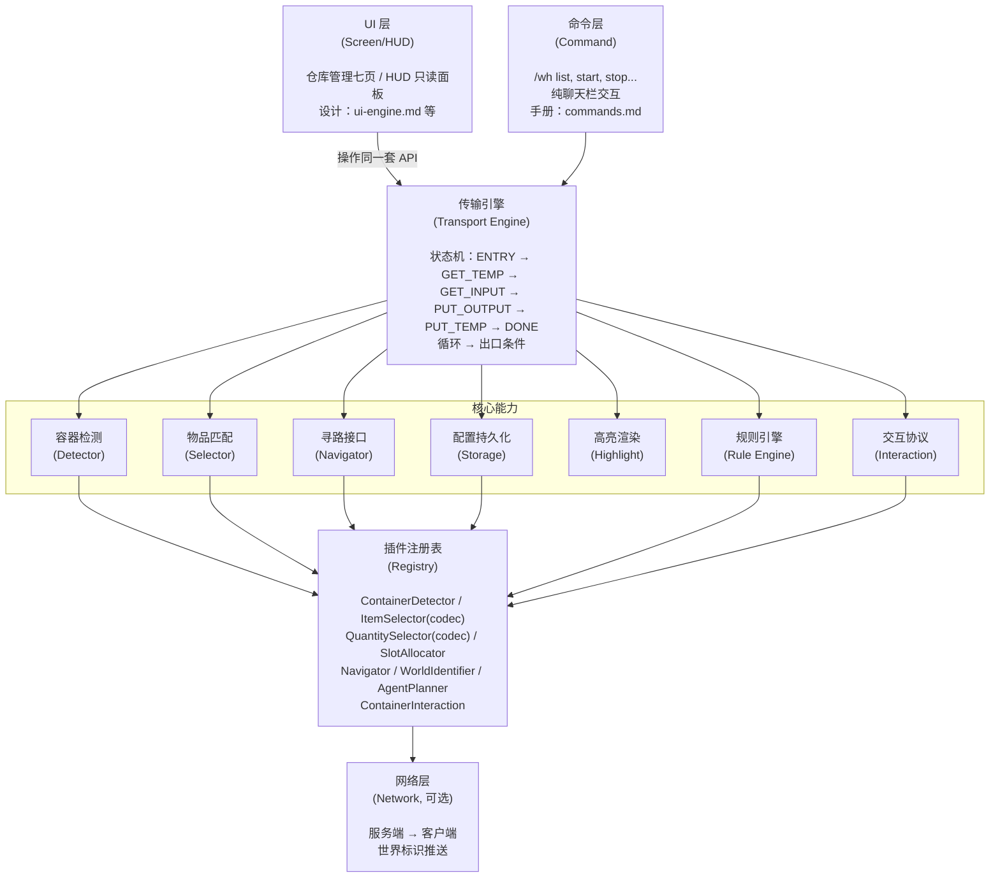
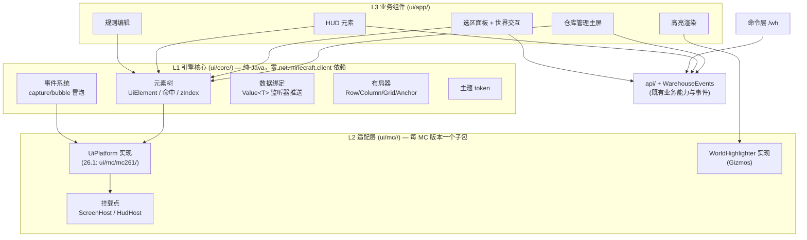

# 设计文档 — Yuanlu Warehouse

> 本目录由原单文件 `doc/PDD.md`（产品设计文档 v0.3–v0.5）与 `doc/UI-PDD.md`（UI 层设计文档 v0.3）按模块拆分而来。**各文件章节号与原 PDD 保持一致**——代码注释中大量「PDD §x.x」「UI-PDD §x.x」引用按对应文件定位。

| 文件 | 原出处 | 内容 |
|---|---|---|
| [README.md](README.md) | PDD §1/§2/§12 + UI-PDD §2/§12 | 概述、架构分层、包结构（本文） |
| [data-model.md](data-model.md) | PDD §3 | Warehouse / ContainerInfo / 规则 / 选择器 / 缓存 / TransferPlan |
| [world-identity.md](world-identity.md) | PDD §4 | serverId/worldId/worldName 三层、推送、world-map.json、WorldDim |
| [transport-engine.md](transport-engine.md) | PDD §5 | 状态机、防振荡、缓存、异常、选区/标记模式、事件系统 |
| [interaction-protocol.md](interaction-protocol.md) | PDD §6 | 容器打开流程、点击原语、精确数量算法、对账协议 |
| [navigation.md](navigation.md) | PDD §7 | Navigator 接口、NoOp 默认实现、扩展寻路器 |
| [container-detection.md](container-detection.md) | PDD §8 | Detector 接口、槽位能力模型、交互 SPI、Mixin 注入点 |
| [plugin-api.md](plugin-api.md) | PDD §9 + UI-PDD §11 | Registry、扩展点总表（含 UI 预留位）、AgentPlanner、规则引擎 |
| [configuration.md](configuration.md) | PDD §11 | 文件结构、序列化健壮性、schema v2、全局配置表 |
| [design-decisions.md](design-decisions.md) | PDD §15 + UI-PDD §16 | 全部设计决策（§15.1–15.12 + D1–D16）与待定项 |
| [ui-engine.md](ui-engine.md) | UI-PDD §3–§4 | L1 引擎核心（元素树/事件/绑定/布局/主题）、L2 适配层 |
| [ui-screens.md](ui-screens.md) | UI-PDD §5–§6 | L3 业务组件（七页导航）、HUD 设计与设置屏 |
| [ui-highlight.md](ui-highlight.md) | UI-PDD §7 | 世界高亮渲染侧（Gizmos 管线） |
| [ui-interaction.md](ui-interaction.md) | UI-PDD §8–§13 | 快捷键、交互设计规范、i18n、UI 包结构、测试映射 |

## 1. 概述

Minecraft Fabric 模组，**纯客户端即可独立运行**，服务端可选装仅用于信息增强（如世界标识等标准 MC 客户端无法获取的信息）。玩家通过定义仓库（容器集合 + 规则），由模组驱动玩家背包作为媒介，自动完成从 INPUT 容器取出物品 → 放入 OUTPUT/TEMP 容器的搬运流程。所有交互均模拟正常玩家行为（打开 GUI、点击槽位），不对绕过反作弊提供支持。高度模块化设计，全部功能通过 API 接口解耦，命令层与 UI 层操作同一套 API，支持附属 mod 扩展。

## 2. 架构分层



UI 层自身采用三层架构（详见 ui-engine.md / ui-screens.md）：



**UI 依赖方向规则**（强制）：

1. L1 不 import 任何 `net.minecraft.client.*`；MC **通用**类型（`ItemStack`、`Component`、`BlockPos`）允许作为数据类型出现（这些类历史上远比 client GUI 类稳定）。
2. L3 不 import 任何 `net.minecraft.client.gui.*`——一切绘制/挂载经 L1 端口（`UiDraw`）与 L2 实现。
3. L2 是唯一允许接触 client GUI API 与 Fabric 渲染 API 的包；L2 不含业务逻辑。
4. 违反 2/3 由 ArchUnit 风格的 JVM 单测守护（ui-interaction.md §13）。

## 12. 包结构规划

**纯客户端 mod**：全部业务代码位于 `src/client/java`；`src/main/java` 仅保留 ModInitializer（服务端增强/网络层挂载点）。依据见 design-decisions.md §15.2。

```
src/client/java/bid/yuanlu/mc/warehouse/     # ★ 全部业务代码
├── api/                        # 公开 API 接口（插件的编译期契约）
│   ├── container/              # ContainerDetector, ContainerInfo, IOType, SlotInfo
│   ├── item/                   # ItemSelector, QuantitySelector, QuantityContext, ItemRule
│   ├── warehouse/              # Warehouse, WarehouseManager
│   ├── transport/              # TransportEngine, TransportState, TransferPlan
│   ├── navigation/             # Navigator, Goal, PathStatus
│   ├── interaction/            # ContainerInteraction, ContainerHandle
│   ├── plugin/                 # WarehousePlugin, WarehouseRegistry, SelectorCodec, AgentPlanner
│   └── world/                  # ServerIdentifier, WorldIdentifier, WorldDim, WorldDimPos
├── core/                       # 核心实现
│   ├── registry/               # WarehouseRegistry 实现 + 内置注册
│   ├── warehouse/              # WarehouseManagerImpl
│   ├── transfer/               # TransferOverlay（跨仓库搬运 overlay）
│   ├── transport/              # TransportEngineImpl（状态机 + 轮次追踪）
│   ├── engine/                 # 规则引擎 + 容器协议
│   │   ├── rule/               # RuleApplicator, ItemMatcher, QuantityCalculator
│   │   └── container/          # ContainerSession(协议层), ContainerMemoryManager
│   ├── cache/                  # 三级缓存管理（CacheKey、自愈失效）
│   ├── highlight/              # HighlightManager
│   ├── selection/              # SelectionState, SelectionOps（命令层与 UI 共享）
│   ├── mark/                   # MarkMode（标记模式）
│   ├── world/                  # WorldSession, WorldNameMapper 等
│   ├── event/                  # WarehouseEvents 定义 + 命令层桥接
│   └── config/                 # JSON 读写（codec 分发、schemaVersion、原子写）
├── impl/                       # 内置实现
│   ├── selector/               # IdSelector, TagSelector, NameSelector, NbtSelector, CompositeSelector (+各 codec)
│   ├── quantity/               # CountSelector, GroupSelector, FillSlotsSelector, PercentSelector (+各 codec)
│   ├── allocator/              # FirstFitAllocator
│   ├── container/              # 原版箱子/熔炉/潜影盒等检测器 + VanillaGuiInteraction
│   ├── navigation/             # NoOpNavigator
│   └── world/                  # Singleplayer/MultiplayerServerIdentifier, ServerPushedWorldIdentifier
├── command/                    # /wh 命令实现（Brigadier 子命令类）
├── mixin/                      # client mixins（注册于 yuanlu-warehouse.client.mixins.json，见 container-detection.md §8.7）
├── util/                       # CoordinateUtils, RelativeCoords, McScreens 等
├── ui/                         # UI 三层（core/mc/app，详见 ui-interaction.md §12）
└── YuanluWarehouseClient.java  # ClientModInitializer：入口 + 内置实现注册 + 事件桥接

src/main/java/bid/yuanlu/mc/warehouse/
├── YuanluWarehouse.java        # ModInitializer：服务端增强装配
└── net/                        # 服务端→客户端推送（WhWorldIdPayload, ServerWorldIdSync）

src/client/resources/
└── yuanlu-warehouse.client.mixins.json
src/main/resources/
└── fabric.mod.json
```

约束：`splitEnvironmentSourceSets` 下 client 不引用 gametest/test；api/ 包保持最小依赖面，便于未来如需服务端共享时可平移。

## 13. 测试策略映射

呼应 [../testing.md](../testing.md) 的两层测试：

| 层           | 覆盖内容                                                                                                                            | 位置                                   |
| ------------ | ----------------------------------------------------------------------------------------------------------------------------------- | -------------------------------------- |
| JVM 单测     | Selector/QuantitySelector/SlotAllocator 纯逻辑、规则合并语义（data-model.md §3.7）、坐标换算、Gson 序列化往返（含多态 codec）、配置加载与冲突检测、UI L1 无头测试 | `src/test`                             |
| E2E GameTest | 容器打开协议（超时/身份校验）、点击对账、状态机整轮循环、出口条件与未知态、缓存自愈、SUSPENDED 三种恢复路径、RunReport 五档、UI 开屏/HUD/高亮冒烟 | `src/gametest`（真实启动 MC，CI 矩阵） |
