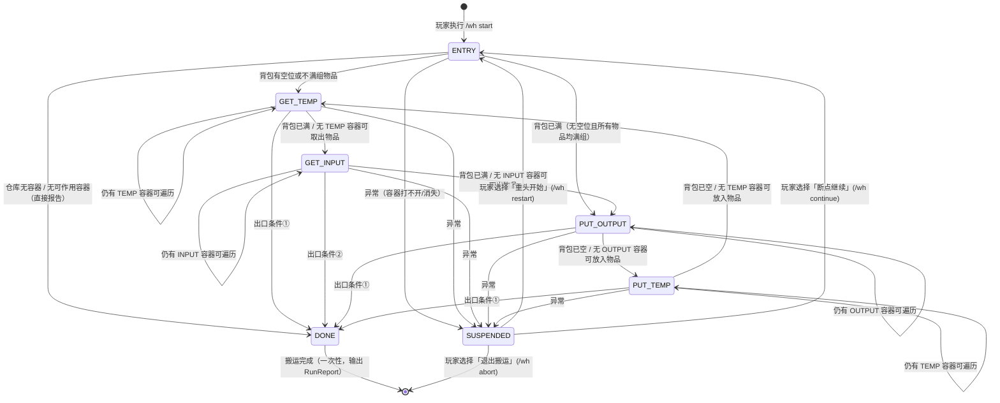

# 传输引擎 (Transport Engine)

> 原 PDD §5。章节号保持不变——代码注释中的「PDD §5.x」引用按本文件定位。

## 5.1 状态定义

```java
/** 搬运状态枚举 */
enum TransportState {
    /** 入口决策：判断背包是否有空位/不满组物品 */
    ENTRY,
    /** 从 TEMP 容器取出物品到背包 */
    GET_TEMP,
    /** 从 INPUT 容器取出物品到背包 */
    GET_INPUT,
    /** 从背包放入物品到 OUTPUT 容器 */
    PUT_OUTPUT,
    /** 从背包放入物品到 TEMP 容器 */
    PUT_TEMP,
    /** 出口条件满足，搬运结束 */
    DONE,
    /** 异常发生，搬运暂停 */
    SUSPENDED
}
```

## 5.2 状态机



> continue/restart 均经 ENTRY 重入（重新做入口决策与队列构建），区别在轮次标志是否重置；continue 会把挂起时在途/出错的容器记入 skip 集合，本轮不再访问（`/wh stop` 后 continue 同样跳过在途容器——无损恢复为待修项，见 todos）。「断点」指轮次与统计延续，非阶段断点恢复。

**出口条件**：

- ① `(OUTPUT 全满 && TEMP 全满)`
- ② `(INPUT 全空)`

全满指——对于 OUTPUT/TEMP，所有容器均无空位且无不满组物品，或不满组物品在 INPUT 侧找不到可以合并的物品了；全空指——对于 INPUT，所有容器均无物品可取出。

聚合判定遇到**未探索容器**时，出口条件一律视为不满足——先探索再判定，禁止把未知当作满或空。DONE 为一次性结束：达成出口条件即停止并输出 RunReport（§5.9），不做持续监听；watch 持续监控模式为待定扩展（design-decisions.md §15.11）。

## 5.3 状态机详细逻辑

**ENTRY**：

1. 获取当前激活仓库的容器列表；为空 → DONE 并报告
2. 检测玩家背包是否有空位或不满组的物品
3. 有空位 → GET_TEMP；无空位 → PUT_OUTPUT

**媒介口径（必须全流程统一）**：搬运媒介 = 主背包 36 格（快捷栏 + 主格）。盔甲槽、副手槽**永不参与**搬运的判定与操作。「有空位 / 不满组 / 已满 / 已空」四种判断使用同一口径（口径不一致会导致终止评估错乱）。

**访问队列（基于缓存的阶段预筛）**：

每个取出/放入阶段开始时，先基于**缓存**构建本阶段的访问队列（不预先开箱扫描）：

- 队列包含激活仓库中该 IO 类型的**全部容器**（跨世界/跨维度一律不做过滤）——激活仓库后应能访问所有世界的所有维度，能否前往是各 Navigator 自身的能力（navigation.md §7），去不了的经 FAILED 重试耗尽后跳过并报错；

- 未探索过的容器（探索本身即收益）；
- 缓存显示「有可操作内容」的容器——取出阶段=存在可取出物品；放入阶段=存在可放入空间。

队列按 hard 优先级降序、soft 次级降序排列。缓存只决定「要不要去」，绝不作为操作依据——到达后一律以开箱重扫快照为准（data-model.md §3.8 自愈）。

**GET_TEMP / GET_INPUT**（取出阶段）：

```
对访问队列中的每个容器（单容器会话 = 最小计划与执行单元）：
  1. [GET_INPUT 特有] 条件准入检查（见防振荡机制①），不满足则跳过
  2. 寻路前往容器位置
  3. 打开容器（interaction-protocol.md §6.1 协议），扫描内容 → 刷新缓存
  4. 根据规则引擎计算本容器可取出物品列表，生成 moves
     （滚动模拟：每条 move 加入前先在内存模型上模拟执行）
     [GET_TEMP 特有] 按 TEMP 双策略（见防振荡机制②）
  5. 当场执行本容器的全部 moves（interaction-protocol.md §6.2 对账协议）→ settle 重扫 → 关闭
  6. 若背包已满（预估），停止遍历
所有容器处理完毕 → 本阶段结束 → 进入下一状态
```

**PUT_OUTPUT / PUT_TEMP**（放入阶段）：

```
对访问队列中的每个容器（单容器会话 = 最小计划与执行单元）：
  1. 寻路前往容器位置
  2. 打开容器（interaction-protocol.md §6.1 协议），扫描内容 → 刷新缓存
  3. 根据规则引擎和背包物品计算可放入物品列表，生成 moves
     （受目标容器剩余空间与槽位能力约束；滚动模拟同上）
  4. 当场执行本容器的全部 moves（interaction-protocol.md §6.2 对账协议）→ settle 重扫 → 关闭
  5. 若背包已空（预估），停止遍历
所有容器处理完毕 → 本阶段结束 → 进入下一状态
```

> **TransferPlan 的阶段级语义**：每个阶段对应一个 `TransferPlan` 对象，随容器逐个处理而累积 `ItemMove`；执行以单容器会话为粒度滚动完成，而非「全部规划完再统一执行」（后者要求二次寻路，不成立）。TransferPlan 用于事件上报、日志、调试预览与失败定位。

**计划生成的实现指引**：

- **滚动模拟**：TransferPlan 的生成是顺序模拟过程——每加入一条 ItemMove 前先在内存模型上模拟执行，后续可行性判断基于滚动后的状态（防止跨多堆规划总量超限）
- **聚合容量预检**：对容器维护聚合摘要（每 itemId 的总量、占用槽位数、空槽数），`canStore`/「可放入余量」的快速判断只依赖该摘要——同类不满堆的剩余容量 + 空槽 × maxStackSize 的容量贡献，无需逐槽模拟；开箱扫描后构建，每次模拟存取后更新
- **单容器准入**：某物品在目标容器的可放入余量 ≤ 0 → 该条目直接跳过

**防振荡机制（必实现；实测教训来源见 design-decisions.md §15.6）**：

1. **INPUT 条件准入**：GET_INPUT 阶段对未探索的 INPUT 容器，仅当满足任一条件才加入本轮队列：
   - 背包尚有可用空间；
   - 存在仍有空间的 OUTPUT 容器；
   - 存在仍有空间的 TEMP 容器。
     否则跳过——取出后无处安放只会造成空转死循环。
2. **TEMP 取出双策略**：
   - 仍存在未探索的 OUTPUT 容器 → **保守模式**：按 BLACKLIST 空规则超额全取；
   - 全部 OUTPUT 已探索 → **精确模式**：仅取出能匹配某个 OUTPUT 白名单规则的物品。
     目的：避免「TEMP 取出 → OUTPUT 放不下 → PUT_TEMP 放回」的无限振荡。
3. **探索失败不计进展**：容器快照失败（UI 未开/身份不符）不得置 `roundHadNewExplore=true`，也不写入缓存；同一容器连续探索失败 ≥ `exploreFailMax` 次（默认 2）触发 SUSPENDED——防止「永远打不开的容器让轮次永远有进展」的死循环。
4. **放入方向条件准入（防振荡③）**：PUT_OUTPUT/PUT_TEMP 阶段对容器做**静态可行预筛**——背包为空、或背包无任何「该容器规则可放」的物品（WHITELIST 命中 / BLACKLIST 未命中，含 negative 求反；`PutFeasibility`）则不入队。已探索容器再叠加「快照无空间」「Detector 收拒」（`acceptsPutAnywhere`）剔除。
   - 未探索 OUTPUT 若规则上无任何可放物品（如空白名单）→ 连探索都不去（避免空跑开箱）；
   - 口径注记：规则不可行的未探索 OUTPUT 将**保持未探索**，出口①（storage_full，要求 OUTPUT 全探索）可能永不触发；出口②（input_empty）不依赖它，运行仍正常终止。
   - 检测器级过滤（燃料/可熔炼）在无快照时不可知 → 对未探索容器保守放行（宁多去不漏去），执行期 `planPutInto` 再裁。

**TransferPlan 执行流程**：见 interaction-protocol.md §6.2（运行时交互协议），含服务端对账。

**轮次追踪**：

```
roundHadAction: boolean     // 本轮是否有任何物品被移动（以对账成功为准）
roundHadNewExplore: boolean // 本轮是否有新容器被首次成功探索

如果连续两轮 roundHadAction == false && roundHadNewExplore == false：
  → 判定为"无进展"，自动终止搬运并输出 RunReport（含五档诊断，§5.9）
```

## 5.4 缓存机制

**三级缓存**：

| 类型   | 清除时机                 | 适用场景                             |
| ------ | ------------------------ | ------------------------------------ |
| NONE   | 搬运轮次结束时           | 机器入口/出口等频繁变化的容器        |
| MEMORY | 退出世界/服务器时        | 普通箱子等在一个游戏会话内不变的内容 |
| DISK   | 用户主动清除或重新打开时 | 长期存储区域，如仓库主存储区         |

> MEMORY/DISK 的「内容不变」假设在多人服/漏斗环境下随时可能失效，因此自愈机制（data-model.md §3.8）是缓存体系的必要组成部分：预检错误只损失一次白跑，不会造成错误操作。

**缓存规则**：

- 缓存是惰性的：需要容器内容时，有缓存用缓存，无缓存则打开容器扫描
- 任何被动操作（因搬运需要打开容器）都会刷新缓存
- 通过 Mixin 拦截 `Screen.onClose()` 可以自动刷新缓存（即使不是由引擎触发的打开）；写入前校验 Screen↔容器会话绑定（data-model.md §3.8）
- **玩家手动开箱刷新**：玩家打开激活仓库内已注册容器，关屏后以真实扫描回写缓存。绑定用三层原版信号收敛——
  ① 点击瞬间捕获（`MultiPlayerGameMode.useItemOn` 方块 use 分支 consumed，排除潜行放置）；
  ② 开屏包 FIFO 配对（开屏包顺序 == 点击顺序）；
  ③ 开合信号验证（木桶 `OPEN` 方块状态 / 箱子·末影箱·潜影盒开合块事件；无动画类型放行）。
  终审：关屏扫描走 Detector 身份校验（BE 类型+标题+槽位数），任何错绑绝不写缓存。
  引擎运行期间由引擎归属判定（`isEngineBound`）排除双写；引擎自身 open 也走 useItemOn，被归属守卫拦下，其缓存由 closeScanSink/settle 重扫负责。
- `NONE` 缓存在搬运轮次结束后清除，但搬运轮次内可重复使用以节省操作
- 可选 `cacheTtlSeconds`（默认 0=禁用）：为 MEMORY/DISK 增加时间维度的陈旧保险，超期强制重扫

## 5.5 异常处理

**异常类型**：

> 实现以 `ContainerSession.Failure` 枚举为准：`CONTAINER_GONE`（容器消失）、`NOT_OPENED`（容器打不开）、`UI_MISMATCH`（身份不符）、`OPERATION_TIMEOUT`（操作超时）、`UI_CLOSED_EXTERNAL`（UI 被外部关闭）、`REACH_FAILED`（reach 预检不过，含玩家中途远离）、`CLICK_CORRECTED`（服务端纠正包，见 interaction-protocol.md §6.2）、`PLAYER_GONE`（玩家离线）。

| 异常               | 触发条件                                            | 处理方式                             |
| ------------------ | --------------------------------------------------- | ------------------------------------ |
| 容器消失           | 坐标处无方块或方块实体类型与预期不符                | 暂停，提示玩家                       |
| 寻路失败           | Navigator FAILED 且重试次数耗尽（navigation.md §7.1）| 跳过该容器并报错，继续整体搬运 |
| 容器打不开         | WAIT_SCREEN 超时（interaction-protocol.md §6.1）    | 暂停，提示玩家                       |
| UI 身份不匹配      | Screen 标题/槽位数/方块实体与 Detector 判定不符     | 暂停，提示玩家                       |
| 操作超时           | click 后 confirmTimeoutTicks 内无服务端对账（interaction-protocol.md §6.2） | 失效该容器缓存 + 暂停 |
| UI 被外部关闭      | 对账完成前 Screen 关闭（按 E、死亡、踢出界面）      | **绝不视为成功**，暂停               |
| 服务端纠正         | 点击后槽位被回滚至点击前状态（CLICK_CORRECTED）     | 暂停，提示玩家                       |
| 反复探索失败       | 同一容器连续 ≥ exploreFailMax 次                    | 暂停，提示玩家                       |
| 玩家死亡           | 死亡掉落风险                                        | 终止本轮搬运，要求人工确认后 restart |
| 断线/切世界/切维度 | worldId 变化或连接中断（world-identity.md §4.1）    | 终止搬运                             |

> 死亡在实现中经「容器屏关闭 → UI_CLOSED_EXTERNAL」路径呈现为暂停（等效要求人工确认）；切维度无独立检测，跨维度容器按探索失败口径处理——目标语义（终止并报告）保留为待修项。

> **口径注记**：探索类异常（容器消失、容器打不开、探索路径上的 UI 身份不匹配）取 §5.3③ 口径——单次「跳过 + 计数」，同一容器累计达 `exploreFailMax`（configuration.md §11.4）方触发「反复探索失败」行暂停；表中其余行的「暂停」立即生效。

**恢复选项与命令映射**：

```
暂停后玩家处理完现场，可选：
  1. 重头开始 → /wh restart（重置状态与轮次标志，重新 ENTRY）
  2. 断点继续 → /wh continue（沿用轮次统计，经 ENTRY 重入；挂起时在途/出错容器记入 skip，本轮不再访问）
  3. 退出搬运 → /wh abort
注：/wh stop 同样经 SUSPENDED 暂停；continue 重入时在途容器会进 skip 集合（与"无损恢复，不跳过容器"的目标语义有差，待修）。
```

## 5.6 多仓库流转

**支持场景**：将一个仓库整体视为 INPUT 源，搬空后输入到另一个仓库的 OUTPUT 中。

```
/wh transfer <源仓库> <目标仓库> start   # 开始跨仓库搬运
/wh transfer status                      # 查看跨仓库搬运状态
/wh transfer stop                        # 停止跨仓库搬运
```

实现方式：`transfer` 命令将源仓库的**所有容器临时视为 INPUT**（无视其原本的 ioType），将目标仓库的**所有容器临时视为 OUTPUT**（无视其原本的 ioType），然后启动标准状态机流程。搬运完成后恢复原配置。（更泛化的阶段序列策略化为待定扩展，见 design-decisions.md §15.11。）

实现机制（`TransferOverlay`）：向 WarehouseManager 压入一张源+目标仓库的**叠加视图**（overlay id = `<src>__to__<dst>`），叠加期间激活仓库切换为该视图、`save()` 静默跳过（不落盘）；`RUN_FINISHED` 时自动弹栈恢复原激活状态，`/wh transfer stop` 手动弹出；SUSPENDED → continue 期间叠加视图保持存活。

其他多仓库场景（如仓库间平衡、管道式流转）暂不考虑，留待后续扩展。

## 5.7 范围选择

用户可以框选一片区域，批量设置容器类型/规则，并可选地交由 AgentPlanner 细化配置。

**命令式框选**：

```
/wh select pos1 [--look]        # 设置第一角点：默认取玩家站位；--look 取准星指向方块(player.pick)
/wh select pos2 [--look]        # 设置第二角点（同上）
/wh select expand <n> <dir>     # 向指定方向扩展选区
/wh select show                 # 打印当前选区两角坐标与体积
/wh select clear                # 清除选区
/wh select set-type <INPUT|OUTPUT|TEMP|IGNORE>  # 批量设置框选内所有（已注册）容器的类型
/wh select set-rule <rule-id>   # 批量关联规则
/wh select set-cache <NONE|MEMORY|DISK>          # 批量设置缓存类型
/wh select plan                 # 交由 AgentPlanner 自动配置（AgentPlanner 未内置实现，命令为 stub）
```

> 批量操作只作用于**已注册**且位于选区内的容器（不做方块枚举发现）；选区的世界内可视化是常开的 Gizmo 选区盒（§5.8 + 快捷键 `wh.select.show` 切换），`select show` 仅输出坐标文本。区域扫描（枚举选区内方块生成新 ContainerInfo）未实现，见 todos。

**标记模式（mark mode）**：

逐个容器的交互式录入，命令：

```
/wh container mark <type> [--rule R] [--template T]   # 进入/再次执行退出（切换式）
```

- 进入后：右键未注册容器 → 打开后自动捕获内容入库（复用 interaction-protocol.md §6.1 协议与 syncId 门控）→ 自动关屏并按 `<type>` 注册；重复右键已注册容器 → 从仓库移除
- `--rule` 注册时直接关联规则；`--template T` 批量套用全局规则（同类型多容器免重复参数）
- 准星指向已注册容器时以动作栏文本提示状态（轮廓渲染见 §5.8 高亮系统）；等待内容期间又打开新容器 → 两者的等待一并取消（防内容混淆）
- 标记完成即完成首次内容采集，天然成为该容器的缓存种子
- **右键感知无需输入拦截 Mixin**：引擎每 tick 记录准星指向的容器方块，检测到开屏事件时绑定「最后指向的容器」即可（纯轮询；container-detection.md §8.7 的 useItemOn Mixin 仅服务于手动开箱刷新信号采集等增强，非标记模式所必需）

区域选点式点击框选为待定扩展（日常录入由标记模式覆盖，见 design-decisions.md §15.11）；区域扫描：三重循环遍历选区内坐标，`level.getBlockEntity` 后按各 Detector 的 `matchesBlock` 归类生成 ContainerInfo。成本 O(体积)，大选区需提示预计耗时。

## 5.8 高亮系统

高亮系统用于在游戏世界中可视化显示容器类型和状态，帮助玩家快速了解仓库布局。

**高亮类型**：

| 类型            | 颜色 | 说明                     |
| --------------- | ---- | ------------------------ |
| INPUT_OUTLINED  | 红色 | INPUT 容器轮廓           |
| OUTPUT_OUTLINED | 绿色 | OUTPUT 容器轮廓          |
| TEMP_OUTLINED   | 黄色 | TEMP 容器轮廓            |
| IGNORE_OUTLINED | 灰色 | IGNORE 容器轮廓          |
| HAS_SPACE       | 青色 | 容器有空位（运行时临时） |
| FULL            | 白色 | 容器已满（运行时临时）   |

**实现方式**：

`HighlightManager`（core/highlight/）每客户端 tick（及 `WAREHOUSE_CHANGED`）从**激活仓库配置**构建不可变快照 `List<Entry(AABB, HighlightType)>`（当前 (serverId, worldName, dim) 内、按 IOType 映射类型色，相对坐标经 anchor 解析为绝对 AABB）；渲染帧只读快照提交 Gizmos 管线（ui-highlight.md §7，无需高亮专用 mixin）。引擎不参与数据喂入——`HIGHLIGHT_CHANGED` 事件保留为未来运行时状态色的接入信号。

（HAS_SPACE/FULL 两种状态色与运行时联动为待定扩展，见 design-decisions.md §15.11——定义了却不赋值等于没定义，要么实现要么不列。）

## 5.9 事件系统

采用 Fabric `Event<T>` 类型化事件（design-decisions.md §15.9）——新增事件不破坏 API，且**插件也可订阅**。全部事件在客户端主线程触发，监听器不得阻塞。

```java
public final class WarehouseEvents {
    /** 搬运状态变化 */           public static final Event<TransportStateListener> TRANSPORT_STATE;
    /** 进度描述更新 */           public static final Event<ProgressListener> PROGRESS;
    /** 异常发生 */               public static final Event<ErrorListener> ERROR;
    /** 单个 ItemMove 完成 */     public static final Event<ItemMovedListener> ITEM_MOVED;
    /** 仓库配置变更 */           public static final Event<WarehouseChangedListener> WAREHOUSE_CHANGED;
    /** 高亮数据更新 */           public static final Event<HighlightChangedListener> HIGHLIGHT_CHANGED;
    /** 搬运结束报告 */           public static final Event<RunFinishedListener> RUN_FINISHED;
}
```

命令层订阅这些事件输出聊天栏文字（`EventChatBridge`：ERROR/RUN_FINISHED 恒输出，TRANSPORT_STATE 仅 `debug=true` 时输出，避免状态机自循环刷屏）；UI 层（ui-screens.md §6 HUD）同样订阅并渲染，插件可做统计/通知等扩展。

PROGRESS 采用两级粒度：**阶段级**状态（§5.1 TransportState）+ **动作级**描述（MOVING / SCANNING / PICKING / PUTTING），UI 可分别渲染。

**搬运结束报告 RunReport**（递进式终止诊断）：

```java
record RunReport(RunGrade grade, int itemsMoved, int rounds, long durationMs, String detailKey) {}
enum RunGrade { PERFECT, GOOD, ACCEPTABLE, BLOCKED, ABNORMAL }
```

| 档位       | 判定                                                   |
| ---------- | ------------------------------------------------------ |
| PERFECT    | INPUT 清空且背包装运完毕                               |
| GOOD       | OUTPUT 满 & TEMP 空 & 背包空                           |
| ACCEPTABLE | OUTPUT 满，TEMP 仍有剩余                               |
| BLOCKED    | OUTPUT/TEMP 空间不足，无法继续                         |
| ABNORMAL   | 仍有可用空间但无搬运计划（逻辑漏洞信号，附诊断上下文） |
