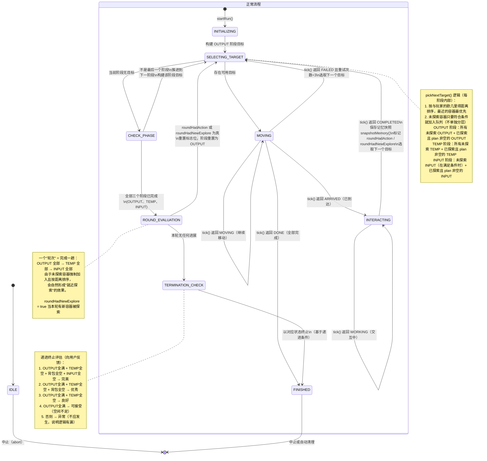

# 容器探索与搬运逻辑优化方案

## 一、总体设计概述

| 当前架构问题                                                 | 新架构设计                                                                             |
| ------------------------------------------------------------ | -------------------------------------------------------------------------------------- |
| 容器类型 `RELAY`                                             | **全局重命名为 `TEMP`**（临时暂存端）                                                  |
| `PathfindingController` 一次性排序遍历 (OUTPUT→INPUT→RELAY)  | **三阶段循环**：每轮固定顺序 `OUTPUT → TEMP → INPUT`，循环直到无进展                   |
| `TransferPlan` 只有一个全局 `Direction`                      | **`ItemMove` 自带 `direction`**，支持 TEMP 的双向操作                                  |
| 无容器探索状态管理                                           | **记忆即探索状态**：`ContainerMemory.get(pos) == null` → 未探索；否则已探索            |
| `RuleApplicator.planRelay` 强制 `TO_PLAYER` 方向（严重 bug） | **重写 `planTemp`**：拆分为 `planTempRemove(取出)` + `planTempAdd(放入)`，各自方向正确 |
| 未探索容器被完全跳过                                         | **未探索容器强制加入队列**：必须逐个打开获取记忆                                       |

---

## 二、关键状态机设计

### 2.1 容器探索状态（隐式）

不需要新增 enum，由 `ContainerMemory` 是否存在判断：

```
ContainerMemory.get(absPos) == null     → UNEXPLORED（未探索）
ContainerMemory.get(absPos) != null     → EXPLORED（已探索，内容可信）
```

- **何时变为 EXPLORED**：`ContainerController.snapshotMemory()` 被调用时（到达容器自动打开 / 用户手动关闭 GUI）
- **何时重置为 UNEXPLORED**：用户执行 `/warehouse container memory clear`（单个/全部）

### 2.2 TEMP 取出策略状态机

这是整个方案最核心的规则逻辑：

```
全局状态: hasUnexploredOutput = 仓库中是否存在 type==OUTPUT 且 UNEXPLORED 的容器？

TEMP 取出 (planTempRemove):
  IF hasUnexploredOutput == true:
     // 还不知道 OUTPUT 要什么，保守策略：把所有"匹配规则但超额"的物品取出到背包
     // 让这些物品有机会被后续发现的 OUTPUT 接收
     按 BLACKLIST 规则计算 → 超 quantifier 目标数量的全部取出
  ELSE:
     // 所有 OUTPUT 都已探索，精确策略：
     // 只取出"匹配某个 OUTPUT 规则"的物品（即 OUTPUT 可能会接收的类型）
     // 其他不符合 OUTPUT 需求的物品即使堆在 TEMP 也不取（避免死循环）
     遍历 TEMP 中物品 → 检查是否匹配任一 OUTPUT 规则 → 匹配的超额部分取出
```

### 2.3 搬运循环状态机（PathfindingController）



**目标选择排序原则（每阶段内部）：**

所有符合该阶段条件的容器统一按**与玩家的欧几里得距离**排序，距离最近的优先处理。探索状态仅影响是否加入队列，不影响排序优先级。

```java
enum Phase { OUTPUT, TEMP, INPUT }

阶段内排序:
  1. 收集所有符合当前阶段条件的容器
  2. 计算每个容器到玩家的欧几里得距离
  3. 按距离升序排列（最近的优先）
  4. 遍历处理

容器加入队列的条件:
  OUTPUT: type==OUTPUT
    - UNEXPLORED → 加入（目标：获取记忆 + 顺便放入匹配物品）
    - EXPLORED + plan 非空 → 加入（基于记忆的正常搬运）
    - EXPLORED + plan 为空 → 不加入

  TEMP: type==TEMP
    - UNEXPLORED → 加入（目标：获取记忆 + 双向处理）
    - EXPLORED + plan 非空 → 加入
    - EXPLORED + plan 为空 → 不加入

  INPUT: type==INPUT
    - UNEXPLORED + (OUTPUT有空 || TEMP有空 || 背包不满) → 加入
    - UNEXPLORED + (OUTPUT满 && TEMP满 && 背包满) → 不加入（取了没地方放）
    - EXPLORED + plan 非空 → 加入
    - EXPLORED + plan 为空 → 不加入
```

**阶段切换**：当当前阶段候选队列遍历完毕时，自动推进到下一阶段。

### 2.4 终止条件

**实际停止逻辑（硬条件）：**
```
停止当且仅当：
  roundHadAction == false     // 本轮没有任何搬运操作
  AND
  roundHadNewExplore == false // 本轮没有任何新容器被探索
```

由于所有未探索容器都会被强制加入队列，前几轮一定会有 `roundHadNewExplore = true`。
当所有容器都被探索过（全部 EXPLORED）后，`roundHadNewExplore` 将永远为 false。
此时如果本轮也没有任何搬运操作，说明所有已探索容器的 plan 均为空，即：
- OUTPUT 全满或无匹配物品
- TEMP 无操作需求
- INPUT 已空或无空间可放
系统已达到稳态，可以停止。

**递进反馈条件（软条件，用于向用户报告结果）：**

```java
String evaluateStopReason(boolean outputFull, boolean tempEmpty, boolean invEmpty, boolean inputEmpty) {
    if (outputFull && tempEmpty && invEmpty && inputEmpty) 
        return "完美完成：Output 全满，Temp 全空，背包全空，Input 全空";
    if (outputFull && tempEmpty && invEmpty) 
        return "完成：Output 全满，Temp 已空，背包已空（Input 可能还有物品但不需要）";
    if (outputFull && tempEmpty) 
        return "完成：Output 全满，Temp 已空（背包可能还有无法处理的物品）";
    if (outputFull) 
        return "停止：Output 已满（空间不足，无法继续搬运）";
    return "异常：仍有可用空间但无搬运计划（请检查容器规则或报告 bug）";
}
```

---

## 三、各层改动方案

### 3.1 数据模型层（model/）

#### `model/ContainerType.java` — 重命名

```java
public enum ContainerType {
    INPUT,
    OUTPUT,
    TEMP,      // RELAY → TEMP
    IGNORE
}
```

#### `model/ContainerInfo.java` — defaultMode 更新

```java
public static RuleMode defaultMode(ContainerType type) {
    return switch (type) {
        case INPUT -> RuleMode.BLACKLIST;
        case OUTPUT -> RuleMode.WHITELIST;
        case TEMP -> RuleMode.BLACKLIST;   // RELAY → TEMP
        case IGNORE -> RuleMode.BLACKLIST;
    };
}
```

#### `engine/highlight/HighlightManager.java` — 高亮类型更新

- `RELAY_OUTLINED` → `TEMP_OUTLINED`

### 3.2 规则引擎层（engine/rule/）

#### `engine/rule/RuleApplicator.java` — 核心重构

**(1) TransferPlan 结构改造：**

```java
public static class TransferPlan {
    public final List<ItemMove> moves;
    // 移除全局 direction，或保留仅作兼容
    // public final Direction direction;  ← 废弃

    public static class ItemMove {
        public final int slotIndex;
        public final ItemStack item;
        public final int amount;
        public final int targetSlot;
        public final Direction direction;   // ← 新增：每个 move 自带方向

        public ItemMove(int slotIndex, ItemStack item, int amount, int targetSlot, Direction direction) {
            // ...
        }
    }
}
```

**(2) calculatePlan 分支更新：**

```java
return switch (info.type) {
    case INPUT -> planInput(snapshot, allRules, mode);
    case OUTPUT -> planOutput(snapshot, allRules, playerInventory, mode);
    case TEMP -> planTemp(snapshot, allRules, playerInventory, mode, hasUnexploredOutput, outputRules);
    default -> null;
};
```

**(3) planTemp 完全重写（核心逻辑）：**

```java
private static TransferPlan planTemp(
    ContainerSnapshot tempSnapshot,
    List<ItemRule> tempRules,
    ContainerSnapshot playerInventory,
    RuleMode mode,
    boolean hasUnexploredOutput,
    List<ItemRule> allOutputRules   // 聚合所有 OUTPUT 容器引用的规则
) {
    List<ItemMove> moves = new ArrayList<>();

    // === 阶段 A：从 TEMP 取出到背包 (TO_PLAYER) ===
    List<ItemMove> removes;
    if (hasUnexploredOutput) {
        // 还有 OUTPUT 未探索：保守策略，取出匹配规则但超额的全部
        removes = calcTempRemoveAggressive(tempSnapshot, tempRules, mode);
    } else {
        // 全部 OUTPUT 已探索：精确策略，只取 OUTPUT 可能接收的类型
        removes = calcTempRemoveSelective(tempSnapshot, tempRules, mode, allOutputRules);
    }
    removes.forEach(m -> moves.add(new ItemMove(m.slotIndex, m.item, m.amount, -1, Direction.TO_PLAYER)));

    // === 阶段 B：从背包放入 TEMP (TO_CONTAINER) ===
    // 只放那些"确定无法放入任何已探索 OUTPUT"的物品
    List<ItemMove> adds = calcTempAddSelective(tempSnapshot, tempRules, playerInventory, mode, allOutputRules);
    adds.forEach(m -> moves.add(new ItemMove(m.slotIndex, m.item, m.amount, -1, Direction.TO_CONTAINER)));

    return moves.isEmpty() ? null : new TransferPlan(moves);
}
```

**`calcTempRemoveSelective` 逻辑**：

- 对于 TEMP 中每个物品，检查 `allOutputRules`
- 如果匹配任一 OUTPUT 规则 → 按 quantifier 计算应保留数量，超额部分取出
- 如果不匹配任何 OUTPUT 规则 → **不取出**（留在 TEMP）

**`calcTempAddSelective` 逻辑**：

- 遍历背包物品
- 对每个物品，检查所有已探索 OUTPUT 的规则 → 如果任一 OUTPUT 会接收该物品（且该 OUTPUT 记忆显示不满），**跳过**（留给 OUTPUT 阶段处理）
- 如果没有任何已探索 OUTPUT 会接收该物品，检查 TEMP 自身规则 → 如果 TEMP 接受且未满 → 放入

**(4) planInput / planOutput 调整：**

- 给每个 `ItemMove` 构造时添加 `Direction.TO_PLAYER` / `Direction.TO_CONTAINER`

### 3.3 容器交互层（engine/container/）

#### `engine/container/ContainerInteractor.java` — mapSlot 改造

```java
private static int mapSlot(ItemMove move, int containerSlots) {
    // 不再接收全局 direction，使用 move.direction
    if (move.direction == Direction.TO_CONTAINER) {
        if (move.slotIndex < 9) {
            return containerSlots + 27 + move.slotIndex;  // 快捷栏
        } else {
            return containerSlots + (move.slotIndex - 9); // 背包主体
        }
    } else {
        // TO_PLAYER: slotIndex 直接是容器内槽位编号
        return move.slotIndex;
    }
}

// tick() 中调用：
int menuSlot = mapSlot(move, containerSlots);
// 移除 plan.direction 的使用
```

**兼容性问题**：`execute()` 同步方法也需要相同改造。

### 3.4 控制器层（controller/）

#### `controller/PathfindingController.java` — 完全重构

**状态字段变更：**

```java
// 移除：
// private List<ContainerInfo> sortedContainers;
// private int containerIndex;

// 新增：
private Phase currentPhase;           // OUTPUT, TEMP, INPUT
private List<ContainerTarget> roundTargets;  // 当前阶段的目标队列
private int targetIndex;              // 当前阶段内索引
private boolean roundHadAction;       // 本轮是否有实际操作
private boolean roundHadNewExplore;   // 本轮是否有新容器被探索
```

**`ContainerTarget` 结构：**

```java
private static class ContainerTarget {
    final BlockPos pos;
    final ContainerInfo info;
    final boolean wasExplored;  // 加入队列时是否已探索
    final double distanceSq;    // 与玩家的距离平方（用于排序）
    
    ContainerTarget(BlockPos pos, ContainerInfo info, boolean wasExplored, double distanceSq) {
        this.pos = pos;
        this.info = info;
        this.wasExplored = wasExplored;
        this.distanceSq = distanceSq;
    }
}
```

**关键方法 `pickNextTarget()`：**

```java
private ContainerTarget pickNextTarget() {
    while (targetIndex >= roundTargets.size()) {
        // 当前阶段结束，推进到下一阶段
        if (!advancePhase()) {
            // 所有阶段结束，一轮完成
            if (!evaluateRoundCompletion()) {
                return null; // 结束运行
            }
            // 开始新一轮
            currentPhase = Phase.OUTPUT;
            buildPhaseTargets();
            targetIndex = 0;
        }
    }
    return roundTargets.get(targetIndex++);
}
```

**`buildPhaseTargets()` 按阶段构建目标（核心更新）：**

```java
private void buildPhaseTargets() {
    roundTargets.clear();
    Warehouse w = getWarehouse();
    if (w == null) return;

    var cc = ContainerController.getInstance();
    ContainerSnapshot playerInv = new ContainerInteractor(interactionSpeed).capturePlayerInventory();
    
    // 收集符合条件的容器
    List<ContainerCandidate> candidates = new ArrayList<>();

    switch (currentPhase) {
        case OUTPUT -> {
            for (ContainerInfo c : w.containers) {
                if (c.type != ContainerType.OUTPUT) continue;
                BlockPos abs = toAbsolute(c);
                ContainerSnapshot mem = cc.getMemory(abs);
                
                if (mem == null) {
                    // 未探索 OUTPUT：加入队列
                    candidates.add(new ContainerCandidate(abs, c, false));
                } else {
                    // 已探索：基于记忆预判 plan 是否非空
                    TransferPlan plan = RuleApplicator.calculatePlan(c, mem, w.rules, playerInv);
                    if (plan != null && !plan.moves.isEmpty()) {
                        candidates.add(new ContainerCandidate(abs, c, true));
                    }
                }
            }
        }
        case TEMP -> {
            boolean hasUnexplored = hasUnexploredOutput(w, cc);
            List<ItemRule> allOutputRules = collectAllOutputRules(w);

            for (ContainerInfo c : w.containers) {
                if (c.type != ContainerType.TEMP) continue;
                BlockPos abs = toAbsolute(c);
                ContainerSnapshot mem = cc.getMemory(abs);
                
                if (mem == null) {
                    // 未探索 TEMP：加入队列
                    candidates.add(new ContainerCandidate(abs, c, false));
                } else {
                    // 已探索：基于记忆
                    TransferPlan plan = RuleApplicator.calculatePlan(
                        c, mem, w.rules, playerInv, hasUnexplored, allOutputRules
                    );
                    if (plan != null && !plan.moves.isEmpty()) {
                        candidates.add(new ContainerCandidate(abs, c, true));
                    }
                }
            }
        }
        case INPUT -> {
            // 判断未探索 INPUT 是否需要加入
            boolean hasOutputSpace = hasAnyOutputSpace(w, cc, playerInv);
            boolean hasTempSpace = hasAnyTempSpace(w, cc, playerInv);
            boolean inventoryNotFull = !isInventoryFull(playerInv);
            boolean needExploreInput = hasOutputSpace || hasTempSpace || inventoryNotFull;

            for (ContainerInfo c : w.containers) {
                if (c.type != ContainerType.INPUT) continue;
                BlockPos abs = toAbsolute(c);
                ContainerSnapshot mem = cc.getMemory(abs);
                
                if (mem == null) {
                    // 未探索 INPUT：有条件加入
                    if (needExploreInput) {
                        candidates.add(new ContainerCandidate(abs, c, false));
                    }
                    // else: 所有输出空间已满，不加入（取了没地方放）
                } else {
                    // 已探索：基于记忆
                    TransferPlan plan = RuleApplicator.calculatePlan(c, mem, w.rules, playerInv);
                    if (plan != null && !plan.moves.isEmpty()) {
                        candidates.add(new ContainerCandidate(abs, c, true));
                    }
                }
            }
        }
    }
    
    // 按与玩家的距离排序（最近的优先）
    Player player = Minecraft.getInstance().player;
    BlockPos playerPos = player.blockPosition();
    candidates.sort(Comparator.comparingDouble(
        cand -> cand.pos.distSqr(playerPos)
    ));
    
    // 转换为最终目标队列
    for (ContainerCandidate cand : candidates) {
        double distSq = cand.pos.distSqr(playerPos);
        roundTargets.add(new ContainerTarget(cand.pos, cand.info, cand.wasExplored, distSq));
    }
}

// 需要新增的结构

private static class ContainerCandidate {
    final BlockPos pos;
    final ContainerInfo info;
    final boolean wasExplored;
    
    ContainerCandidate(BlockPos pos, ContainerInfo info, boolean wasExplored) {
        this.pos = pos;
        this.info = info;
        this.wasExplored = wasExplored;
    }
}
```

**交互完成后状态更新：**

```java
// 在 tick() 的 INTERACTING 分支中：
if (interactor.isCompleted()) {
    var cc = ContainerController.getInstance();
    ContainerSnapshot updated = interactor.captureCurrentScreen();
    if (updated != null) {
        cc.snapshotMemory(interactionPos, updated);
    }
    
    // 标记本轮状态
    if (currentTarget != null && !currentTarget.wasExplored) {
        roundHadNewExplore = true;  // 新容器被探索
    }
    if (interactor.getState() == State.COMPLETED && currentPlanHadMoves) {
        roundHadAction = true;      // 有实际搬运操作
    }
    
    interacting = false;
    interactor = null;
    // 不递增 containerIndex，继续 pickNextTarget
    retryCount = 0;
}
```

**`evaluateRoundCompletion()` — 终止条件判断：**

```java
private boolean evaluateRoundCompletion() {
    if (roundHadAction || roundHadNewExplore) {
        // 本轮有进展，继续下一循环
        resetRoundFlags();
        return true;
    }

    // 本轮完全无进展，评估停止条件（递进式）
    var cc = ContainerController.getInstance();
    Warehouse w = getWarehouse();

    boolean outputFull = isOutputFullySatisfied(w, cc);
    boolean tempEmpty = isTempFullyEmpty(w, cc);
    boolean invEmpty = isInventoryEmpty();
    boolean inputEmpty = isInputFullyEmpty(w, cc);

    String stopReason = evaluateStopReason(outputFull, tempEmpty, invEmpty, inputEmpty);
    sendStopFeedback(stopReason, outputFull, tempEmpty, invEmpty, inputEmpty);
    return false; // 停止
}
```

**递进评估逻辑：**

```java
private String evaluateStopReason(boolean outputFull, boolean tempEmpty, boolean invEmpty, boolean inputEmpty) {
    if (outputFull && tempEmpty && invEmpty && inputEmpty) return "完美完成：所有条件满足";
    if (outputFull && tempEmpty && invEmpty) return "完成：Output 已满，Temp 已空，背包已空";
    if (outputFull && tempEmpty) return "完成：Output 已满，Temp 已空";
    if (outputFull) return "停止：Output 已满（空间不足无法继续）";
    return "异常：仍有可用空间但无搬运计划（请检查规则配置）";
}
```

#### `controller/ContainerController.java` — 辅助查询方法

新增一批可被 PathfindingController 调用的全局状态查询：

```java
// 检查是否存在未探索的 OUTPUT
public boolean hasUnexploredOutput(Warehouse w) { ... }

// 聚合仓库中所有 OUTPUT 容器引用的规则
public List<ItemRule> collectAllOutputRules(Warehouse w) { ... }

// 检查是否还有任意 OUTPUT 有可放入空间（基于记忆）
public boolean hasAnyOutputSpace(Warehouse w, ContainerSnapshot playerInv) { ... }

// 检查是否还有任意 TEMP 有可放入空间（基于记忆）
public boolean hasAnyTempSpace(Warehouse w, ContainerSnapshot playerInv) { ... }

// 检查玩家背包是否已满
public boolean isInventoryFull(ContainerSnapshot playerInv) { ... }

// 基于记忆判断 OUTPUT 是否全部已满（无已探索 OUTPUT 时返回 false）
public boolean isOutputFullySatisfied(Warehouse w) { ... }

// 基于记忆判断 TEMP 是否全部已空（无可取出物品）
public boolean isTempFullyEmpty(Warehouse w) { ... }

// 玩家背包是否为空
public boolean isInventoryEmpty() { ... }

// 基于记忆判断 INPUT 是否全部已空（无可取出物品）
public boolean isInputFullyEmpty(Warehouse w) { ... }
```

**`executeTransfer()` 路径中的 RELAY → TEMP 同步更新。**

### 3.5 命令层（command/）

#### `command/sub/ContainerSubCommand.java`

- 所有错误提示 `"Use: INPUT, OUTPUT, RELAY, IGNORE"` → `"Use: INPUT, OUTPUT, TEMP, IGNORE"`
- `ContainerType.valueOf()` 异常提示更新

#### `command/sub/RunSubCommand.java`

- 可保持不变，但反馈信息中如果有仓库状态说明，建议增加循环进度提示

### 3.6 Mixin 层（mixin/）

#### `mixin/ContainerScreenMixin.java`

- 如果有引用 `ContainerType.RELAY` → 改为 `ContainerType.TEMP`

---

## 四、完整文件改动清单

| #   | 文件路径                                    | 改动性质     | 具体改动                                                                 |
| --- | ------------------------------------------- | ------------ | ------------------------------------------------------------------------ |
| 1   | `model/ContainerType.java`                  | 重命名       | `RELAY` → `TEMP`                                                         |
| 2   | `model/ContainerInfo.java`                  | 更新         | `defaultMode()` 中 `RELAY` → `TEMP`                                      |
| 3   | `engine/rule/RuleApplicator.java`           | **大幅重构** | TransferPlan 结构改造；planRelay → planTemp 重写；calculatePlan 新增参数 |
| 4   | `engine/container/ContainerInteractor.java` | 修改         | `mapSlot` 和 `tick()/execute()` 改用 move-level direction                |
| 5   | `controller/PathfindingController.java`     | **完全重写** | 三阶段循环状态机；未探索容器强制加入；递进终止条件                       |
| 6   | `controller/ContainerController.java`       | 新增方法     | 10+ 个全局状态查询辅助方法；executeTransfer 更新                         |
| 7   | `engine/highlight/HighlightManager.java`    | 重命名       | `RELAY_OUTLINED` → `TEMP_OUTLINED`                                       |
| 8   | `command/sub/ContainerSubCommand.java`      | 文本更新     | 所有 RELAY 引用和提示文本                                                |
| 9   | `mixin/ContainerScreenMixin.java`           | 更新         | 如有 RELAY 引用改为 TEMP                                                 |
| 10  | `ARCH.md`                                   | 文档更新     | 架构文档中所有 RELAY 和旧搬运流程描述                                    |

---

## 五、已解决问题

### 5.1 无记忆时的首次运行

**已解决。** 未探索容器不再被跳过，而是强制加入队列。具体策略：

- **OUTPUT 未探索**：无条件强制加入，到达后基于实际快照计算 plan。有空间就放匹配物品，没空间就跳过。记忆被更新为 EXPLORED。
- **TEMP 未探索**：无条件强制加入，到达后双向处理（取出+放入）。记忆被更新。
- **INPUT 未探索**：有条件强制加入，仅在 OUTPUT/TEMP/背包至少有一个不满时加入。如果所有输出端都满了，跳过（取了东西没地方放）。

这使得首次运行可以从全空记忆状态正常工作，逐个探索容器并建立记忆。

### 5.2 JSON 兼容性

无需处理。mod 处于开发阶段，直接升级。旧存档中的 `"type": "RELAY"` 会导致 Gson 反序列化失败，建议用户重新配置或手动修改 JSON。

---

## 六、下一步

方案已确认。可以开始实现。预计涉及约 10 个文件的修改，核心工作量在：
1. `PathfindingController.java` — 状态机重写
2. `RuleApplicator.java` — TransferPlan 改造 + planTemp 实现
3. `ContainerInteractor.java` — mapSlot 适配双向 direction
4. `ContainerController.java` — 新增状态查询方法

建议按以下顺序实现：
1. 先做模型层重命名（ContainerType 等）
2. 再做 RuleApplicator 的 TransferPlan 改造
3. 接着适配 ContainerInteractor
4. 最后重写 PathfindingController 主循环
5. 命令和文档最后更新
